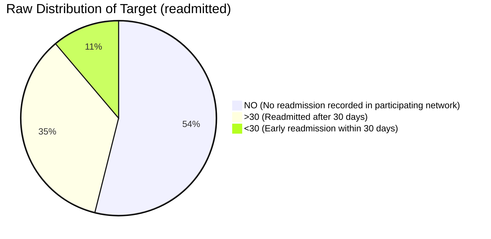

# Phase C1 — Dataset & Clinical Task Audit: Target Definition & Formulation

## 1. Raw Target Attribute: `readmitted`

In the UCI Diabetes 130-US Hospitals dataset, the target column is named `readmitted`. It encodes whether the patient had an inpatient hospital readmission recorded in the participating hospital network following the current discharge, and within what time horizon:

### Quantitative Raw Target Distribution

| Raw Value | Clinical Meaning | Encounter Count | Percentage of Total |
| :--- | :--- | :---: | :---: |
| `'NO'` | No readmission recorded in the dataset's participating hospital network | 54,864 | 53.91% |
| `'>30'` | Readmission recorded after 30 days post-discharge | 35,545 | 34.93% |
| `'<30'` | **Early readmission recorded within 30 days post-discharge** | 11,357 | 11.16% |
| **Total** | | **101,766** | **100.00%** |

---

## 2. Mathematical Task Formulation

### Primary Task: 30-Day Early Readmission Prediction (Binary)
Thirty-day readmission is a widely used hospital quality and risk-prediction endpoint and is the target explicitly supported by the UCI dataset. Readmissions after 30 days are generally considered distinct disease progression or unrelated episodes rather than discharge-related care failures.

We formally define the primary clinical prediction target $y_i \in \{0, 1\}$ for encounter $i$ as:

$$y_i = \begin{cases} 1 & \text{if } \text{readmitted}_i = \text{'<30'} \\ 0 & \text{if } \text{readmitted}_i \in \{\text{'>30'}, \text{'NO'}\} \end{cases}$$

#### Prevalence & Class Imbalance:
- **Positive Class ($y=1$, Early Readmission <30d)**: $N_1 = 11,357$ ($11.16\%$)
- **Negative Class ($y=0$, No early readmission)**: $N_0 = 90,409$ ($88.84\%$)
- **Imbalance Ratio**: $\approx 1 : 7.96$

### Secondary Task: 3-Class Granular Outcome (Multi-Class)
For granular clinical profiling and research comparison, the raw 3-class target is preserved:

$$y_i^{\text{3-class}} \in \{0: \text{'NO'}, 1: \text{'>30'}, 2: \text{'<30'}\}$$

---

## 3. Prediction-Time Boundary

The primary task is defined at the **point of discharge planning**. Therefore, features representing information accumulated during the completed inpatient encounter (e.g., total length of stay, total procedures, cumulative medication count, and in-hospital medication alterations) may be used, provided that they are available before the prediction is issued.

**Important Operational Constraint**: This formulation represents a **Discharge-Time Risk Stratification Task** and must not be interpreted as an admission-time readmission prediction task.

---

## 4. Multimodal Fusion Context (ACARA-U)

In the FusionMedAI framework, the clinical module outputs calibrated risk probabilities $P(\text{Readmission}_{<30\text{d}} \mid X_{\text{clinical}})$ and associated epistemic uncertainty. This risk score is fused with the Wagner ulcer grade risk (Foot module) and diabetic retinopathy stage risk (Retina module) to form a unified systemic diabetes severity profile.
