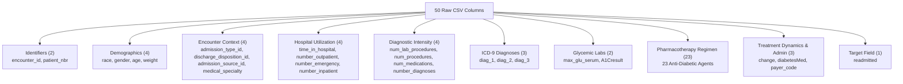

# Phase C1 — Dataset & Clinical Task Audit: Feature Taxonomy & Clinical Domains

## 1. Domain Taxonomy Architecture

The dataset contains **50 raw CSV columns**: **47 predictive/input attributes**, **2 identifier fields**, and **1 target field**, categorized across **9 clinical and operational domains**:

---

## 2. Exhaustive Domain Specifications

### Group 1: Identifiers ($N=2$ fields)
- `encounter_id`: Surrogate integer primary key for the hospital stay.
- `patient_nbr`: De-identified surrogate identifier used to link multiple encounters belonging to the same patient.

### Group 2: Demographics ($N=4$ attributes)
- `race`: Categorical (Caucasian, AfricanAmerican, Hispanic, Asian, Other, `?`).
- `gender`: Categorical (Female: 54,708, Male: 47,055, Unknown/Invalid: 3).
- `age`: Ordinal age group in 10-year intervals (`[0-10)` to `[90-100)`).
- `weight`: Ordinal weight interval in 25-lb bins (`[0-25)` to `[175-200)`), heavily unrecorded (96.86% `'?'`).

### Group 3: Encounter Context ($N=4$ attributes)
- `admission_type_id`: Integer key referencing emergency, urgent, elective, newborn, trauma center, etc.
- `discharge_disposition_id`: Integer key referencing discharge to home, SNF, home health, expired, hospice, AMA, etc.
- `admission_source_id`: Integer key referencing physician referral, clinic referral, emergency room, hospital transfer, etc.
- `medical_specialty`: Specialty of admitting physician (73 distinct values, e.g., Internal Medicine, Cardiology, Pediatrics-Endocrinology).

### Group 4: Prior Healthcare Utilization ($N=4$ attributes)
- `time_in_hospital`: Inpatient length of stay (1 to 14 days).
- `number_outpatient`: Outpatient clinic visits in the 12 months preceding the encounter.
- `number_emergency`: Emergency department visits in the 12 months preceding the encounter.
- `number_inpatient`: Inpatient hospitalizations in the 12 months preceding the encounter.

### Group 5: Diagnostic & Clinical Intensity ($N=4$ attributes)
- `num_lab_procedures`: Total number of distinct laboratory tests ordered during the stay (range 1–132).
- `num_procedures`: Total count of diagnostic or therapeutic procedures performed (range 0–6).
- `num_medications`: Count of distinct medications administered during hospitalization (range 1–81).
- `number_diagnoses`: Total diagnosis codes documented for the encounter (range 1–16).

### Group 6: ICD-9 Diagnosis Codes ($N=3$ attributes)
- `diag_1`: Primary admission diagnosis (717 unique codes).
- `diag_2`: Secondary diagnosis (749 unique codes).
- `diag_3`: Additional/tertiary diagnosis (790 unique codes).
*Note: Includes ICD-9-CM disease categories: Circulatory (390–459), Respiratory (460–519), Endocrine/Diabetes (250.xx), Digestive (520–579), Genitourinary (580–629), Neoplasms (140–239), Injury/Poisoning (800–999), Musculoskeletal (710–739), and Other.*

### Group 7: Glycemic Monitoring & Point-of-Care Labs ($N=2$ attributes)
- `max_glu_serum`: Maximum glucose serum test result (`None` [94.75%], `Norm` [2.55%], `>200` [1.46%], `>300` [1.24%]).
- `A1Cresult`: Glycated hemoglobin (HbA1c) lab test result (`None` [83.28%], `>8` [8.07%], `Norm` [4.90%], `>7` [3.75%]).

### Group 8: Diabetic Pharmacotherapy Regimen ($N=23$ attributes)
Covers 23 specific active pharmaceutical ingredients (monotherapies and fixed-dose combinations). Each is encoded as `No` (not prescribed), `Steady` (maintained on baseline dose), `Up` (dosage titrated upwards), or `Down` (dosage decreased):

1. `metformin` (Biguanide)
2. `repaglinide` (Meglitinide)
3. `nateglinide` (Meglitinide)
4. `chlorpropamide` (First-gen Sulfonylurea)
5. `glimepiride` (Second-gen Sulfonylurea)
6. `acetohexamide` (First-gen Sulfonylurea)
7. `glipizide` (Second-gen Sulfonylurea)
8. `glyburide` (Second-gen Sulfonylurea)
9. `tolbutamide` (First-gen Sulfonylurea)
10. `pioglitazone` (Thiazolidinedione)
11. `rosiglitazone` (Thiazolidinedione)
12. `acarbose` (Alpha-glucosidase inhibitor)
13. `miglitol` (Alpha-glucosidase inhibitor)
14. `troglitazone` (Thiazolidinedione)
15. `tolazamide` (First-gen Sulfonylurea)
16. `examide` (DPP-4 inhibitor candidate — *Zero variance: 100% 'No'*)
17. `citoglipton` (DPP-4 inhibitor candidate — *Zero variance: 100% 'No'*)
18. `insulin` (Exogenous human/analog insulin)
19. `glyburide-metformin` (Combination agent)
20. `glipizide-metformin` (Combination agent)
21. `glimepiride-pioglitazone` (Combination agent)
22. `metformin-rosiglitazone` (Combination agent)
23. `metformin-pioglitazone` (Combination agent)

### Group 9: Treatment Dynamics, Administrative, and Target ($N=4$ fields: 3 attributes + 1 target)
- `change`: Binary indicator (`Ch`: 47,011 [46.20%], `No`: 54,755 [53.80%]) indicating whether any diabetic medication dosage or prescription was altered during the encounter.
- `diabetesMed`: Binary indicator (`Yes`: 78,363 [77.00%], `No`: 23,403 [23.00%]) indicating whether any diabetic medication was prescribed or administered.
- `payer_code`: Commercial/government billing code (`MC`: Medicare, `MD`: Medicaid, `HM`: HMO, `BC`: Blue Cross, `SP`: Self-pay, `?`: Unrecorded [39.56%]).
- `readmitted`: Target variable (`NO`, `>30`, `<30`).
