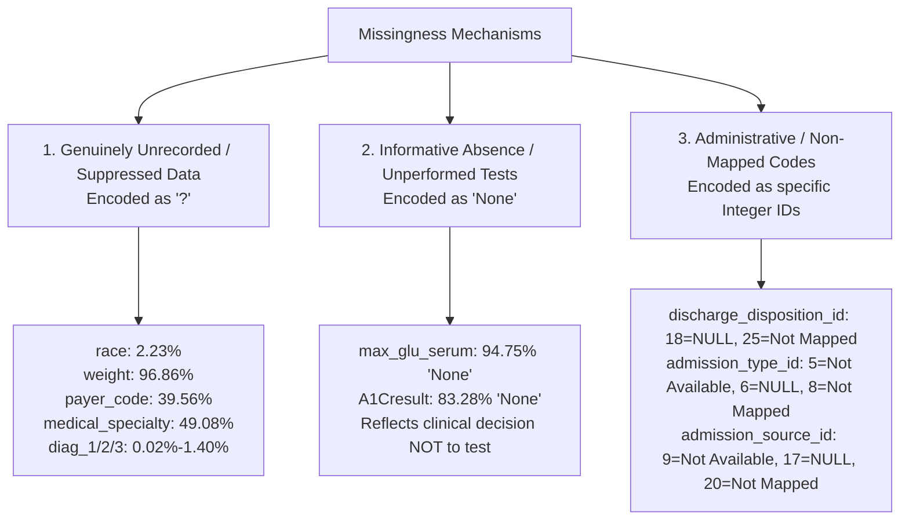

# Phase C1 — Dataset & Clinical Task Audit: Missingness Profile & Informative Absence

## 1. Missingness Paradigms in Clinical Data

In clinical informatics, "missingness" is heterogeneous and cannot be collapsed into a single NaN concept. The dataset exhibits **three distinct missingness mechanisms**:

---

## 2. Quantitative Missingness Profile: `'?'` Representation

Seven features use the string character `'?'` to denote uncollected or missing data:

| Feature Name | Column Data Type | Count of `'?'` | Missingness % | Clinical Interpretation of Absence |
| :--- | :--- | :---: | :---: | :--- |
| `weight` | `object` | 98,569 | **96.86%** | Body weight was rarely entered into structured fields across participating hospitals. Practically uninformative in raw state. |
| `medical_specialty` | `object` | 49,949 | **49.08%** | Specialty omitted or handled by general hospitalist services without subspecialty coding. |
| `payer_code` | `object` | 40,256 | **39.56%** | Non-clinical administrative insurance billing tag omitted or suppressed for privacy. |
| `race` | `object` | 2,273 | **2.23%** | Patient declined to report, or registrar omitted racial demographic field. |
| `diag_3` | `object` | 1,423 | **1.40%** | Patient had fewer than three discrete diagnostic conditions coded for this stay. |
| `diag_2` | `object` | 358 | **0.35%** | Patient had only a single primary diagnosis coded. |
| `diag_1` | `object` | 21 | **0.02%** | Uncoded primary diagnosis (rare administrative omission). |

---

## 3. Informative Absence: `'None'` in Laboratory Tests

In many tabular ML pipelines, the string `'None'` in `max_glu_serum` or `A1Cresult` is mistakenly parsed as a null/missing value and imputed. **This violates clinical reality:**

### 3.1 `A1Cresult` (Glycated Hemoglobin)
- `'None'`: **84,748 encounters (83.28%)**
- `'>8'`: 8,216 encounters (8.07%)
- `'Norm'`: 4,990 encounters (4.90%)
- `'>7'`: 3,812 encounters (3.75%)

**Clinical Meaning**: Clinicians do not order HbA1c tests randomly. Under ADA guidelines, HbA1c is ordered when chronic glycemic control is questionable or requires adjustment. If a patient is stable, an HbA1c test may not be ordered during a short acute stay. As demonstrated by Strack et al. (2014), patients whose HbA1c was measured and resulted in medication change had distinct readmission patterns compared to unmeasured patients. Treating `'None'` as missing data destroys this behavioral signal.

### 3.2 `max_glu_serum` (Serum Glucose Test)
- `'None'`: **96,420 encounters (94.75%)**
- `'Norm'`: 2,597 encounters (2.55%)
- `'>200'`: 1,485 encounters (1.46%)
- `'>300'`: 1,264 encounters (1.24%)

**Clinical Meaning**: Routine serum glucose lab panels are distinguished from acute point-of-care capillary checks. A high serum glucose result ($>200$ or $>300$ mg/dL) indicates acute hyperosmolar or uncontrolled states. `'None'` indicates that standard protocol panels were deemed sufficient without standalone serum lab elevation profiling.

---

## 4. Administrative Missingness in Integer ID Fields

The lookup file `IDS_mapping.csv` reveals that integer ID fields explicitly designate missing, unmapped, or null administrative values:

### `admission_type_id`
- Code `5`: *Not Available* (4,785 encounters, 4.70%)
- Code `6`: *NULL* (6,071 encounters, 5.97%)
- Code `8`: *Not Mapped* (320 encounters, 0.31%)
- **Total Administrative Missingness**: $11,176$ encounters ($10.98\%$)

### `discharge_disposition_id`
- Code `18`: *NULL* (3,691 encounters, 3.63%)
- Code `25`: *Not Mapped* (989 encounters, 0.97%)
- Code `26`: *Unknown/Invalid* (0 encounters in dataset)
- **Total Administrative Missingness**: $4,680$ encounters ($4.60\%$)

### `admission_source_id`
- Code `9`: *Not Available* (125 encounters, 0.12%)
- Code `15`: *Not Available* (0 encounters)
- Code `17`: *NULL* (6,781 encounters, 6.66%)
- Code `20`: *Not Mapped* (161 encounters, 0.16%)
- Code `21`: *Unknown/Invalid* (0 encounters)
- **Total Administrative Missingness**: $7,067$ encounters ($6.94\%$)

---

## 5. Audit Policy & Pre-Modeling Stance

1. **No Blind Imputation**: In Phase C1, no imputation is applied.
2. **Explicit Semantic Encoding**: During subsequent pipeline development (Phase C2), `'None'` in lab tests must be treated as a valid categorical state ("Not Measured / Not Ordered") rather than imputed using mean/mode/KNN methods.
3. **'?' Preservation**: The `'?'` string must be explicitly mapped to `"Unknown"` or a dedicated categorical level to retain missingness indicators for tree-based models.
