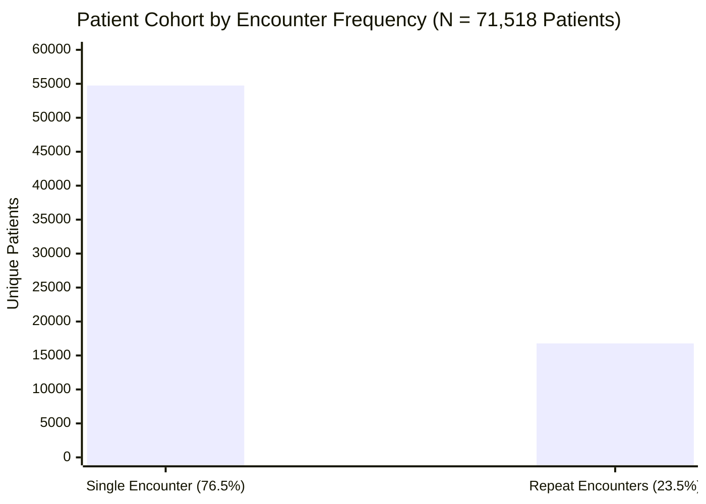

# Phase C1 — Dataset & Clinical Task Audit: Identifier & Encounter Dynamics

## 1. Core Question: *"Should this column participate in modeling?"*

The dataset contains two primary identifier fields:
- `encounter_id` (Unique per hospital visit; $N = 101,766$)
- `patient_nbr` (De-identified surrogate identifier used to link multiple encounters belonging to the same patient; $N = 71,518$)

**Strict Audit Decision**:
Neither `encounter_id` nor `patient_nbr` may be used as input predictive features in machine learning models.
- `encounter_id` carries arbitrary database sequencing artifacts and chronological drift.
- `patient_nbr` would lead to high-cardinality memorization and fatal overfitting to specific patient identities.

However, `patient_nbr` is **strictly required for dataset partitioning and grouping**.

---

## 2. Encounter vs. Patient Level Dynamics

A central architectural finding of this audit is that **the UCI Diabetes dataset is encounter-level rather than an independent-patient dataset**.



### Encounter Distribution Across Patients

| Encounters per Patient | Patient Count | Cumulative Patients | % of All Patients | Total Encounters Generated | % of Total Encounters |
| :---: | :---: | :---: | :---: | :---: | :---: |
| **1** | 54,745 | 54,745 | 76.55% | 54,745 | 53.80% |
| **2** | 10,434 | 65,179 | 91.14% | 20,868 | 20.51% |
| **3** | 3,328 | 68,507 | 95.79% | 9,984 | 9.81% |
| **4** | 1,421 | 69,928 | 97.78% | 5,684 | 5.59% |
| **5** | 717 | 70,645 | 98.78% | 3,585 | 3.52% |
| **6** | 346 | 70,991 | 99.26% | 2,076 | 2.04% |
| **7** | 207 | 71,198 | 99.55% | 1,449 | 1.42% |
| **8** | 111 | 71,309 | 99.71% | 888 | 0.87% |
| **9** | 70 | 71,379 | 99.81% | 630 | 0.62% |
| **10** | 42 | 71,421 | 99.86% | 420 | 0.41% |
| **11–40** | 97 | 71,518 | 100.00% | 1,447 | 1.42% |
| **Total** | **71,518** | — | **100.00%** | **101,766** | **100.00%** |

### Key Analytical Findings:
1. **76.55% of patients** appear exactly once in the dataset.
2. **23.45% of patients** account for **46.20% of all encounters** (47,021 encounters).
3. The highest encounter count for a single individual patient is **40 encounters** (Patient ID `88785891`).

---

## 3. Patient-Level Group Leakage Hazard

If records are randomly split at the encounter level (standard $k$-fold cross-validation or simple `train_test_split`), encounters from the same patient will be distributed across both training and test partitions:

```
[LEAKAGE PATTERN - Random Encounter Split]
Patient A, Encounter 1 (Admitted Jan 2005) --> TRAIN SET
Patient A, Encounter 2 (Admitted Feb 2005) --> TEST SET (Model memorizes Patient A's baseline!)
```

### Mandatory Data Splitting Protocol for Phase C2:
- **Group-Stratified Splitting**: All data splits (train, validation, test) must use `GroupKFold` or `StratifiedGroupKFold` grouped strictly by `patient_nbr`.
- **Zero Patient Overlap**:
  $$\text{Patients}(\mathcal{D}_{\text{train}}) \cap \text{Patients}(\mathcal{D}_{\text{val}}) \cap \text{Patients}(\mathcal{D}_{\text{test}}) = \emptyset$$
- **Encounter-Subset Strategy Option**: In clinical literature (*Strack et al., 2014*), studies often evaluate the *first encounter only* per patient ($N = 71,518$) or evaluate full grouped encounter cohorts. Both configurations must preserve strict patient-level boundary isolation.
