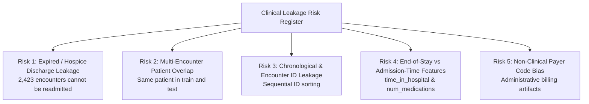

# Phase C1 — Dataset & Clinical Task Audit: Leakage Risk Register

## 1. Core Question: *"Could this column expose information unavailable at prediction time?"*

Data leakage in clinical machine learning occurs when features contain information that would not be available at the point of clinical decision-making, or when target outcomes are structurally predetermined.

This register formally catalogs **five major leakage risks** identified during the Phase C1 audit:

---

## 2. Exhaustive Leakage Risk Catalog

### Risk 1: Expired & Hospice Discharge Status Leakage (Critical)
- **Affected Feature**: `discharge_disposition_id`
- **Mechanism**: Patients who die during hospitalization or are discharged into hospice care are structurally incapable of being readmitted alive.
- **Quantitative Audit**:
  - Code `11` (*Expired*): 1,642 encounters $\rightarrow$ 100% `NO` readmission (0 readmissions)
  - Code `13` (*Hospice / home*): 399 encounters
  - Code `14` (*Hospice / medical facility*): 372 encounters
  - Code `19` (*Expired at home*): 8 encounters $\rightarrow$ 100% `NO` readmission
  - Code `20` (*Expired in medical facility*): 2 encounters $\rightarrow$ 100% `NO` readmission
  - **Total Expired/Hospice Cohort**: **2,423 encounters** (2.38% of dataset)
- **Impact**: Including expired patients with `discharge_disposition_id = 11` provides the model with a trivial shortcut (if expired, $P(\text{readmitted}) = 0$), falsely inflating model specificity.
- **Mitigation Protocol for Phase C2**: Expired/hospice encounters must be formally flagged and excluded from readmission risk cohorts in accordance with CMS guidelines and standard clinical epidemiology.

---

### Risk 2: Multi-Encounter Patient Leakage Across Splits (Critical)
- **Affected Features**: `patient_nbr`, demographic variables, chronic diagnostic profiles
- **Mechanism**: 16,773 patients appear multiple times (2 to 40 encounters). Standard random partitioning places early encounters in training and late encounters in testing.
- **Impact**: A model can memorize patient-specific baseline medication sensitivities or diagnosis patterns, creating unrealistically high validation metrics that collapse on unseen patients.
- **Mitigation Protocol for Phase C2**: Mandatory grouping by `patient_nbr` across all cross-validation and evaluation splits.

---

### Risk 3: Chronological Drift & Database ID Ordering (High)
- **Affected Feature**: `encounter_id`
- **Mechanism**: In Cerner Health Facts, `encounter_id` values generally increase monotonically with chronological admission year (1999 to 2008).
- **Impact**: Using `encounter_id` directly or indirectly as an ordinal feature allows the model to exploit temporal shifts in standard-of-care guidelines rather than clinical pathology.
- **Mitigation Protocol for Phase C2**: Complete exclusion of `encounter_id` from feature matrices.

---

### Risk 4: End-of-Stay vs. Admission-Time Timing Discrepancy (Moderate)
- **Affected Features**: `time_in_hospital`, `num_lab_procedures`, `num_procedures`, `num_medications`, `change`
- **Mechanism**: These variables aggregate counts across the *entire inpatient stay* up to discharge.
- **Clinical Nuance**: In clinical practice, if risk prediction is executed at the exact *moment of discharge* (Discharge Planning Risk), these full-stay metrics are legitimate and known. However, if risk prediction is intended at the *moment of admission*, using total stay duration or cumulative lab counts introduces retrospective lookahead leakage.
- **Mitigation Protocol for Phase C2**: Clearly document the decision boundary: FusionMedAI formulates clinical tabular risk as a **Discharge-Time Risk Stratification Task** (evaluating readmission risk when discharge planning is finalized).

---

### Risk 5: Administrative Insurance / Payer Code (Low to Moderate)
- **Affected Feature**: `payer_code` (39.56% missing)
- **Mechanism**: Payer codes (e.g., Medicare `MC`, Medicaid `MD`, Commercial `BC`) reflect reimbursement models and billing logistics rather than physiological patient states.
- **Impact**: Risk of learning socio-economic insurance artifacts rather than clinical risk.
- **Mitigation Protocol for Phase C2**: Evaluate feature importance and ablation to prevent model reliance on administrative billing proxies.
