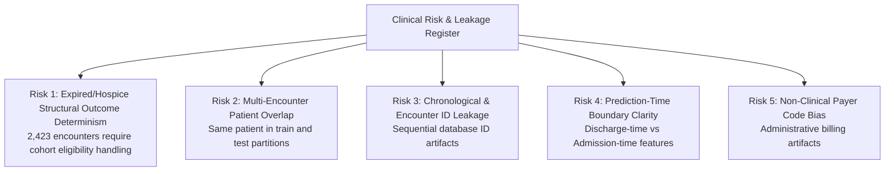

# Phase C1 — Dataset & Clinical Task Audit: Cohort Eligibility & Leakage Risk Register

## 1. Core Question: *"Could this column expose information unavailable at prediction time or distort cohort eligibility?"*

In clinical machine learning, predictive validity can be compromised when features contain information unavailable at the prediction boundary, or when cohort definitions include cases for which the target outcome is structurally deterministic or clinically inappropriate.

This register formally catalogs **five major risk categories** identified during the Phase C1 audit:

---

## 2. Exhaustive Risk Catalog

### Risk 1: Expired/Hospice Structural Outcome Determinism & Cohort Ineligibility (Critical)
- **Affected Feature**: `discharge_disposition_id`
- **Mechanism**: Certain discharge dispositions identify encounters for which a subsequent readmission outcome is structurally impossible or clinically inappropriate to define. An expired patient cannot subsequently experience an inpatient readmission. Similarly, transfer to hospice care represents a planned transition to palliative care rather than acute inpatient readmission.
- **Quantitative Audit**:
  - **In-Hospital / Facility Expiration ($N = 1,652$)**:
    - Code `11` (*Expired*): 1,642 encounters $\rightarrow$ 100% `NO` readmission (0 readmissions recorded)
    - Code `19` (*Expired at home*): 8 encounters $\rightarrow$ 100% `NO` readmission
    - Code `20` (*Expired in medical facility*): 2 encounters $\rightarrow$ 100% `NO` readmission
  - **Hospice Transfers ($N = 771$)**:
    - Code `13` (*Hospice / home*): 399 encounters (344 `NO`, 36 `>30`, 19 `<30`)
    - Code `14` (*Hospice / medical facility*): 372 encounters (341 `NO`, 7 `>30`, 24 `<30`)
  - **Total Cohort Eligibility Flag**: **2,423 encounters with discharge dispositions associated with death or hospice care require explicit cohort eligibility handling.**
- **Impact**: Including expired patients with `discharge_disposition_id = 11` provides the model with a trivial shortcut (if expired, $P(\text{readmitted}) = 0$), distorting model specificity.
- **Mitigation Protocol for Phase C2**: Define the eligible readmission cohort before model training and exclude ineligible discharge outcomes according to the prespecified cohort definition.

---

### Risk 2: Multi-Encounter Patient Leakage Across Splits (Critical)
- **Affected Features**: `patient_nbr`, demographic variables, chronic diagnostic profiles
- **Mechanism**: 16,773 patients appear multiple times (2 to 40 encounters). Standard random partitioning places early encounters in training and late encounters in testing.
- **Impact**: A model can memorize patient-specific baseline medication sensitivities or diagnosis patterns, creating unrealistically high validation metrics that collapse on unseen patients.
- **Mitigation Protocol for Phase C2**: Mandatory grouping by `patient_nbr` across all cross-validation and evaluation splits.

---

### Risk 3: Chronological Drift & Database ID Ordering (High)
- **Affected Feature**: `encounter_id`
- **Mechanism**: In Cerner Health Facts, `encounter_id` values generally increase monotonically with chronological admission year (1999 to 2008).
- **Impact**: Using `encounter_id` directly or indirectly as an ordinal feature allows the model to exploit temporal shifts in standard-of-care guidelines rather than clinical pathology.
- **Mitigation Protocol for Phase C2**: Complete exclusion of `encounter_id` from feature matrices.

---

### Risk 4: Prediction-Time Boundary Alignment (Moderate)
- **Affected Features**: `time_in_hospital`, `num_lab_procedures`, `num_procedures`, `num_medications`, `change`
- **Mechanism**: These variables aggregate counts across the *entire inpatient stay* up to discharge.
- **Clarification of Decision Boundary**:
  The primary task is defined at the **point of discharge planning**. Therefore, features representing information accumulated during the completed inpatient encounter may be used, provided that they are available before the prediction is issued. This formulation must not be interpreted as an admission-time readmission prediction task.
- **Mitigation Protocol for Phase C2**: Maintain strict documentation that the clinical tabular pipeline operates as a **Discharge-Time Risk Stratification** model.

---

### Risk 5: Administrative Insurance / Payer Code (Low to Moderate)
- **Affected Feature**: `payer_code` (39.56% missing)
- **Mechanism**: Payer codes (e.g., Medicare `MC`, Medicaid `MD`, Commercial `BC`) reflect reimbursement models and billing logistics rather than physiological patient states.
- **Impact**: Risk of learning socio-economic insurance artifacts rather than clinical risk.
- **Mitigation Protocol for Phase C2**: Evaluate feature importance and ablation to prevent model reliance on administrative billing proxies.
