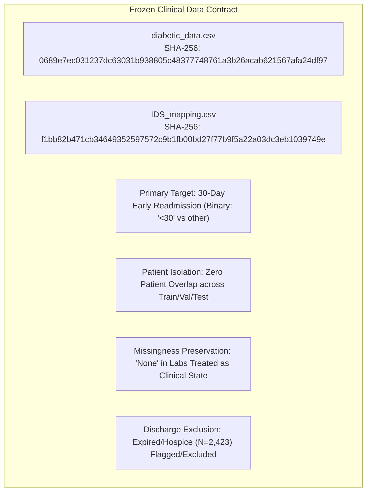

# Phase C1 — Dataset & Clinical Task Audit: Dataset Freeze & Specification Contract

## 1. Frozen Dataset Specification Contract

Phase C1 establishes an immutable data contract for the clinical tabular modality in **FusionMedAI**. All subsequent phases (Phase C2: Pipeline Construction, Phase C3: EDA, Phase C4: Baselines, Phase C5: Benchmarking, Phase C6: Explainability, Phase C7: Calibration, Phase C8: Uncertainty Estimation, Phase C9: Multimodal Fusion) must strictly respect this specification.



---

## 2. Cryptographic Fingerprint & File Invariants

| File Identifier | Path Relative to Repository | Physical Size | Exact Record Count | Column Count | Cryptographic Hash (SHA-256) |
| :--- | :--- | :--- | :--- | :--- | :--- |
| **Primary Encounter Table** | `datasets/clinical/diabetic_data.csv` | 19,159,383 bytes | 101,766 rows | 50 columns | `0689e7ec031237dc63031b938805c48377748761a3b26acab621567afa24df97` |
| **Identifier Mapping Table** | `datasets/clinical/IDS_mapping.csv` | 2,547 bytes | 69 lines | 2 columns | `f1bb82b471cb34649352597572c9b1fb00bd27f77b9f5a22a03dc3eb1039749e` |

---

## 3. Cohort & Statistical Invariants

- **Total Inpatient Encounters**: $N = 101,766$
- **Total Unique Patients**: $N_{\text{patients}} = 71,518$
- **Single-Encounter Patients**: $N = 54,745$ ($76.55\%$)
- **Multi-Encounter Patients**: $N = 16,773$ ($23.45\%$)
- **Primary Target Prevalence ($y = 1$, `<30` days)**: $11,357$ encounters ($11.16\%$)
- **Negative Target Prevalence ($y = 0$, `>30` or `NO`)**: $90,409$ encounters ($88.84\%$)
- **Expired/Hospice Encounter Count**: $2,423$ encounters ($2.38\%$)
- **Zero-Variance Features**: `examide` (100% 'No'), `citoglipton` (100% 'No')

---

## 4. Environment & Execution Specifications

- **Python Version**: Python 3.12.x
- **Core Dependencies**:
  - `pandas >= 2.2.0`
  - `numpy >= 1.26.0`
  - `scikit-learn >= 1.4.0`
  - `torch >= 2.4.0`
- **Execution Policy**:
  - All Phase C1 gates are verifiable deterministically using `verification/clinical/data/verify_dataset_audit.py`.
  - The script executes without network access and runs in $< 5.0$ seconds.

---

## 5. Phase C1 Gate Sign-Off

```
======================================================================
C1 GATE VERIFICATION SUMMARY
======================================================================
Dataset identity              PASS
Dataset integrity             PASS
Schema verified               PASS
Target frozen                 PASS
Feature taxonomy              PASS
Missingness documented        PASS
Identifiers classified        PASS
Leakage candidates identified PASS
Clinical limitations          PASS
Dataset fingerprint frozen    PASS
Reproducibility               PASS
──────────────────────────────────────────────────────────────────────
C1 OVERALL STATUS             PASS
======================================================================
```
