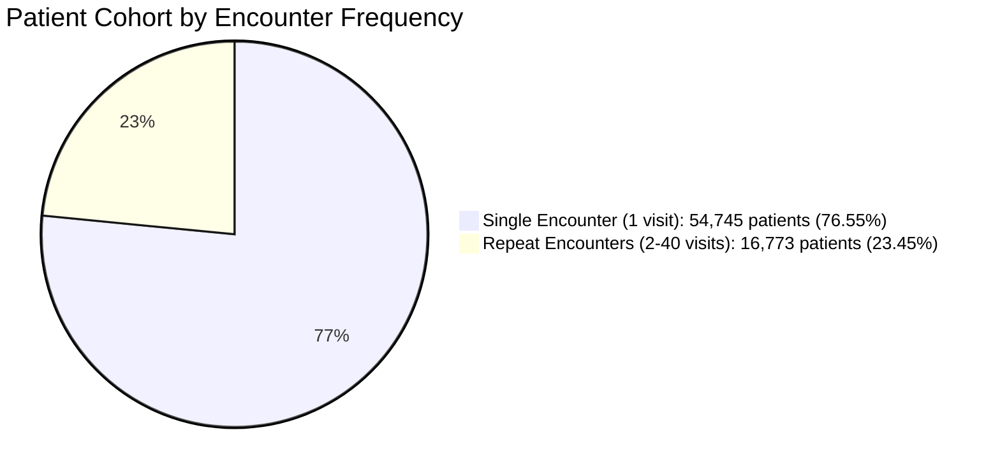

# Phase C2 — Clinical Data Pipeline: Patient & Encounter Structure (C2.1)

## 1. Unit of Observation & Structural Hierarchy

In the raw frozen dataset (`datasets/clinical/diabetic_data.csv`), each row represents an **individual inpatient hospital encounter**, not an independent human patient.

- **Total Encounters ($N_{\text{enc}}$)**: $101,766$
- **Total Unique Patients ($N_{\text{pat}}$)**: $71,518$
- **Grouping Variable**: `patient_nbr` (De-identified surrogate patient identifier)
- **Primary Key**: `encounter_id` (Surrogate encounter identifier)
- **Encounter Range per Patient**: $1 \le k \le 40$

---

## 2. Quantitative Encounter Frequency Distribution

| Encounters per Patient ($k$) | Unique Patients | Cumulative Patients | % of Patients | Total Encounters | % of All Encounters |
| :---: | :---: | :---: | :---: | :---: | :---: |
| **1** | 54,745 | 54,745 | 76.55% | 54,745 | 53.80% |
| **2** | 10,434 | 65,179 | 91.14% | 20,868 | 20.51% |
| **3** | 3,328 | 68,507 | 95.79% | 9,984 | 9.81% |
| **4** | 1,421 | 69,928 | 97.78% | 5,684 | 5.59% |
| **5** | 717 | 70,645 | 98.78% | 3,585 | 3.52% |
| **6** | 346 | 70,991 | 99.26% | 2,076 | 2.04% |
| **7** | 207 | 71,198 | 99.55% | 1,449 | 1.42% |
| **8** | 111 | 71,309 | 99.71% | 888 | 0.87% |
| **9** | 70 | 71,379 | 99.81% | 630 | 0.62% |
| **10** | 42 | 71,421 | 99.86% | 420 | 0.41% |
| **11–40** | 97 | 71,518 | 100.00% | 1,447 | 1.42% |
| **Total** | **71,518** | — | **100.00%** | **101,766** | **100.00%** |

---

## 3. Target Distribution: Single-Encounter vs. Repeat-Encounter Cohorts

Patients with repeated hospitalizations exhibit substantially different readmission dynamics compared to single-visit patients:

| Cohort | Subpopulation Size | Target `'NO'` | Target `'>30'` | Target `'<30'` (Primary Target) |
| :--- | :--- | :---: | :---: | :---: |
| **Single-Encounter Patients** ($k=1$) | $54,745$ encounters | $42,701$ ($78.00\%$) | $9,878$ ($18.04\%$) | **$2,166$ ($3.96\%$)** |
| **Repeat-Encounter Patients** ($k \ge 2$) | $47,021$ encounters | $12,163$ ($25.87\%$) | $25,667$ ($54.59\%$) | **$9,191$ ($19.55\%$)** |
| **Combined Cohort** | $101,766$ encounters | $54,864$ ($53.91\%$) | $35,545$ ($34.93\%$) | **$11,357$ ($11.16\%$)** |

### Key Structural Findings:
1. **$80.93\%$ of all 30-day early readmissions** ($9,191$ out of $11,357$) originate from the $23.45\%$ repeat-encounter patient cohort.
2. The early readmission rate is **nearly $5\times$ higher** in the repeat-encounter subpopulation ($19.55\%$) versus the single-encounter subpopulation ($3.96\%$).
3. Multi-encounter patients frequently experience **variable target outcomes over time**:
   - $83.51\%$ of multi-encounter patients ($14,007$ patients) have at least two distinct readmission outcomes across their longitudinal record.
   - Only $16.49\%$ ($2,766$ patients) have a constant outcome across all repeat visits.
