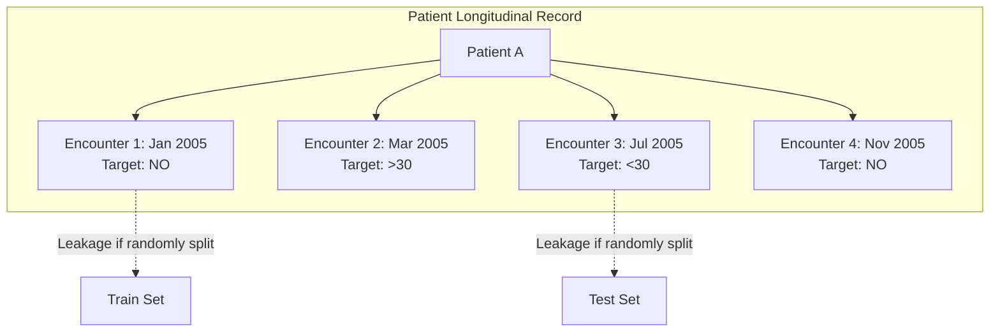

# Phase C2 — Clinical Data Pipeline: Repeat-Encounter Analysis (C2.2)

## 1. Objectives & Risk Rationale

This analysis evaluates how repeated hospitalizations generate potential information leakage when building predictive models.

---

## 2. Recurrence Concentration & Repeat Characteristics

1. **Patient Concentration**:
   - The top $10\%$ most frequent patients ($7,152$ individuals) account for **$31,244$ encounters ($30.70\%$ of the entire dataset)**.
   - The maximum number of encounters for a single individual patient is **$40$ visits** (Patient ID `88785891`).
2. **Within-Patient Target Label Dynamics**:
   - Among the $16,773$ patients with multiple encounters:
     - **$14,007$ patients ($83.51\%$)** have non-constant target transitions (e.g., oscillating between `'NO'`, `'>30'`, and `'<30'`).
     - **$2,766$ patients ($16.49\%$)** maintain an identical label across all observed visits.
3. **Chronic vs. Acute Feature Persistence**:
   - Demographic variables (`race`, `gender`, initial `age` band) and chronic baseline diagnoses remain stable across repeat encounters.
   - Acute variables (`time_in_hospital`, `num_lab_procedures`, `max_glu_serum`, specific medication dosage adjustments) vary dynamically per admission.

---

## 3. Cross-Split Leakage Mechanism & Invalidation

If an encounter-level split (standard $k$-fold cross-validation or un-grouped random train/test split) is used:
- A model trained on early encounters from Patient A will memorize patient-specific baseline features (e.g., exact medication sensitivities, diagnostic combinations, admitting specialty).
- When evaluating on later encounters from Patient A in the test set, the model achieves artificially elevated predictive accuracy.
- On genuine out-of-sample patients, performance collapses.

### Conclusion & Requirement:
`patient_nbr` must serve strictly as a **grouping constraint**. No single patient may appear in more than one partition (Train, Validation, or Test).
