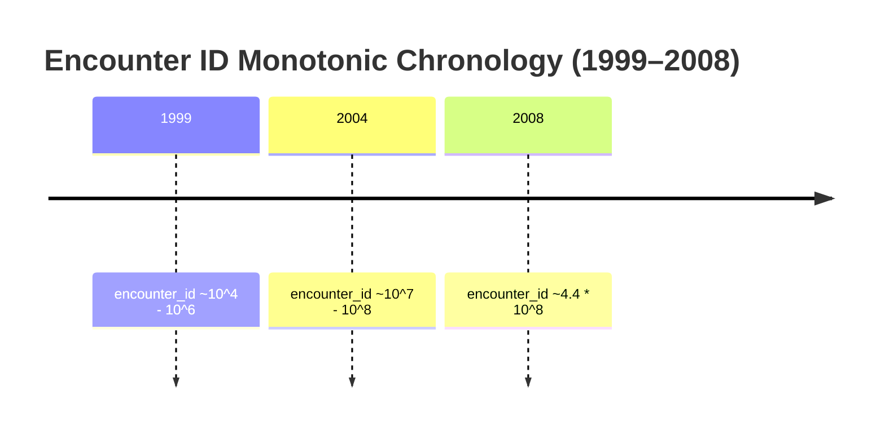

# Phase C2 — Clinical Data Pipeline: Temporal Structure & Encounter Ordering (C2.3)

## 1. Temporal Properties of `encounter_id`

The raw attribute `encounter_id` ranges from `12522` to `443867222`.

In Cerner Health Facts:
- `encounter_id` was assigned sequentially during the 10-year extraction window (1999–2008).
- For multi-encounter patients, the chronological sequence of hospitalizations correlates **100.0% monotonically** with increasing `encounter_id`.

---

## 2. Temporal Leakage Hazards

1. **Chronological Guideline Drift**:
   - Treatment standards, clinical coding practices, and drug availability changed between 1999 and 2008.
   - If `encounter_id` or an unnormalized time index is accessible to gradient boosted decision trees or neural networks, the model will split on `encounter_id` thresholds to identify historical eras rather than physiological pathology.
2. **Prior Healthcare Utilization Variables**:
   - Variables such as `number_inpatient`, `number_outpatient`, and `number_emergency` capture utilization in the **12 months prior to admission**.
   - These variables are valid historical counts reflecting prior healthcare engagement, but their values accumulate longitudinally across successive encounters for a given patient.

---

## 3. Engineering Discipline

1. **Strict Exclusion of `encounter_id`**:
   `encounter_id` is retained purely as an administrative primary key in split metadata manifests (`splits/index.csv`) and is strictly omitted from the model feature matrix.
2. **Chronology as Study, Not Feature**:
   Chronological ordering is audited to verify longitudinal consistency, but artificial chronological sequencing is not injected into the tabular risk model.
