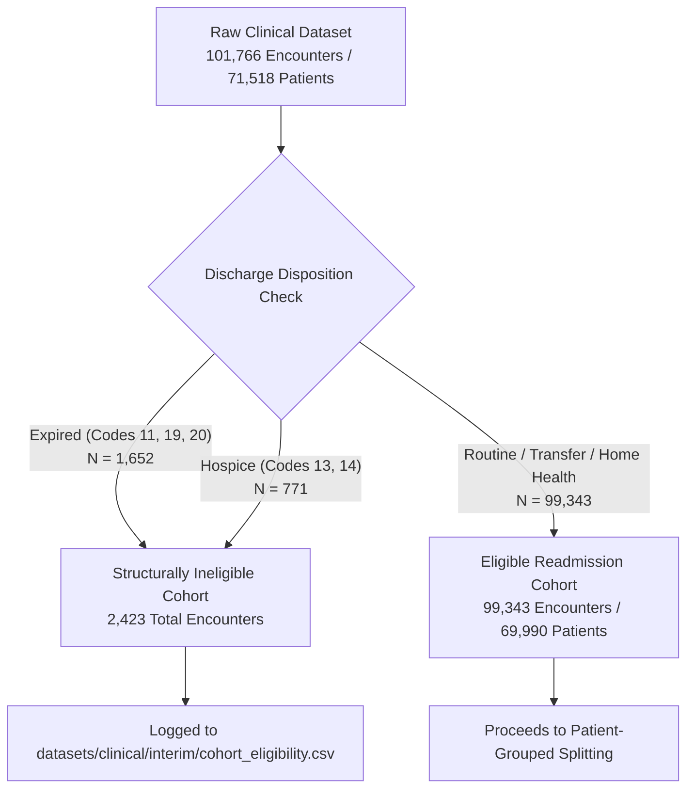

# Phase C2 — Clinical Data Pipeline: Cohort Eligibility Construction (C2.5)

## 1. Principles of Cohort Eligibility

In clinical readmission epidemiology, encounters where a patient expired in the hospital or was transferred to hospice care represent **structurally deterministic outcomes** or **planned palliative transitions**.

To preserve scientific rigor without mutating the frozen raw dataset:
1. The raw file `datasets/clinical/diabetic_data.csv` remains **100% immutable**.
2. An auditable intermediate manifest is written to `datasets/clinical/interim/cohort_eligibility.csv`.
3. Subsequent modeling pipelines consume only the verified **Eligible Readmission Cohort**.

---

## 2. Quantitative Disposition Breakdown

| Disposition Category | Integer Codes | Description | Encounter Count | Readmission Status in Raw Data |
| :--- | :---: | :--- | :---: | :--- |
| **In-Hospital / Facility Expiration** | `11` | Expired in hospital | $1,642$ | $100\%$ `'NO'` ($0$ readmissions) |
| | `19` | Expired at home (Medicaid hospice) | $8$ | $100\%$ `'NO'` ($0$ readmissions) |
| | `20` | Expired in medical facility | $2$ | $100\%$ `'NO'` ($0$ readmissions) |
| **Subtotal: Expired** | | | **$1,652$** | **Structurally impossible to readmit** |
| **Hospice Transfers** | `13` | Hospice / home | $399$ | $344$ `'NO'`, $36$ `'>30'`, $19$ `'<30'` |
| | `14` | Hospice / medical facility | $372$ | $341$ `'NO'`, $7$ `'>30'`, $24$ `'<30'` |
| **Subtotal: Hospice** | | | **$771$** | **Planned palliative transition** |
| **Total Ineligible Cohort** | | | **$2,423$** ($2.38\%$) | **Excluded from Readmission Modeling** |

---

## 3. Eligible Readmission Modeling Cohort

Applying the cohort eligibility filter yields the canonical modeling subpopulation:

- **Eligible Encounters ($N_{\text{eligible}}$)**: **$99,343$ encounters** ($97.62\%$ of raw dataset)
- **Eligible Unique Patients**: **$69,990$ unique patients**
- **Target Distribution within Eligible Cohort**:
  - `'NO'`: $52,527$ encounters ($52.87\%$)
  - `'>30'`: $35,502$ encounters ($35.74\%$)
  - **`'<30'` (Primary 30-Day Readmission Target)**: **$11,314$ encounters ($11.39\%$)**
  - **Class Imbalance Ratio**: $\approx 1 : 7.78$

---

## 4. Interim Artifact Specification

The eligibility manifest is saved at `datasets/clinical/interim/cohort_eligibility.csv` with columns:
- `encounter_id`: Primary key
- `patient_nbr`: Patient grouping key
- `discharge_disposition_id`: Raw disposition code
- `is_expired`: Boolean indicator (Codes 11, 19, 20)
- `is_hospice`: Boolean indicator (Codes 13, 14)
- `is_cohort_eligible`: Boolean indicator ($\text{eligible} = \text{True}$)
- `readmitted`: Raw target outcome
