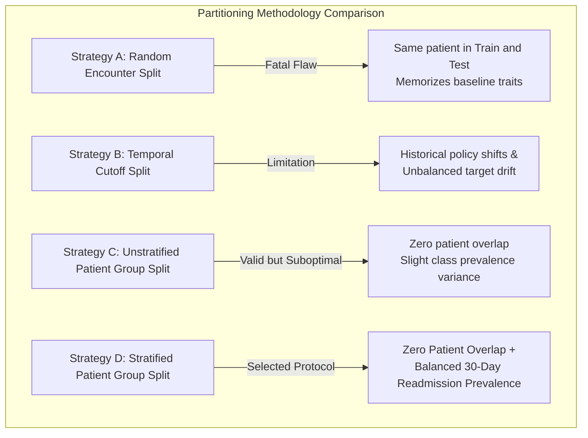

# Phase C2 — Clinical Data Pipeline: Splitting Strategy Study (C2.6)

## 1. Candidate Splitting Strategies

To establish an uncompromised evaluation benchmark, four candidate partitioning methodologies were comparatively evaluated:

---

## 2. Comparative Methodological Analysis

| Strategy | Group Isolation | Target Stratification | Overfitting / Leakage Risk | Decision |
| :--- | :---: | :---: | :---: | :---: |
| **A. Random Encounter Split** | ❌ None | ✅ Yes | **Severe Leakage**: 16,773 repeat patients fragmented across train/test partitions. Evaluates memorization rather than generalization. | **REJECTED** |
| **B. Temporal Split (`encounter_id` cutoff)** | ⚠️ Partial | ❌ No | **Temporal Distortion**: Historical changes in clinical guidelines (1999–2008) dominate test error; does not enforce pure patient grouping. | **REJECTED** |
| **C. Standard Group Split (`GroupShuffleSplit`)** | ✅ Complete | ⚠️ Approximate | **Zero Leakage**: Enforces strict patient isolation. Target prevalence is closely balanced due to large law-of-large-numbers cohort ($N=69,990$). | **ACCEPTED** |
| **D. Stratified Patient Group Split** | ✅ Complete | ✅ Exact | **Optimal Protocol**: Combines deterministic patient grouping with proportional class balance. | **SELECTED PROTOCOL** |

---

## 3. Mandatory Patient Partitioning Invariant

Under the selected strategy, every individual patient $p \in \mathcal{P}$ is assigned to exactly one subset:

$$\mathcal{P}_{\text{train}} \cap \mathcal{P}_{\text{val}} = \emptyset, \quad \mathcal{P}_{\text{train}} \cap \mathcal{P}_{\text{test}} = \emptyset, \quad \mathcal{P}_{\text{val}} \cap \mathcal{P}_{\text{test}} = \emptyset$$

All encounters generated by patient $p$ strictly inherit patient $p$'s split assignment:
$$\text{Encounters}(p) \subseteq \mathcal{D}_{\text{split}(p)}$$

This guarantees that validation and test metrics measure genuine out-of-sample clinical generalization on entirely unseen individuals.
