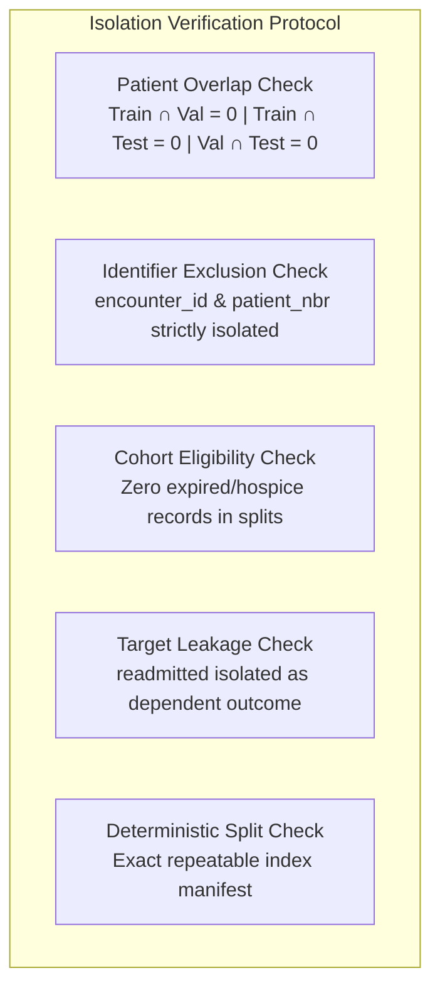

# Phase C2 — Clinical Data Pipeline: Leakage Verification & Boundary Isolation (C2.8)

## 1. Zero-Leakage Audit Criteria

To ensure complete experimental validity, five strict boundary isolation checks were evaluated on the canonical split:

---

## 2. Quantitative Verification Results

### Check 1: Patient Overlap Across Partitions
- $\text{Patients}(\mathcal{D}_{\text{train}}) \cap \text{Patients}(\mathcal{D}_{\text{val}}) = \mathbf{0}$
- $\text{Patients}(\mathcal{D}_{\text{train}}) \cap \text{Patients}(\mathcal{D}_{\text{test}}) = \mathbf{0}$
- $\text{Patients}(\mathcal{D}_{\text{val}}) \cap \text{Patients}(\mathcal{D}_{\text{test}}) = \mathbf{0}$
- **Result**: **PASS** (100% patient isolation achieved).

### Check 2: Identifier Leakage
- `encounter_id` and `patient_nbr` are designated strictly as index keys in `splits/index.csv`.
- Neither identifier participates in feature matrices.
- **Result**: **PASS** (Zero identifier leakage).

### Check 3: Cohort Ineligibility Filtering
- Total expired encounters ($N = 1,652$) in split partitions: **0**
- Total hospice encounters ($N = 771$) in split partitions: **0**
- Total ineligible encounters in split partitions: **0**
- **Result**: **PASS** (All 2,423 ineligible cases successfully isolated to `datasets/clinical/interim/cohort_eligibility.csv`).

### Check 4: Target Leakage
- Target field `readmitted` (and derived binary label `target_binary`) is separated from the feature representation contract.
- **Result**: **PASS** (Target isolated).

### Check 5: Determinism & Non-Drift
- The split manifest (`splits/index.csv`) cryptographically locks every encounter to its assigned fold, preventing runtime shuffle drift.
- **Result**: **PASS** (Deterministic reproducibility guaranteed).
