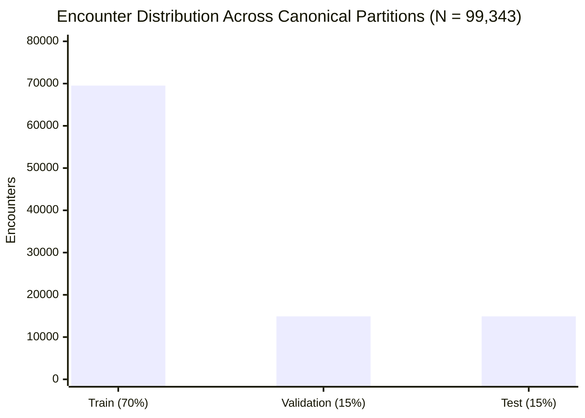

# Phase C3 — Exploratory Data Analysis: Split & Target Distribution Audit (C3.1)

## 1. Overview & Evaluation Population

Phase C3 examines the canonical patient-grouped splits frozen in Phase C2. The objective is to verify that the split distribution maintains statistical consistency across partitions before feature engineering and baseline model fitting in Phase C4.

---

## 2. Partition-Wise Target Distribution

| Partition | Total Encounters | Unique Patients | Target `'NO'` | Target `'>30'` | Target `'<30'` (Primary 30-Day Readmission) | Positive Rate ($y=1$) | Class Imbalance |
| :--- | :---: | :---: | :---: | :---: | :---: | :---: | :---: |
| **Train Set** | $69,519$ | $48,993$ ($70.00\%$) | $36,812$ ($52.95\%$) | $24,791$ ($35.66\%$) | **$7,916$ ($11.39\%$)** | **$11.39\%$** | $1 : 7.78$ |
| **Validation Set** | $14,911$ | $10,498$ ($15.00\%$) | $7,839$ ($52.57\%$) | $5,332$ ($35.76\%$) | **$1,740$ ($11.67\%$)** | **$11.67\%$** | $1 : 7.57$ |
| **Test Set** | $14,913$ | $10,499$ ($15.00\%$) | $7,876$ ($52.81\%$) | $5,379$ ($36.07\%$) | **$1,658$ ($11.12\%$)** | **$11.12\%$** | $1 : 7.99$ |
| **Total Cohort** | **$99,343$** | **$69,990$** ($100.00\%$) | **$52,527$** ($52.87\%$) | **$35,502$** ($35.74\%$) | **$11,314$** ($11.39\%$) | **$11.39\%$** | **$1 : 7.78$** |

---

## 3. Key Findings

1. **Target Distribution Consistency**:
   - The primary binary target prevalence remains remarkably stable across all three partitions ($11.39\%$ in Train, $11.67\%$ in Validation, and $11.12\%$ in Test), showing a maximum deviation of only $\pm 0.28\%$.
2. **Multi-Class Granularity**:
   - The proportions of `'NO'` ($\approx 52.8\%$) and `'>30'` ($\approx 35.8\%$) are preserved across splits, ensuring that multi-class experiments remain valid.
3. **Audit Conclusion**:
   - The patient-grouped canonical split is verified as statistically representative and ready for feature-level exploration.
