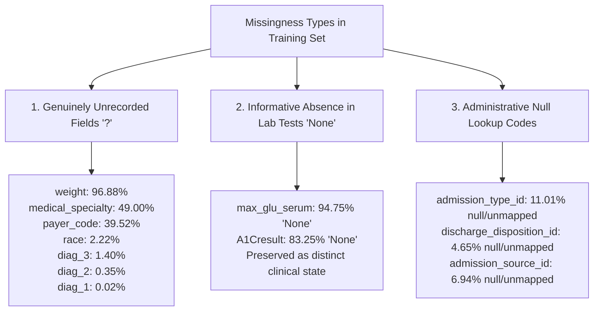

# Phase C3 — Exploratory Data Analysis: Missingness Structure Analysis (C3.2)

## 1. Missingness Paradigms

Following the Phase C1 data contract, missingness is analyzed strictly across three operational mechanisms on the training population ($N = 69,519$):

---

## 2. Quantitative Training Set Missingness Profile

| Feature Name | Column Type | Missing Code | Missing Count (Train) | Missingness % | Early Readmission Rate when Missing vs Present |
| :--- | :--- | :---: | :---: | :---: | :---: |
| `weight` | `object` | `'?'` | $67,351$ | **$96.88\%$** | Missing: $11.38\%$ vs Present: $11.75\%$ |
| `medical_specialty` | `object` | `'?'` | $34,064$ | **$49.00\%$** | Missing: $10.97\%$ vs Present: $11.79\%$ |
| `payer_code` | `object` | `'?'` | $27,476$ | **$39.52\%$** | Missing: $10.42\%$ vs Present: $12.02\%$ |
| `race` | `object` | `'?'` | $1,544$ | **$2.22\%$** | Missing: $9.33\%$ vs Present: $11.44\%$ |
| `diag_3` | `object` | `'?'` | $974$ | **$1.40\%$** | Missing: $7.70\%$ vs Present: $11.44\%$ |
| `diag_2` | `object` | `'?'` | $244$ | **$0.35\%$** | Missing: $6.15\%$ vs Present: $11.41\%$ |
| `diag_1` | `object` | `'?'` | $16$ | **$0.02\%$** | Missing: $6.25\%$ vs Present: $11.39\%$ |

---

## 3. Informative Absence in Glycemic Laboratory Tests

| Lab Feature | Category Value | Training Count | % of Train | Readmission Rate ($y=1$) | Clinical Significance |
| :--- | :---: | :---: | :---: | :---: | :--- |
| `A1Cresult` | `'None'` | $57,872$ | **$83.25\%$** | **$11.66\%$** | Unmeasured; standard baseline inpatient population. |
| | `'>8'` | $5,669$ | **$8.15\%$** | **$10.37\%$** | Poor chronic control; often triggers medication change. |
| | `'Norm'` | $3,391$ | **$4.88\%$** | **$9.61\%$** | Controlled glycemia; lowest readmission rate. |
| | `'>7'` | $2,587$ | **$3.72\%$** | **$10.51\%$** | Moderately elevated glycemia. |
| `max_glu_serum` | `'None'` | $65,868$ | **$94.75\%$** | **$11.33\%$** | Serum glucose test not ordered. |
| | `'Norm'` | $1,770$ | **$2.55\%$** | **$10.51\%$** | Normal serum glucose during stay. |
| | `'>200'` | $1,006$ | **$1.45\%$** | **$13.42\%$** | Elevated glucose; elevated acute readmission risk. |
| | `'>300'` | $875$ | **$1.26\%$** | **$14.86\%$** | Severe hyperglycemia; highest acute readmission risk. |

### Empirical Verification:
- Encounters with `max_glu_serum = '>300'` exhibit an early readmission rate of **$14.86\%$** versus **$11.33\%$** for `'None'` and **$10.51\%$** for `'Norm'`.
- This confirms that laboratory measurement absence is **Missing Not At Random (MNAR)** and contains predictive discriminative signal.

---

## 4. Policy Stance for Preprocessing

1. **Explicit Category Encoding**:
   - `'None'` in `A1Cresult` and `max_glu_serum` will be retained as an explicit categorical state.
2. **Missing Indicator Encoding for '?'**:
   - For `medical_specialty`, `payer_code`, and `race`, `'?'` will be represented as `"Unknown"`.
3. **Imputation Exclusion**:
   - No statistical imputation (mean/median/KNN) will be applied to informatively missing laboratory tests.
