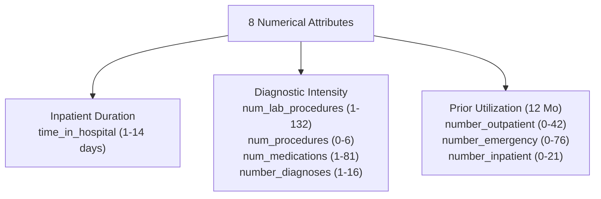

# Phase C3 — Exploratory Data Analysis: Numerical Feature Analysis (C3.3)

## 1. Overview of Numerical Features

The training population ($N = 69,519$) contains **8 numerical and count attributes**. All 8 features were analyzed to evaluate their distributional characteristics, skewness, zero-inflation, and separation between readmission classes.

---

## 2. Statistical Profiles on Training Cohort

| Feature Name | Mean $\pm$ Std | Median (IQR) | Min – Max | Skewness | Zero % | Positive Target Mean ($y=1$) | Negative Target Mean ($y=0$) | Target Association Trend |
| :--- | :---: | :---: | :---: | :---: | :---: | :---: | :---: | :--- |
| `time_in_hospital` | $4.40 \pm 2.98$ | $4.0$ ($2.0 - 6.0$) | $1 - 14$ | $+0.87$ | $0.0\%$ | **$4.76$** | $4.35$ | Longer stay increases readmission risk |
| `num_lab_procedures` | $43.12 \pm 19.66$ | $44.0$ ($31.0 - 57.0$) | $1 - 132$ | $-0.24$ | $0.0\%$ | **$44.40$** | $42.96$ | Weak positive risk association |
| `num_procedures` | $1.34 \pm 1.71$ | $1.0$ ($0.0 - 2.0$) | $0 - 6$ | $+1.04$ | $45.8\%$ | **$1.28$** | $1.35$ | Slight inverse association |
| `num_medications` | $16.03 \pm 8.12$ | $15.0$ ($10.0 - 20.0$) | $1 - 81$ | $+1.33$ | $0.0\%$ | **$16.78$** | $15.93$ | Polypharmacy increases risk |
| `number_outpatient` | $0.37 \pm 1.27$ | $0.0$ ($0.0 - 0.0$) | $0 - 42$ | $+8.83$ | **$83.7\%$** | **$0.47$** | $0.36$ | Heavily zero-inflated; positive risk |
| `number_emergency` | $0.20 \pm 0.94$ | $0.0$ ($0.0 - 0.0$) | $0 - 76$ | $+22.86$ | **$88.4\%$** | **$0.37$** | $0.18$ | Severe skew; $>2\times$ rate in readmitted |
| `number_inpatient` | $0.63 \pm 1.26$ | $0.0$ ($0.0 - 1.0$) | $0 - 21$ | $+3.64$ | **$66.9\%$** | **$1.01$** | $0.59$ | **Strongest predictor**: $>1.7\times$ in readmitted |
| `number_diagnoses` | $7.43 \pm 1.93$ | $8.0$ ($6.0 - 9.0$) | $1 - 16$ | $-0.87$ | $0.0\%$ | **$7.76$** | $7.38$ | Comorbidity burden elevates risk |

---

## 3. Distributional Findings & Transformation Justifications

1. **Prior Utilization Extreme Skewness**:
   - `number_emergency` (skew: $+22.86$), `number_outpatient` (skew: $+8.83$), and `number_inpatient` (skew: $+3.64$) are heavily zero-inflated.
   - **Recommended Representation**:
     - For linear models / neural networks: Apply $\log(1 + x)$ or standard robust scaling.
     - For tree ensembles (XGBoost / LightGBM / CatBoost): Raw counts preserve split fidelity without transformation.
2. **Clinical Intensity Variables**:
   - `num_medications` (max $81$) and `num_lab_procedures` (max $132$) have right-tailed extensions representing high-acuity cases.
   - Median values ($15$ medications, $44$ lab tests) indicate robust typical clinical intensity.
3. **Primary Signal Driver**:
   - `number_inpatient` shows the strongest separation: patients readmitted within 30 days had an average of **$1.01$ prior inpatient stays** in the preceding 12 months compared to **$0.59$** for non-readmitted patients.
