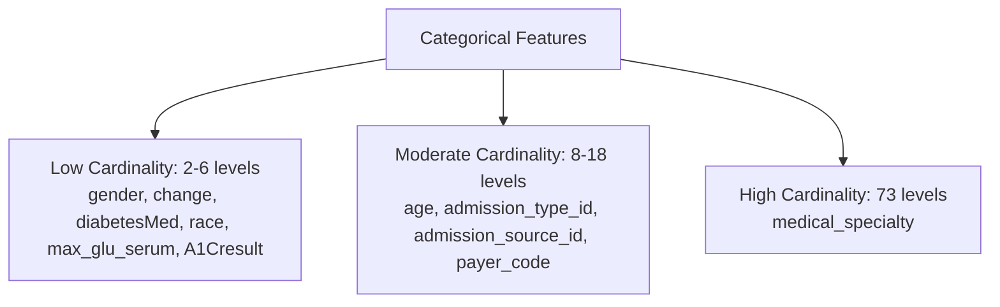

# Phase C3 — Exploratory Data Analysis: Categorical Feature Analysis (C3.4)

## 1. Overview & Cardinality Audit

The training cohort contains **11 core categorical attributes** (excluding diagnosis codes and individual medications, which are audited in dedicated subsequent sections).

---

## 2. Categorical Distribution & Target Prevalence on Train Cohort

| Feature Name | Cardinality | Dominant / Top Category | Top Category % | Readmission Rate by Category ($y=1$) | Cardinality Handling Strategy |
| :--- | :---: | :--- | :---: | :--- | :--- |
| `gender` | $3$ | Female ($37,344$) | $53.72\%$ | Female: $11.47\%$, Male: $11.30\%$, Unknown: $0.0\%$ ($3$ cases) | Binary / One-Hot Encoding |
| `age` | $10$ | `[70-80)` ($17,794$) | $25.59\%$ | Monotonically rises from $3.8\%$ (`[0-10)`) to $12.3\%$ (`[70-80)`) | Ordinal Integer or One-Hot |
| `race` | $6$ | Caucasian ($52,001$) | $74.80\%$ | Caucasian: $11.47\%$, AfricanAmerican: $11.66\%$, Hispanic: $10.42\%$, Asian: $8.95\%$, Other: $10.04\%$, `?`: $9.33\%$ | One-Hot Encoding |
| `change` | $2$ | `No` ($37,341$) | $53.71\%$ | `Ch` (Change): **$12.35\%$** vs `No`: **$10.55\%$** | Binary ($0/1$) Encoding |
| `diabetesMed` | $2$ | `Yes` ($53,522$) | $76.99\%$ | `Yes`: **$12.01\%$** vs `No`: **$9.30\%$** | Binary ($0/1$) Encoding |
| `admission_type_id` | $8$ | `1` (Emergency) ($36,881$) | $53.05\%$ | Emergency ($1$): $11.96\%$, Urgent ($2$): $11.23\%$, Elective ($3$): $9.77\%$ | Frequency / One-Hot Encoding |
| `admission_source_id`| $17$| `7` (Emergency Room) ($39,268$)| $56.49\%$ | ER ($7$): $11.97\%$, Physician Ref ($1$): $10.96\%$, Clinic Ref ($2$): $11.08\%$ | Top-$K$ / Frequency Encoding |
| `payer_code` | $18$ | `?` (Unrecorded) ($27,476$) | $39.52\%$ | `MC` (Medicare): $12.72\%$, `MD` (Medicaid): $11.47\%$, `?`: $10.42\%$, `SP`: $8.78\%$ | Top-8 + Other + Unknown |
| `medical_specialty` | $73$ | `?` (Unrecorded) ($34,064$) | $49.00\%$ | InternalMedicine: $12.38\%$, FamilyPractice: $12.06\%$, Cardiology: $10.94\%$, Surgery: $9.82\%$ | Top-10 + Other + Unknown |

---

## 3. High-Cardinality Management: `medical_specialty`

`medical_specialty` has 73 raw categories, with heavy concentration in a small number of specialties:
- **Top 5 Known Specialties**:
  1. `InternalMedicine`: $10,030$ ($14.43\%$)
  2. `Emergency/Trauma`: $5,248$ ($7.55\%$)
  3. `Family/GeneralPractice`: $5,043$ ($7.25\%$)
  4. `Cardiology`: $3,744$ ($5.39\%$)
  5. `Surgery-General`: $2,109$ ($3.03\%$)
- **Long Tail**: 50 specialties have fewer than $100$ encounters each.

### Policy Recommendation:
Apply **Top-10 + Other + Missing/Unknown grouping** or target encoding fitted strictly on training folds, rather than expanding to 73 sparse one-hot dummy columns.
