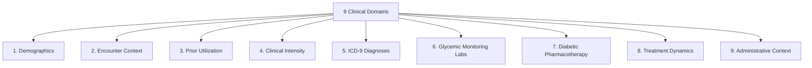

# Phase C3 — Exploratory Data Analysis: Clinical Feature Groups Analysis (C3.5)

## 1. Domain Group Architecture

The 47 predictive attributes and 1 target field are analyzed across the **9 clinical/operational domains** established during Phase C1:

---

## 2. Quantitative Domain Evaluation

| Domain | Attribute Count | Information Represented | Sparsity / Missingness | Target Association Strength | Recommended Preprocessing Representation |
| :--- | :---: | :--- | :---: | :---: | :--- |
| **1. Demographics** | $4$ | Age, gender, race, weight | Low (except weight: $96.9\%$) | Moderate (Age strongly stratified) | One-Hot for Race/Gender; Ordinal for Age; Drop Weight |
| **2. Encounter Context** | $3$ | Admission type, source, physician specialty | Moderate ($49\%$ in specialty) | Moderate | Top-$K$ One-Hot / Frequency Encoding |
| **3. Prior Utilization** | $3$ | 12-month historical inpatient, outpatient, ER visits | High zero-inflation ($67-88\%$) | **Very High** (`number_inpatient` strongest signal) | Log1p transform for linear/NN; Raw counts for Trees |
| **4. Clinical Intensity** | $4$ | Length of stay, total lab tests, procedures, meds | Zero missingness | **High** | Robust / Standard Scaling |
| **5. ICD-9 Diagnoses** | $3$ | Primary, secondary, tertiary discharge diagnoses | High cardinality ($>700$ codes each) | **High** | 9-Class ICD-9 Clinical Grouping |
| **6. Glycemic Labs** | $2$ | Point-of-care glucose and HbA1c test results | High `'None'` ($83-95\%$) | Moderate (Informative MNAR) | Discrete 4-State Categorical / Ordinal |
| **7. Pharmacotherapy** | $21$ | 21 active agents (excluding 2 zero-variance) | High sparsity on oral agents | Moderate | Ordinal ($0=\text{No}, 1=\text{Steady}, 2=\text{Up}, 3=\text{Down}$) |
| **8. Treatment Dynamics** | $2$ | Medication change indicator, diabetesMed indicator | Zero missingness | Moderate | Binary ($0/1$) Encoding |
| **9. Administrative** | $1$ | Insurance payer code | High missingness ($39.5\%$) | Low | Top-$8$ + Other + Unknown |

---

## 3. Cross-Domain Redundancy & Interaction Notes

1. **`diabetesMed` vs. Medication Features**:
   - `diabetesMed = 'No'` implies that all 21 medication columns are `'No'`.
   - `diabetesMed = 'Yes'` is an exact indicator that at least one diabetic medication was prescribed or administered.
2. **`change` vs. Medication Dosage Columns**:
   - `change = 'Ch'` indicates that at least one medication feature had an `'Up'` or `'Down'` state (or a new medication was introduced).
3. **Polypharmacy & Length of Stay**:
   - `num_medications` and `time_in_hospital` exhibit moderate positive correlation ($r \approx +0.46$), reflecting increased therapeutic complexity during prolonged admissions.
