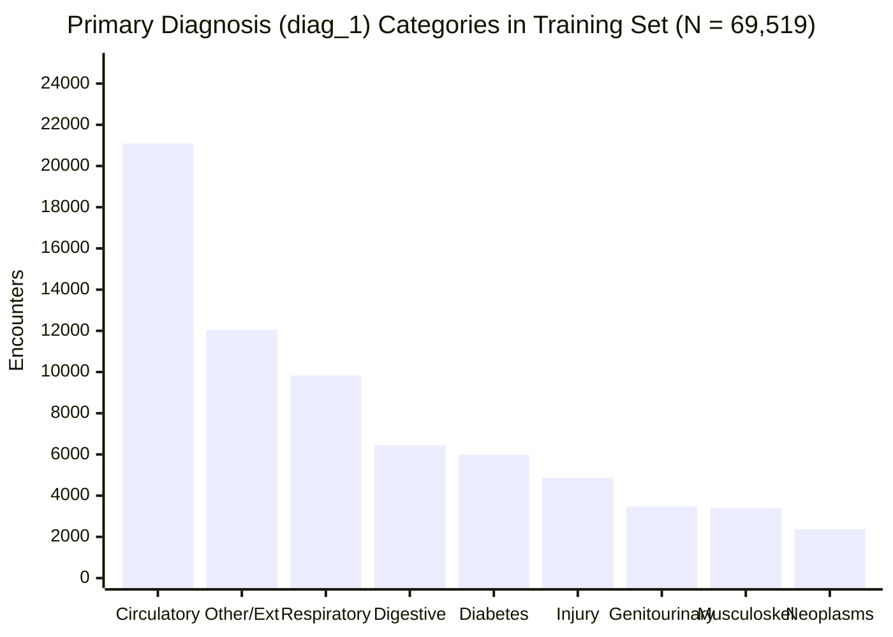

# Phase C3 — Exploratory Data Analysis: Diagnosis Representation Analysis (C3.6)

## 1. High-Cardinality ICD-9 Audit

The dataset records up to three diagnostic codes per encounter (`diag_1`, `diag_2`, `diag_3`). We explicitly distinguish between raw full-dataset cardinality and training-partition cardinality:

- **Raw / Full-Dataset Cardinality** (Eligible Cohort $N = 99,343$):
  - `diag_1` (Primary Admission Diagnosis): **$717$** distinct raw codes
  - `diag_2` (Secondary Diagnosis): **$749$** distinct raw codes
  - `diag_3` (Tertiary Diagnosis): **$790$** distinct raw codes
- **Training-Partition Cardinality** (Training Split $N = 69,519$):
  - `diag_1`: **$689$** distinct raw codes
  - `diag_2`: **$697$** distinct raw codes
  - `diag_3`: **$744$** distinct raw codes

---

## 2. ICD-9-CM Clinical Grouping Standard

In accordance with standard clinical informatics literature (*Strack et al., 2014*), raw ICD-9 codes are mapped into **9 clinically grounded disease chapters**:

| Disease Chapter | ICD-9 Code Range | Clinical Description | `diag_1` Count (%) | `diag_2` Count (%) | `diag_3` Count (%) |
| :--- | :--- | :--- | :---: | :---: | :---: |
| **Circulatory** | $390–459$, $785$ | Heart failure, CAD, hypertension, MI | $21,088$ ($30.3\%$) | $21,794$ ($31.3\%$) | $20,683$ ($29.7\%$) |
| **Respiratory** | $460–519$, $786$ | COPD, pneumonia, asthma, dyspnea | $9,831$ ($14.1\%$) | $7,403$ ($10.6\%$) | $4,984$ ($7.2\%$) |
| **Diabetes** | $250.xx$ | Diabetes mellitus with/without complications | $5,984$ ($8.6\%$) | $8,764$ ($12.6\%$) | $11,760$ ($16.9\%$) |
| **Digestive** | $520–579$, $787$ | GI hemorrhage, gastroenteritis, liver disease | $6,463$ ($9.3\%$) | $2,877$ ($4.1\%$) | $2,698$ ($3.9\%$) |
| **Injury / Poisoning** | $800–999$ | Fractures, trauma, drug poisoning | $4,866$ ($7.0\%$) | $1,671$ ($2.4\%$) | $1,327$ ($1.9\%$) |
| **Genitourinary** | $580–629$, $788$ | Acute/chronic kidney disease, UTI | $3,476$ ($5.0\%$) | $5,821$ ($8.4\%$) | $4,438$ ($6.4\%$) |
| **Musculoskeletal** | $710–739$ | Osteoarthritis, arthropathies | $3,406$ ($4.9\%$) | $1,250$ ($1.8\%$) | $1,330$ ($1.9\%$) |
| **Neoplasms** | $140–239$ | Malignant and benign neoplasms | $2,364$ ($3.4\%$) | $1,648$ ($2.4\%$) | $1,230$ ($1.8\%$) |
| **Other / Supplementary** | All other codes, $V/E$ codes, `?` | Endocrine (non-diabetes), skin, missing | $12,041$ ($17.4\%$) | $18,291$ ($26.3\%$) | $21,069$ ($30.3\%$) |

---

## 3. Position Overlap & Multi-Diagnosis Behavior

1. **Diabetes Position Drift**:
   - Only **$8.6\%$ of patients** have diabetes as their primary admitting diagnosis (`diag_1`).
   - However, diabetes appears in **$12.6\%$ of secondary (`diag_2`)** and **$16.9\%$ of tertiary (`diag_3`)** diagnoses.
   - Across all three fields, **$37.4\%$ of encounters** explicitly list an active `250.xx` diagnosis code.
2. **Cardiovascular Comorbidity Dominance**:
   - Circulatory diseases account for the largest single share across all three diagnosis positions ($\approx 30\%$).
3. **Representation Decision**:
   - Raw ICD-9 strings ($>700$ levels) will be mapped into the 9 clinical categories, which can then be cleanly one-hot encoded or frequency-encoded for downstream machine learning.
