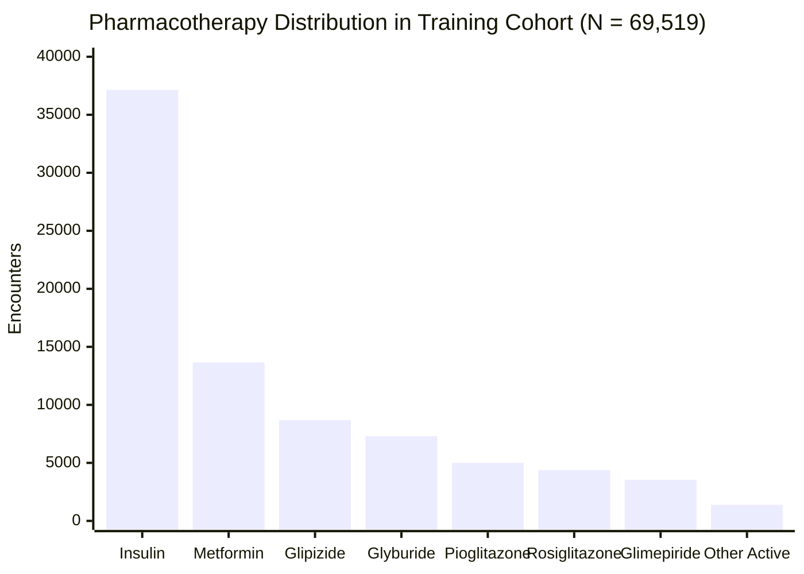

# Phase C3 — Exploratory Data Analysis: Medication & Treatment Representation (C3.7)

## 1. Medication Exposure Paradigm

The dataset contains **23 medication attributes audited** in total:
- **21 active medication features** evaluated for clinical exposure and predictive utility
- **2 zero-variance medication features** (`examide`, `citoglipton`) identified as constant ($100\%$ `'No'`) and excluded

Each active agent is encoded as a discrete 4-level exposure state:
- `No` ($0$): Not prescribed or administered during the encounter.
- `Steady` ($1$): Continued on an established, unchanged dosage.
- `Up` ($2$): Dosage titrated upwards during the hospital stay.
- `Down` ($3$): Dosage decreased during the hospital stay.

---

## 2. Quantitative Medication Exposure Table (Training Cohort)

| Medication Name | Drug Class | Prescribed % | `No` Count | `Steady` Count | `Up` Count | `Down` Count | Readmission Rate ($y=1$) |
| :--- | :--- | :---: | :---: | :---: | :---: | :---: | :---: |
| **`insulin`** | Exogenous Insulin | **$53.43\%$** | $32,377$ | $21,123$ | $7,725$ | $8,294$ | No: $10.02\%$, Steady: $11.75\%$, Up: $13.57\%$, Down: $13.91\%$ |
| **`metformin`** | Biguanide | **$19.64\%$** | $55,865$ | $12,652$ | $741$ | $261$ | Prescribed: $10.05\%$ vs No: $11.72\%$ |
| **`glipizide`** | 2nd-gen Sulfonylurea | **$12.50\%$** | $60,829$ | $7,764$ | $530$ | $396$ | Prescribed: $11.16\%$ vs No: $11.42\%$ |
| **`glyburide`** | 2nd-gen Sulfonylurea | **$10.50\%$** | $62,220$ | $6,375$ | $558$ | $366$ | Prescribed: $10.85\%$ vs No: $11.45\%$ |
| **`pioglitazone`** | Thiazolidinedione | **$7.20\%$** | $64,514$ | $4,749$ | $166$ | $90$ | Prescribed: $10.85\%$ vs No: $11.43\%$ |
| **`rosiglitazone`** | Thiazolidinedione | **$6.30\%$** | $65,140$ | $4,196$ | $124$ | $59$ | Prescribed: $10.94\%$ vs No: $11.42\%$ |
| **`glimepiride`** | 2nd-gen Sulfonylurea | **$5.10\%$** | $65,974$ | $3,212$ | $215$ | $118$ | Prescribed: $10.78\%$ vs No: $11.42\%$ |
| `repaglinide` | Meglitinide | $1.51\%$ | $68,467$ | $945$ | $76$ | $31$ | Prescribed: $13.27\%$ vs No: $11.36\%$ |
| `glyburide-metformin`| Combination Oral | $0.70\%$ | $69,033$ | $474$ | $7$ | $5$ | Prescribed: $9.88\%$ vs No: $11.40\%$ |
| `nateglinide` | Meglitinide | $0.69\%$ | $69,042$ | $453$ | $16$ | $8$ | Prescribed: $12.37\%$ vs No: $11.38\%$ |
| `acarbose` | $\alpha$-Glucosidase Inh. | $0.30\%$ | $69,308$ | $204$ | $5$ | $2$ | Prescribed: $8.53\%$ vs No: $11.40\%$ |
| `chlorpropamide` | 1st-gen Sulfonylurea | $0.09\%$ | $69,459$ | $55$ | $4$ | $1$ | Prescribed: $6.67\%$ vs No: $11.39\%$ |
| `tolbutamide` | 1st-gen Sulfonylurea | $0.02\%$ | $69,504$ | $15$ | $0$ | $0$ | Prescribed: $6.67\%$ vs No: $11.39\%$ |
| `tolazamide` | 1st-gen Sulfonylurea | $0.04\%$ | $69,493$ | $25$ | $1$ | $0$ | Prescribed: $11.54\%$ vs No: $11.39\%$ |
| `miglitol` | $\alpha$-Glucosidase Inh. | $0.04\%$ | $69,492$ | $22$ | $2$ | $3$ | Prescribed: $7.41\%$ vs No: $11.39\%$ |
| `glipizide-metformin`| Combination Oral | $0.01\%$ | $69,510$ | $9$ | $0$ | $0$ | Prescribed: $0.00\%$ ($9$ cases) |
| `troglitazone` | Thiazolidinedione | $0.004\%$ | $69,516$ | $3$ | $0$ | $0$ | Prescribed: $0.00\%$ ($3$ cases) |
| `acetohexamide` | 1st-gen Sulfonylurea | $0.001\%$ | $69,518$ | $1$ | $0$ | $0$ | Prescribed: $0.00\%$ ($1$ case) |
| `glimepiride-pioglitazone`| Combination Oral | $0.001\%$ | $69,518$ | $1$ | $0$ | $0$ | Prescribed: $0.00\%$ ($1$ case) |
| `metformin-rosiglitazone` | Combination Oral | $0.001\%$ | $69,518$ | $1$ | $0$ | $0$ | Prescribed: $0.00\%$ ($1$ case) |
| `metformin-pioglitazone` | Combination Oral | $0.001\%$ | $69,518$ | $1$ | $0$ | $0$ | Prescribed: $0.00\%$ ($1$ case) |
| **`examide`** | DPP-4 Candidate | **$0.00\%$** | $69,519$ | $0$ | $0$ | $0$ | **Zero Variance (100% 'No') — Excluded** |
| **`citoglipton`** | DPP-4 Candidate | **$0.00\%$** | $69,519$ | $0$ | $0$ | $0$ | **Zero Variance (100% 'No') — Excluded** |

---

## 3. Dosage Dynamics & Readmission Risk

1. **Insulin Titration Risk**:
   - Patients requiring insulin dosage increases (`Up`) or decreases (`Down`) have early readmission rates of **$13.57\%$** and **$13.91\%$**, respectively, compared to **$10.02\%$** for patients not prescribed insulin.
2. **Treatment Change Signal (`change`)**:
   - Encounters with any active medication alteration (`change = 'Ch'`) exhibit an early readmission rate of **$12.35\%$** versus **$10.55\%$** for encounters without medication modification (`change = 'No'`).
3. **Representation Decision**:
   - Encode 21 active medications as ordinal levels ($0, 1, 2, 3$) or compact one-hot representations.
   - Drop `examide` and `citoglipton`.
