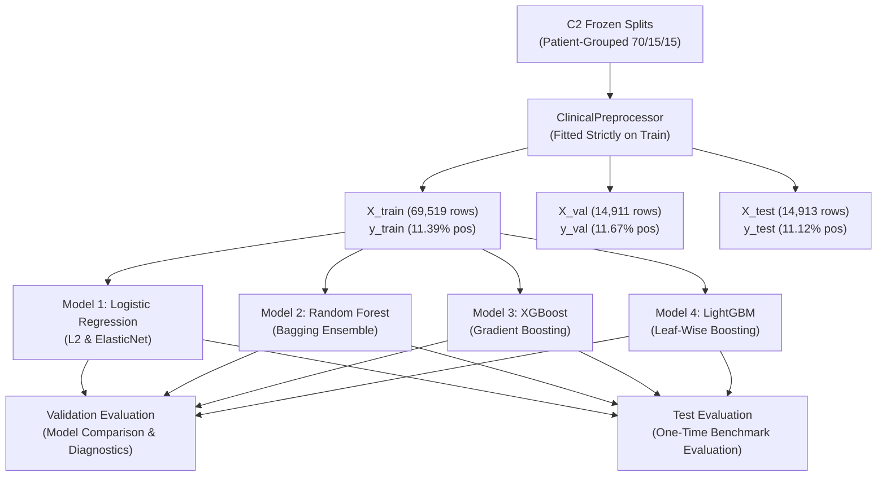

# Phase C4 — Baseline Modeling: Frozen Modeling Contract & Evaluation Protocol (C4.1)

## 1. Executive Summary & Objective

Phase C4 establishes the definitive baseline modeling framework for the Clinical Tabular Modality of **FusionMedAI**. The core scientific question addressed is:

> *How well can conventional machine learning architectures predict 30-day early diabetic readmission using strictly the clinical information available at the discharge-planning decision boundary?*

Phase C4 establishes clean, reproducible reference points across standard model families before aggressive architecture search or multimodal fusion.

---

## 2. Invariable Input Artifacts & Provenance

The modeling pipeline consumes the following frozen artifacts as immutable inputs:

| Input Artifact | Path | Exact Row / Dimension | Provenance / Role |
| :--- | :--- | :---: | :--- |
| **Training Split** | `datasets/clinical/processed/splits/train.csv` | $69,519$ encounters | Model fitting & transformer parameter estimation |
| **Validation Split** | `datasets/clinical/processed/splits/val.csv` | $14,911$ encounters | Baseline tuning, threshold evaluation, error analysis |
| **Test Split** | `datasets/clinical/processed/splits/test.csv` | $14,913$ encounters | Final unbiased benchmark evaluation |
| **Feature Contract** | `datasets/clinical/metadata/eda/reports/feature_representation_contract.json` | $47$ attributes | Authoritative encoding and transformation rules |

---

## 3. Strict Experimental Invariants & Anti-Leakage Rules

1. **Train-Only Estimator Fitting**:
   - Every preprocessor component (scalers, one-hot encoders, frequency vocabularies, imputers) must be **fitted strictly on `train.csv`**.
   - Validation and test sets are transformed using the already-fitted preprocessor instance.
2. **Deterministic Reproducibility**:
   - Random seed is locked to `42` across all models and data pipelines.
3. **Partition-Role Invariant (Validation Selection vs. Test Reporting)**:
   - **Validation Data**: Used exclusively for model comparison, diagnostic threshold sweeps, calibration inspection, and hyperparameter decisions.
   - **Test Data**: Strictly held out for final frozen benchmark evaluation.
   - **No Feedback Loop**: No test-derived statistic may influence model selection, feature engineering, preprocessing, threshold selection, or hyperparameter tuning.
4. **Identifier Exclusion**:
   - Identifiers `encounter_id` and `patient_nbr` are strictly omitted from the feature matrix $X$ and retained solely in prediction logs for traceability.

---

## 4. Class Imbalance & Evaluation Metric Architecture

The target outcome exhibits substantial class imbalance ($\approx 11.4\%$ positive prevalence, $1 : 7.8$ ratio). This imposes strict methodological requirements on performance evaluation:

> [!IMPORTANT]
> **Class Imbalance Evaluation Principles**:
> 1. **ROC-AUC alone is insufficient**: Large true-negative counts ($88.6\%$ majority class) can maintain high specificity and high ROC-AUC while obscuring substantial false-positive accumulation in rare-event clinical predictions.
> 2. **PR-AUC (Average Precision) is primary**: Evaluates precision-recall trade-offs specifically on the minority positive class ($y=1$).
> 3. **Overall Accuracy is uninformative**: Trivial majority-class prediction achieves $88.6\%$ accuracy with $0.0\%$ sensitivity and must **not** be used as an evaluation or selection metric.
> 4. **Prevalence-Dependent Operating Metrics**: Positive Predictive Value (PPV) and Negative Predictive Value (NPV) depend directly on baseline prevalence and must be evaluated alongside Sensitivity and Specificity across an explicit threshold grid.

### Three-Tier Metric Framework

### Tier 1: Probability-Independent Discrimination Metrics
- **ROC-AUC**: Area under the Receiver Operating Characteristic curve.
- **PR-AUC (Average Precision)**: Area under the Precision-Recall curve (primary ranking metric under class imbalance).

### Tier 2: Probability Calibration Metrics
- **Brier Score**: Mean squared error between predicted probabilities and binary outcomes:
  $$\text{Brier} = \frac{1}{N} \sum_{i=1}^N (p_i - y_i)^2$$
- **Log Loss (Cross-Entropy)**:
  $$\text{Log Loss} = -\frac{1}{N} \sum_{i=1}^N \left[ y_i \log p_i + (1 - y_i) \log(1 - p_i) \right]$$

### Tier 3: Threshold-Dependent Clinical Operating Metrics
Evaluated across decision thresholds $\theta \in \{0.10, 0.20, 0.30, 0.40, 0.50\}$:
- **Sensitivity (Recall / True Positive Rate)**: $\frac{TP}{TP + FN}$
- **Specificity (True Negative Rate)**: $\frac{TN}{TN + FP}$
- **PPV (Precision / Positive Predictive Value)**: $\frac{TP}{TP + FP}$
- **NPV (Negative Predictive Value)**: $\frac{TN}{TN + FN}$
- **$F_1$-Score**: $\frac{2 \cdot \text{PPV} \cdot \text{Sensitivity}}{\text{PPV} + \text{Sensitivity}}$
