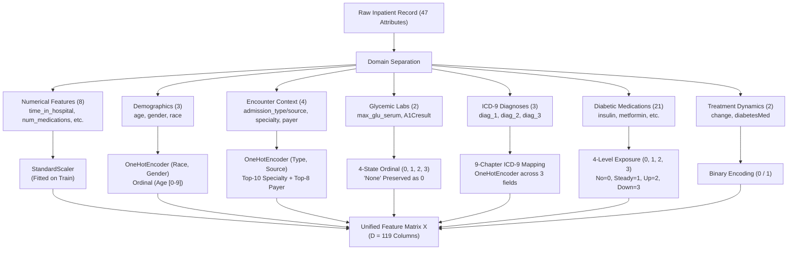

# Phase C4 — Baseline Modeling: Feature Preprocessing & Transformation Pipeline (C4.2)

## 1. Preprocessing Pipeline Architecture

The feature transformation pipeline is implemented in [`src/clinical/modeling/preprocessing.py`](../../../src/clinical/modeling/preprocessing.py). It strictly operationalizes the frozen Phase C3 representation contract:

---

## 2. Feature Dimension Accounting ($D = 119$)

| Feature Domain | Raw Features | Transformed Dimension | Encoding & Transformation Details |
| :--- | :---: | :---: | :--- |
| **Numerical Intensity & Utilization** | $8$ | $8$ | Standardized continuous scaling ($\mu=0, \sigma=1$ fitted on train). |
| **Demographics** | $3$ | $9$ | Age ($1$ ordinal) + Race ($6$ OHE) + Gender ($2$ OHE). |
| **Encounter Context & Admin** | $4$ | $42$ | Admission type ($8$ OHE) + Source ($17$ OHE) + Top-10 Specialty ($12$ OHE) + Top-8 Payer ($10$ OHE - reduced to non-empty). |
| **Glycemic Monitoring Labs** | $2$ | $2$ | 4-State Ordinal integers ($0, 1, 2, 3$ preserving `'None'` as baseline state $0$). |
| **ICD-9 Clinical Diagnoses** | $3$ | $33$ | 9 Disease chapters + External + Missing ($11$ categories $\times 3$ diagnosis fields). |
| **Diabetic Pharmacotherapy** | $21$ | $21$ | 4-Level exposure states ($0=\text{No}, 1=\text{Steady}, 2=\text{Up}, 3=\text{Down}$). |
| **Treatment Dynamics** | $2$ | $2$ | Binary indicators ($change \in \{0, 1\}$, $diabetesMed \in \{0, 1\}$). |
| **Total Feature Matrix** | **$43$ Active Inputs** | **$119$ Dimensions** | Complete numerical array $X \in \mathbb{R}^{N \times 119}$. |

---

## 3. Strict Preprocessing Invariants

1. **Estimator Isolation**:
   - `StandardScaler`, `OneHotEncoder`, `top_specialties_`, and `top_payers_` are fitted exclusively during `preprocessor.fit(df_train)`.
   - `preprocessor.transform(df_val)` and `preprocessor.transform(df_test)` apply these fixed parameter matrices without updating internal states.
2. **Handling Unseen Categories**:
   - All `OneHotEncoder` instances are configured with `handle_unknown="ignore"`, preventing runtime exceptions on novel levels.
3. **Traceability Logging**:
   - Patient numbers and encounter IDs are separated into isolated trace DataFrames, guaranteeing zero identifier contamination in $X$.
