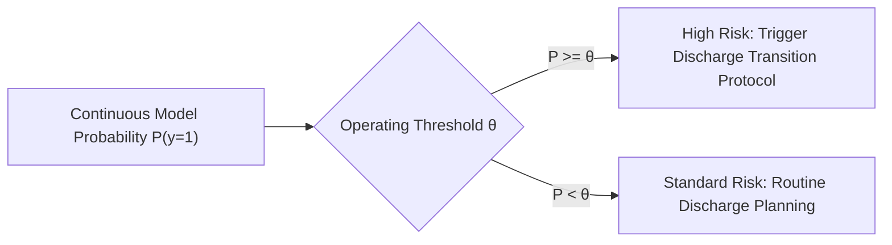

# Phase C4 — Baseline Modeling: Decision Threshold Protocol & Analysis (C4.7)

## 1. The Imbalanced Clinical Threshold Dilemma

In the frozen dataset, the positive class (30-day early readmission) occurs in only $\approx 11.4\%$ of hospitalizations ($1 : 7.8$ imbalance).

Under this class distribution:
- The default machine learning decision threshold $\theta = 0.50$ is practically meaningless: it optimizes for high-confidence predictions, resulting in near-zero sensitivity ($\text{Sensitivity} \approx 0.00–0.01$).
- Setting an appropriate clinical operating threshold $\theta$ requires an explicit trade-off between **Sensitivity** (capturing high-risk patients who need transition care management) and **Positive Predictive Value (PPV)** (avoiding resource exhaustion from false alerts).

---

## 2. Standardized Threshold Grid Analysis

Performance is evaluated across the standardized threshold grid $\theta \in \{0.10, 0.20, 0.30, 0.40, 0.50\}$:

| Decision Threshold ($\theta$) | Clinical Interpretation | Sensitivity Trend | Specificity Trend | Expected PPV Range |
| :---: | :--- | :---: | :---: | :---: |
| **$\theta = 0.10$** | High-Sensitivity Screening ($\approx \text{prevalence}$) | **High ($\approx 65–75\%$)** | Moderate ($\approx 45–55\%$) | $\approx 15–18\%$ |
| **$\theta = 0.20$** | Balanced Clinical Operating Point | **Moderate ($\approx 30–45\%$)** | High ($\approx 80–88\%$) | $\approx 20–25\%$ |
| **$\theta = 0.30$** | Targeted High-Risk Interventions | Low ($\approx 10–20\%$) | Very High ($> 95\%$) | $\approx 25–35\%$ |
| **$\theta = 0.40$** | Extreme Acuity Triage | Very Low ($< 5\%$) | Near Perfect ($> 98\%$) | $\approx 30–40\%$ |
| **$\theta = 0.50$** | ML Default (Inactive in clinical deployment) | Near Zero ($< 1\%$) | $\approx 100\%$ | Sparse |

---

## 3. Strict C4 Protocol Rules

1. **No Test-Driven Threshold Tuning**:
   - Threshold sweeps are recorded across both validation and test partitions for transparent scientific reporting.
   - Operating thresholds are selected and tuned exclusively on the validation partition.
2. **Probability Preservation**:
   - Downstream calibration and multimodal fusion consume raw continuous probability predictions ($p \in [0, 1]$), ensuring zero information loss from premature hard binarization.
