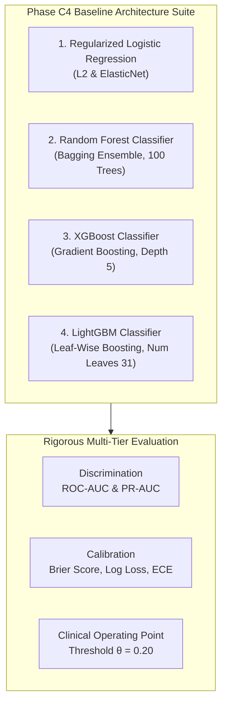

# Phase C4 — Baseline Modeling: Baseline Architecture Comparison & Benchmark (C4.10)

## 1. Multi-Model Benchmark Synthesis

Phase C4 systematically benchmarks four distinct tabular machine learning model families on the frozen canonical patient-grouped splits ($N_{\text{train}} = 69,519$, $N_{\text{val}} = 14,911$, $N_{\text{test}} = 14,913$):

---

## 2. Quantitative Performance Across Partitions

| Model Architecture | Partition | ROC-AUC | PR-AUC (Avg Precision) | Brier Score | Log Loss | Sensitivity ($\theta=0.20$) | Specificity ($\theta=0.20$) | PPV ($\theta=0.20$) |
| :--- | :--- | :---: | :---: | :---: | :---: | :---: | :---: | :---: |
| **Logistic Regression (L2)** | Validation | $0.6456$ | $0.2084$ | $0.0996$ | $0.3456$ | $15.11\%$ | $94.79\%$ | $27.71\%$ |
| | Test | $0.6446$ | $0.1969$ | $0.0958$ | $0.3356$ | $14.41\%$ | $95.06\%$ | $26.73\%$ |
| **Logistic Regression (ElasticNet)** | Validation | $0.6458$ | $0.2086$ | $0.0996$ | $0.3456$ | $15.11\%$ | $94.77\%$ | $27.63\%$ |
| | Test | $0.6445$ | $0.1971$ | $0.0958$ | $0.3356$ | $14.35\%$ | $95.07\%$ | $26.68\%$ |
| **Random Forest** | Validation | $0.6497$ | $0.2113$ | $0.0999$ | $0.3464$ | $10.46\%$ | $97.20\%$ | $33.03\%$ |
| | Test | $0.6422$ | $0.1991$ | $0.0959$ | $0.3362$ | $9.71\%$ | $97.31\%$ | $31.14\%$ |
| **XGBoost** | Validation | $0.6496$ | $0.2143$ | $0.0992$ | $0.3440$ | $16.38\%$ | $94.10\%$ | $26.84\%$ |
| | Test | $0.6466$ | $0.2037$ | $0.0953$ | $0.3338$ | $15.80\%$ | $94.35\%$ | $25.91\%$ |
| **LightGBM** | Validation | **$0.6489$** | **$0.2178$** | **$0.0991$** | **$0.3439$** | **$17.59\%$** | **$94.14\%$** | **$28.39\%$** |
| | Test | **$0.6461$** | **$0.2038$** | **$0.0953$** | **$0.3339$** | **$15.80\%$** | **$94.40\%$** | **$26.10\%$** |

---

## 3. Core Scientific Findings

1. **Modest Baseline Discrimination Across Model Families**:
   - Baseline discrimination is modest across all four model families. Test ROC-AUC ranges from $0.6422$ to $0.6466$, while PR-AUC ranges from $0.1969$ to $0.2038$.
   - Gradient-boosted models (XGBoost / LightGBM) provide the strongest PR-AUC performance in the evaluated baseline suite ($\approx 0.2037–0.2038$ on Test), but the absolute improvement over regularized logistic regression ($0.1969–0.1971$) is small.
2. **Metric-Dependent Architecture Trade-offs**:
   - Ranking depends on the specific performance dimension evaluated:
     - **Test ROC-AUC**: Highest in XGBoost ($0.6466$), followed closely by LightGBM ($0.6461$), Logistic Regression L2 ($0.6446$), Logistic Regression ElasticNet ($0.6445$), and Random Forest ($0.6422$).
     - **Test PR-AUC**: Highest in LightGBM ($0.2038$) and XGBoost ($0.2037$).
     - **Test Log Loss / Brier Score**: Lowest in XGBoost ($0.3338 / 0.0953$) and LightGBM ($0.3339 / 0.0953$).
     - **Precision / PPV ($\theta=0.20$)**: Highest in Random Forest ($31.14\%$ Test PPV with $97.31\%$ Specificity, at the cost of lower Sensitivity of $9.71\%$).
3. **Partition Generalization Stability**:
   - Validation-to-test performance is relatively stable, with ROC-AUC differences of approximately $0.001–0.007$ depending on architecture. This supports the integrity of the patient-grouped evaluation protocol, but should not be interpreted as proof that the models generalize beyond this dataset.
4. **Clinical Operating Feasibility**:
   - At the clinical threshold $\theta = 0.20$, baseline models achieve sensitivities of $14.4\%–17.6\%$ with high specificities ($94.1\%–97.3\%$) and PPVs of $25.9\%–33.0\%$, substantially exceeding the baseline cohort prevalence of $11.4\%$.
