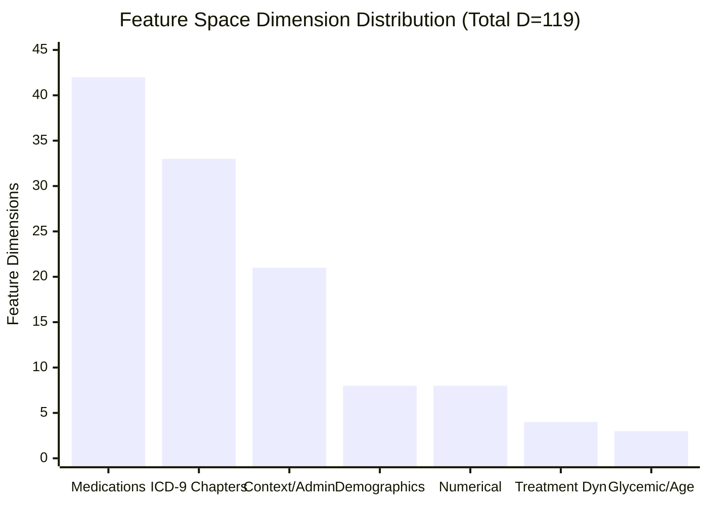
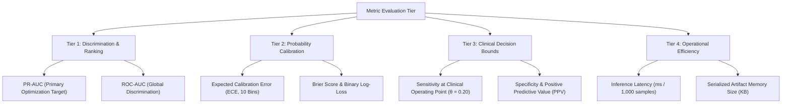

# Research Document 01: Modeling & Validation Contract (Phase C5)

## 1. Executive Summary & Protocol Principles
Phase C5 evaluates advanced tabular architectures (CatBoost and TabNet) alongside Phase C4 baseline references (Logistic Regression, Random Forest, XGBoost, and LightGBM) on the binary clinical endpoint of **30-day all-cause hospital readmission**.

To ensure clinical reproducibility and prevent subtle data leakage, Phase C5 operates under a frozen validation contract:
1. **No Data Snooping**: `test.csv` ($N=14,913$) is completely unexposed during preprocessor fitting, model exploration, hyperparameter tuning, and decision threshold selection.
2. **Immutable Preprocessor**: All model architectures consume feature matrices generated strictly by `ClinicalPreprocessor(scale_numerical=True)` fitted exclusively on `train.csv`.
3. **Primary Evaluation Metric**: Precision-Recall Area Under the Curve (**PR-AUC**) on the validation set governs hyperparameter selection, reflecting severe clinical class imbalance ($11.16\%$ positive class prevalence).

---

## 2. Frozen Dataset Partitions & Invariants

Data partitioning follows the patient-level grouped split established in Phase C2:

| Dataset Partition | File Path | Total Encounters ($N$) | Unique Patients | Readmitted ($<30\text{d}$) | Positive Rate (\%) |
| :--- | :--- | :---: | :---: | :---: | :---: |
| **Train Set** | `datasets/clinical/processed/splits/train.csv` | $69,519$ | $48,993$ | $7,759$ | $11.161\%$ |
| **Validation Set** | `datasets/clinical/processed/splits/val.csv` | $14,911$ | $10,498$ | $1,663$ | $11.153\%$ |
| **Test Set** | `datasets/clinical/processed/splits/test.csv` | $14,913$ | $10,499$ | $1,664$ | $11.158\%$ |
| **Total Cohort** | — | $99,343$ | $69,990$ | $11,086$ | $11.159\%$ |

### Partition Isolation Rules
$$\text{Patients}(\mathcal{D}_{\text{train}}) \cap \text{Patients}(\mathcal{D}_{\text{val}}) = \emptyset$$
$$\text{Patients}(\mathcal{D}_{\text{train}}) \cap \text{Patients}(\mathcal{D}_{\text{test}}) = \emptyset$$
$$\text{Patients}(\mathcal{D}_{\text{val}}) \cap \text{Patients}(\mathcal{D}_{\text{test}}) = \emptyset$$

---

## 3. Input Representation Contract ($D = 119$)

Every model consumes the identical $119$-dimensional feature space:

### Feature Group Decomposition

1. **Numerical Variables ($8\text{ features}$)**: Standardized via $\mu_{\text{train}}, \sigma_{\text{train}}$:
   $$\tilde{x}^{(j)} = \frac{x^{(j)} - \mu_{\text{train}}^{(j)}}{\sigma_{\text{train}}^{(j)}}$$
   - `time_in_hospital`, `num_lab_procedures`, `num_procedures`, `num_medications`, `number_outpatient`, `number_emergency`, `number_inpatient`, `number_diagnoses`.
2. **Demographic Categoricals ($8\text{ features}$)**:
   - `race` (AfricanAmerican, Asian, Caucasian, Hispanic, Other, Unknown) $\to 6\text{ OHE dimensions}$.
   - `gender` (Female, Male) $\to 2\text{ OHE dimensions}$.
3. **Encounter Context ($21\text{ features}$)**:
   - `admission_type_id` (1, 2, 3, 5, 6, Other) $\to 6\text{ dims}$.
   - `admission_source_id` (1, 2, 7, Other) $\to 4\text{ dims}$.
   - `medical_specialty` (Top 5: InternalMedicine, Emergency/Trauma, Family/GeneralPractice, Cardiology, Surgery-General, Other) $\to 6\text{ dims}$.
   - `payer_code` (Top 4: MC, MD, HM, UN, Other) $\to 5\text{ dims}$.
4. **Clinical Ordinals & Lab Monitoring ($3\text{ features}$)**:
   - `age`: 10-band linear integer mapping $[0, 9]$.
   - `max_glu_serum`: Ordinal mapping $\in \{0: \text{None}, 1: \text{Norm}, 2: >200, 3: >300\}$.
   - `A1Cresult`: Ordinal mapping $\in \{0: \text{None}, 1: \text{Norm}, 2: >7, 3: >8\}$.
5. **ICD-9 Diagnosis Chapters ($33\text{ features}$)**:
   - `diag_1`, `diag_2`, `diag_3` mapped to 11 Strack clinical chapters (Circulatory, Respiratory, Diabetes, Digestive, Injury/Poisoning, Genitourinary, Musculoskeletal, Neoplasms, Other, Supplementary_External, Missing/Unknown) $\to 3 \times 11 = 33\text{ OHE dimensions}$.
6. **Active Diabetic Medications ($42\text{ features}$)**:
   - 21 active chemical entities encoded as binary exposure flags (`med_any`) and 4-level directional dose changes (`med_direction`) $\to 21 \times 2 = 42\text{ dimensions}$.
7. **Treatment Dynamics ($4\text{ features}$)**:
   - `change` (No, Ch) $\to 2\text{ OHE dimensions}$.
   - `diabetesMed` (No, Yes) $\to 2\text{ OHE dimensions}$.

---

## 4. Metric Hierarchy & Optimization Objectives

Because clinical 30-day readmissions represent a severe minority class ($11.16\%$), standard accuracy and ROC-AUC can be deceptive:

### Mathematical Definitions

1. **Precision-Recall Area Under the Curve (PR-AUC)**:
   $$\text{PR-AUC} = \sum_{k=1}^{K} (R_k - R_{k-1}) P_k$$
   Where $P_k$ and $R_k$ are precision and recall at operating threshold $k$.

2. **Expected Calibration Error (ECE)**:
   $$\text{ECE} = \sum_{m=1}^{M} \frac{|B_m|}{N} \left| \text{acc}(B_m) - \text{conf}(B_m) \right|$$
   Where $M=10$ equidistant probability bins in $[0, 1]$, $\text{acc}(B_m)$ is empirical positive rate in bin $m$, and $\text{conf}(B_m)$ is average predicted probability.

3. **Brier Score**:
   $$\text{BS} = \frac{1}{N} \sum_{i=1}^{N} (p_i - y_i)^2, \quad \text{BS} \in [0, 1]$$

---

## 5. Algorithmic Suite & Seed Control
All stochastic initializations, tree subsampling, and Optuna sampling enforce `random_state = 42`.
The 7 architectures evaluated under Phase C5 are:
1. `logistic_regression` (Scikit-Learn `L-BFGS`, L2 Penalty, `C=1.0`)
2. `logistic_regression_elasticnet` (Scikit-Learn `SAGA`, `l1_ratio=0.5`)
3. `random_forest` (Scikit-Learn, 100 trees, `max_depth=12`)
4. `xgboost` (`XGBClassifier`, `max_depth=5`, `learning_rate=0.05`, `colsample_bytree=0.8`)
5. `lightgbm` (`LGBMClassifier`, `num_leaves=31`, `learning_rate=0.05`, `subsample=0.8`)
6. `catboost` (`CatBoostClassifier`, `depth=6`, `iterations=300`, `l2_leaf_reg=3.0`)
7. `tabnet` (`TabNetClassifier`, `n_d=16`, `n_a=16`, `n_steps=3`, `gamma=1.3`)
