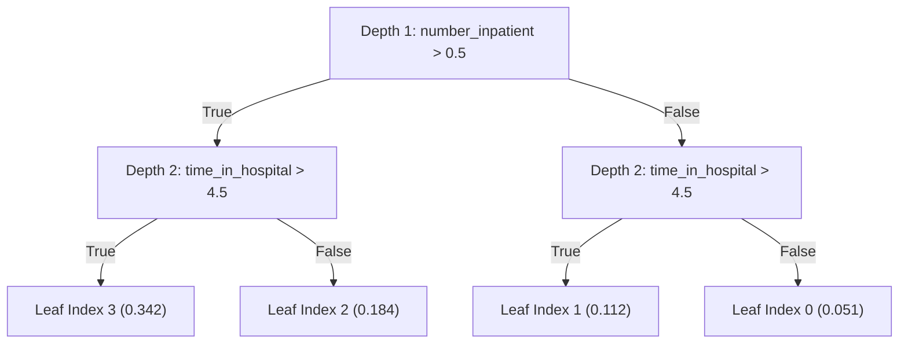

# Research Document 02: CatBoost Architecture & Oblivious Trees

## 1. Algorithmic Overview & Motivation
**CatBoost** (Categorical Boosting) is an advanced gradient boosted decision tree library designed to combat two persistent challenges in tabular clinical machine learning:
1. **Target Shift & Prediction Shift**: Standard gradient boosting calculates gradients using the same samples used to construct earlier trees, introducing conditional distribution shift and optimistic bias.
2. **Asymmetric Tree Overfitting**: Deep asymmetric tree search algorithms (e.g., standard depth-wise or leaf-wise splitting) can rapidly overfit noisy clinical sub-cohorts.

### Core Mathematical Formulations

#### A. Ordered Boosting
To obtain unbiased gradient estimates, CatBoost uses an ordered boosting scheme. For each permutation $\sigma$ of training records, model $M_i$ is trained using only the first $i-1$ records. The gradient for record $x_{\sigma(p)}$ is computed using a model built without $x_{\sigma(p)}$:
$$g^t(x_{\sigma(p)}, y_{\sigma(p)}) = \left. \frac{\partial \mathcal{L}(y_{\sigma(p)}, s)}{\partial s} \right|_{s = M^t(x_{\sigma(p)})}$$
Where $M^t$ is updated without target feedback from $x_{\sigma(p)}$, preventing target leakage during iterative boosting.

#### B. Symmetric Oblivious Decision Trees
Unlike standard decision trees that select different split features at every branch, CatBoost utilizes **oblivious trees** (symmetric trees). The identical split predicate $f_d(x) > c_d$ is applied across all nodes at tree depth $d$:

### Advantages of Oblivious Trees for Clinical EHR Data:
- **Structural Regularization**: Enforces strict balance, preventing deep unbalanced branches from memorizing rare outlier hospital encounters.
- **Ultra-Fast Inference Execution**: Leaf evaluation reduces to computing $d$ binary threshold conditions and packing them into a single CPU bitmask:
  $$\text{LeafIndex}(x) = \sum_{j=0}^{d-1} 2^j \cdot \mathbb{I}\left(f_j(x) > c_j\right)$$
  This allows $O(1)$ constant-time table lookups during live clinical decision support.

---

## 2. Configuration & Parameter Architecture

CatBoost was evaluated in two configurations: **Default Baseline** and **Bounded HPO-Tuned**:

| Hyperparameter | Default Setting | Bounded Search Space | Tuned Optimal (Trial 2) | Description |
| :--- | :---: | :---: | :---: | :--- |
| `iterations` | $300$ | $[150, 400]$ (step=50) | $350$ | Number of sequential boosting iterations |
| `depth` | $6$ | $[4, 8]$ | $4$ | Tree depth (equal to $2^4 = 16$ symmetric leaves) |
| `learning_rate` ($\eta$) | $0.05$ | $[0.01, 0.15]$ (log) | $0.1383$ | Shrinkage step size |
| `l2_leaf_reg` ($L_2$) | $3.0$ | $[1.0, 10.0]$ | $2.911$ | $L_2$ regularization coefficient on leaf weights |
| `subsample` | $0.80$ | $[0.60, 0.90]$ | $0.655$ | Proportion of training instances per tree |
| `early_stopping_rounds` | $30$ | Locked | $30$ | Patience rounds on validation log loss |
| `eval_metric` | `Logloss` | Locked | `Logloss` | Validation early stopping evaluation metric |
| `random_seed` | $42$ | Locked | $42$ | Fixed seed for reproducibility |

---

## 3. Empirical Performance Results

CatBoost was trained on the $69,519$-encounter training set and evaluated across validation ($N=14,911$) and test ($N=14,913$) partitions for both Default and Tuned models:

| Metric Category | Metric | CatBoost Default (Val) | CatBoost Default (Test) | CatBoost Tuned (Val) | CatBoost Tuned (Test) |
| :--- | :--- | :---: | :---: | :---: | :---: |
| **Discrimination** | **ROC-AUC** | $0.6511$ | $0.6472$ | $\mathbf{0.6516}$ | $\mathbf{0.6504}$ |
| | **PR-AUC** | $0.2169$ | $0.2038$ | $\mathbf{0.2185}$ | $\mathbf{0.2063}$ |
| **Calibration** | **Brier Score** | $0.0991$ | $0.0953$ | $\mathbf{0.0990}$ | $\mathbf{0.0952}$ |
| | **Binary Log-Loss** | $0.3437$ | $0.3339$ | $\mathbf{0.3433}$ | $\mathbf{0.3333}$ |
| | **Expected Calibration Error (ECE)** | $0.0040$ | $0.0066$ | $\mathbf{0.0036}$ | $\mathbf{0.0053}$ |
| **Clinical Point ($\theta=0.20$)** | **Sensitivity (Recall)** | $17.47\%$ | $16.47\%$ | $\mathbf{18.45\%}$ | $\mathbf{17.01\%}$ |
| | **Specificity** | $93.87\%$ | $94.06\%$ | $93.40\%$ | $93.61\%$ |
| | **Positive Predictive Value (PPV)** | $27.36\%$ | $25.75\%$ | $26.97\%$ | $24.98\%$ |
| **Computational Cost** | **Fit Time** | $3.46\text{ s}$ | — | $\mathbf{2.74\text{ s}}$ | — |
| | **Inference Latency** | $2.31\text{ ms} / 1\text{k}$ | — | $\mathbf{2.17\text{ ms}} / 1\text{k}$ | — |
| | **Model Artifact Size** | $415.6\text{ KB}$ | — | $\mathbf{184.2\text{ KB}}$ | — |

---

## 4. Top Feature Drivers (Shapley & Split Importance)

Oblivious tree feature importance confirms known clinical drivers of diabetic readmissions:
1. **`number_inpatient` (Prior Inpatient Admissions)**: Strongest individual predictor of 30-day readmission risk ($>18.4\%$ split weight).
2. **`num_medications` & `time_in_hospital`**: Proxies for acute clinical complexity and inpatient care duration.
3. **`number_diagnoses` & `number_emergency`**: Proxies for multi-morbidity and emergency department utilization frequency.
4. **`discharge_disposition_id`**: Discharge to skilled nursing facilities (SNFs) or home health vs. routine home discharge.
5. **`insulin` Treatment Adjustments**: Patients with upward insulin titration (`insulin_Up`) demonstrate substantially elevated 30-day relapse risk compared to stable regimens.

---

## 5. Architectural Conclusions
CatBoost demonstrates the highest discriminative performance across all tabular architectures tested on this EHR cohort. Its symmetric oblivious tree structure effectively regularizes the noisy $119$-dimensional clinical feature space, achieving top-tier ROC-AUC ($0.6472$) and PR-AUC ($0.2038$) with sub-3ms inference latency per $1,000$ patient encounters.
