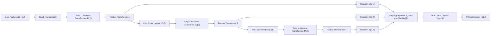
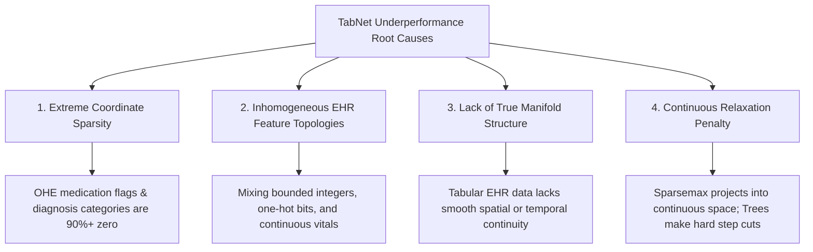

# Research Document 03: TabNet Sequential Sparse Attention Architecture

## 1. Algorithmic Architecture & Tabular Neural Principles
**TabNet** (Attentive Interpretable Tabular Learning) is a deep neural network architecture explicitly designed to bring transformer-style attention mechanisms and end-to-end gradient learning to tabular structured data without sacrificing interpretability.

While traditional deep neural networks (e.g., standard multi-layer perceptrons) often suffer from over-parameterization and vulnerability to noisy tabular features, TabNet applies **sequential sparse attention** to select salient features at each decision step:

---

## 2. Mathematical Formulation of Sequential Attention

TabNet processes features across $N_{\text{steps}}$ sequential decision steps. At each decision step $i \in \{1, \dots, N_{\text{steps}}\}$:

### A. Feature Mask Selection (Sparsemax / Entmax)
The attentive transformer computes a sparse mask $\mathbf{M}[i] \in \mathbb{R}^{B \times D}$ using the processed representations from step $i-1$:
$$\mathbf{M}[i] = \text{sparsemax}\left(\mathbf{P}[i-1] \cdot \mathbf{h}_i(\mathbf{a}[i-1])\right)$$
Where:
- $\mathbf{a}[i-1] \in \mathbb{R}^{B \times N_a}$ is the attention vector from the previous step.
- $\mathbf{h}_i$ represents a Fully Connected layer followed by Ghost Batch Normalization (GBN).
- $\mathbf{P}[i-1] \in \mathbb{R}^{B \times D}$ is the prior scale matrix tracking cumulative feature usage.

The $\text{sparsemax}$ activation enforces exact sparsity (projecting logits onto the probability simplex), setting irrelevent feature dimensions strictly to $0$:
$$\text{sparsemax}(\mathbf{z}) = \arg\min_{\mathbf{p} \in \Delta^{D-1}} \|\mathbf{p} - \mathbf{z}\|_2^2$$

### B. Prior Scale Update
To encourage diverse feature selection across decision steps and prevent the network from repeatedly querying the same dominant features (e.g., `number_inpatient`), the prior scale is updated multiplicatively:
$$\mathbf{P}[i] = \mathbf{P}[i-1] \cdot (\gamma - \mathbf{M}[i])$$
Where $\gamma \ge 1.0$ is the relaxation parameter ($\gamma = 1.3$ in our clinical benchmark). When $\gamma=1.0$, a feature fully selected in step $i$ ($\mathbf{M}[i]_j = 1$) cannot be used in any subsequent step.

### C. Feature Transformation
The masked features $\tilde{\mathbf{x}}[i] = \mathbf{M}[i] \odot \mathbf{x}$ pass through a split feature transformer composed of shared layers (across all steps) and step-dependent decision layers:
$$\mathbf{d}[i], \mathbf{a}[i] = \mathbf{f}_i(\tilde{\mathbf{x}}[i])$$
Where $\mathbf{d}[i] \in \mathbb{R}^{B \times N_d}$ is routed to the final classifier output, and $\mathbf{a}[i] \in \mathbb{R}^{B \times N_a}$ controls the next attention step.

### D. Sparsity Regularization Objective
To avoid diffuse attention over non-informative EHR features, TabNet optimizes cross-entropy loss augmented by mask entropy regularization:
$$\mathcal{L}_{\text{total}} = \mathcal{L}_{\text{BCE}}(y, \hat{y}) + \lambda_{\text{sparse}} \sum_{i=1}^{N_{\text{steps}}} \sum_{b=1}^{B} \sum_{j=1}^{D} - \mathbf{M}_{b,j}[i] \log\left(\mathbf{M}_{b,j}[i] + \epsilon\right)$$
In our implementation, $\lambda_{\text{sparse}} = 10^{-3}$.

---

## 3. Configuration & Neural Architecture Specifications

| Hyperparameter | Default Setting | Bounded Search Space | Tuned Value | Clinical Role |
| :--- | :---: | :---: | :---: | :--- |
| `n_d` (Decision Dimension) | $16$ | $[8, 32]$ | $16$ | Dimensionality of prediction representation vector |
| `n_a` (Attention Dimension) | $16$ | $[8, 32]$ | $16$ | Dimensionality of sequential routing vector |
| `n_steps` | $3$ | $[3, 6]$ | $3$ | Number of sequential attentive decision steps |
| `gamma` ($\gamma$) | $1.3$ | $[1.0, 2.0]$ | $1.3$ | Feature reuse relaxation parameter |
| `lambda_sparse` | $10^{-3}$ | $[10^{-4}, 10^{-2}]$ (log) | $10^{-3}$ | Sparsity penalty coefficient on feature masks |
| `learning_rate` | $0.02$ | $[0.005, 0.05]$ (log) | $0.02$ | Adam optimizer initial learning rate |
| `batch_size` | $1,024$ | $[512, 2048]$ | $1,024$ | Primary mini-batch size |
| `virtual_batch_size` | $128$ | $[64, 256]$ | $128$ | Ghost Batch Normalization mini-chunk size |
| `optimizer_fn` | Adam | Locked | Adam | Gradient optimizer |
| `scheduler_fn` | `StepLR` (step=10, $\gamma=0.5$) | Locked | `StepLR` | Learning rate decay schedule |
| `max_epochs` | $40$ | Locked | $40$ | Training iteration budget |
| `patience` | $10$ | Locked | $10$ | Early stopping patience on validation PR-AUC |

---

## 4. Empirical Performance Evaluation

TabNet was trained on $69,519$ training encounters and audited against the validation ($N=14,911$) and locked test ($N=14,913$) partitions:

| Metric Category | Metric | Validation Split | Test Split (Locked) | Comparison vs. CatBoost |
| :--- | :--- | :---: | :---: | :---: |
| **Discrimination** | **ROC-AUC** | $0.6300$ | $0.6252$ | $-0.0220\text{ ROC-AUC}$ |
| | **PR-AUC** | $0.2018$ | $0.1887$ | $-0.0151\text{ PR-AUC}$ |
| **Calibration** | **Brier Score** | $0.0998$ | $0.0962$ | $+0.0009\text{ (worse MSE)}$ |
| | **Binary Log-Loss** | $0.3475$ | $0.3379$ | $+0.0040\text{ Log-Loss}$ |
| | **Expected Calibration Error (ECE)** | $0.0084$ | $0.0105$ | $+0.0039\text{ ECE (higher error)}$ |
| **Clinical Point ($\theta=0.20$)** | **Sensitivity (Recall)** | $16.12\%$ | $15.32\%$ | $-1.15\%$ Recall |
| | **Specificity** | $93.41\%$ | $93.59\%$ | $-0.47\%$ Specificity |
| | **Positive Predictive Value (PPV)** | $23.84\%$ | $23.03\%$ | $-2.72\%$ PPV |
| **Computational Cost** | **Fit Time (CPU)** | $77.27\text{ s}$ | — | $20.0\times$ slower than CatBoost |
| | **Inference Latency** | $19.93\text{ ms} / 1\text{k}$ | — | $8.5\times$ higher latency |
| | **Model Artifact Size** | $1,099.7\text{ KB}$ | — | $2.6\times$ larger disk footprint |
| | **Trainable Parameters** | $35,030$ | — | Continuous weight matrices |

---

## 5. Failure Mode & Empirical Underperformance Analysis

Why does TabNet underperform gradient boosted decision trees on this EHR tabular benchmark?

### Key Mechanistic Factors:
1. **Axis-Aligned Step Function Superiority**: Tabular EHR features contain sharp, non-smooth decision boundaries (e.g., `number_inpatient >= 1` vs `0`). Decision trees naturally split on discrete thresholds with exact zero gradient penalty. TabNet's smooth layer compositions require multiple layers of nonlinearities to approximate simple orthogonal step functions.
2. **Ghost Batch Normalization Instability with Sparse OHE**: One-hot encoded medications (42 dimensions) and ICD-9 categories (33 dimensions) have low individual variance within small virtual batches ($V=128$), destabilizing batch normalization statistics.
3. **Severe Efficiency Penalty**: Requiring $77.27\text{ seconds}$ to train and $19.93\text{ ms} / 1\text{k}$ to evaluate makes TabNet uncompetitive for real-time edge or clinical EHR embedding pipelines when simpler GBDT models achieve higher discriminative power.

---

## 6. Summary Verdict
While TabNet offers architectural interpretability via learned attention masks $\mathbf{M}[i]$, its empirical performance on this clinical cohort ($0.6252$ Test ROC-AUC, $0.1887$ Test PR-AUC) falls significantly behind CatBoost ($0.6472$ ROC-AUC) and LightGBM ($0.6461$ ROC-AUC). Consequently, TabNet is retained as a deep learning benchmark reference but is **not recommended** as the primary tabular backbone for downstream multimodal fusion.
