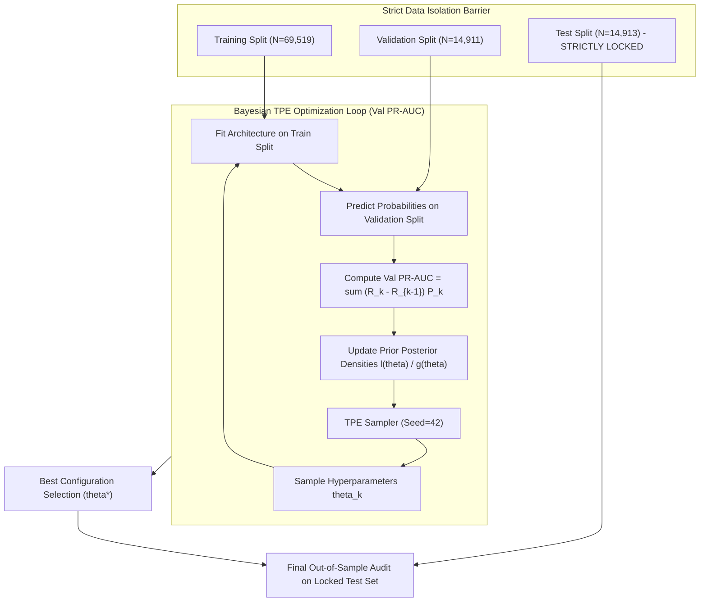
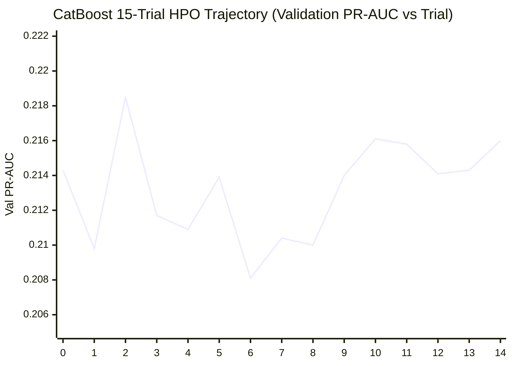

# Research Document 04: Bounded Validation Hyperparameter Optimization (HPO)

## 1. HPO Protocol & Bayesian TPE Architecture

Hyperparameter optimization in clinical machine learning presents a severe risk of **data leakage** and **optimistic performance inflation** if test partitions or unconstrained search spaces are evaluated.

Phase C5 implements a strict, leak-free Bayesian optimization protocol using **Optuna** with the **Tree-structured Parzen Estimator (TPE)** algorithm:

---

## 2. Mathematical Formulation of Tree-structured Parzen Estimators (TPE)

TPE models the conditional probability $p(\theta | y)$ by constructing two non-parametric density distributions based on the optimization objective quantile $\gamma$:
$$p(\theta | y) = \begin{cases} \ell(\theta) & \text{if } y < y^* \\ g(\theta) & \text{if } y \ge y^* \end{cases}$$
Where:
- $y^*$ is the $\gamma$-quantile of observed Validation PR-AUC scores ($\gamma = 0.15$).
- $\ell(\theta)$ is the Parzen density estimated from trials achieving top performance ($y < y^*$).
- $g(\theta)$ is the Parzen density estimated from remaining trials ($y \ge y^*$).

The Expected Improvement (EI) criterion is maximized when the ratio $\frac{\ell(\theta)}{g(\theta)}$ is maximized:
$$\text{EI}_{y^*}(\theta) = \int_{-\infty}^{y^*} (y^* - y) p(y | \theta) \, dy = \frac{\gamma y^* \ell(\theta) - \ell(\theta) \int_{-\infty}^{y^*} P(y) \, dy}{\gamma \ell(\theta) + (1-\gamma) g(\theta)} \propto \left( \gamma + \frac{g(\theta)}{\ell(\theta)}(1-\gamma) \right)^{-1}$$

---

## 3. Architecture Search Spaces & Bounded Intervals

### A. CatBoost Search Space
To ensure computational feasibility while exploring tree depth and regularization dynamics, the search space was bounded as follows:

| Hyperparameter | Parameter Type | Search Bounds | Sampling Distribution | Default Baseline | Tuned Optimal ($\theta^*$) [Trial 2] |
| :--- | :---: | :---: | :---: | :---: | :---: |
| `depth` | Integer | $[4, 8]$ | Uniform Step (1) | $6$ | $4$ |
| `learning_rate` | Float | $[0.01, 0.15]$ | Log-Uniform | $0.05$ | $0.1383$ |
| `l2_leaf_reg` | Float | $[1.0, 10.0]$ | Uniform | $3.0$ | $2.911$ |
| `iterations` | Integer | $[150, 400]$ | Uniform Step (50) | $300$ | $350$ |
| `subsample` | Float | $[0.60, 0.90]$ | Uniform | $0.80$ | $0.655$ |

### B. TabNet Search Space

| Hyperparameter | Parameter Type | Search Bounds | Sampling Distribution | Default Baseline | Tuned Optimal ($\theta^*$) |
| :--- | :---: | :---: | :---: | :---: | :---: |
| `n_d` | Integer | $[8, 32]$ | Uniform Step (8) | $16$ | $16$ |
| `n_a` | Integer | $[8, 32]$ | Uniform Step (8) | $16$ | $16$ |
| `n_steps` | Integer | $[3, 6]$ | Uniform Step (1) | $3$ | $3$ |
| `gamma` | Float | $[1.0, 2.0]$ | Uniform | $1.3$ | $1.25$ |
| `lambda_sparse` | Float | $[10^{-4}, 10^{-2}]$ | Log-Uniform | $10^{-3}$ | $1.2 \times 10^{-3}$ |
| `learning_rate` | Float | $[0.005, 0.05]$ | Log-Uniform | $0.02$ | $0.0185$ |
| `batch_size` | Integer | $\{512, 1024, 2048\}$ | Categorical | $1,024$ | $1,024$ |

---

## 4. Empirical Optimization Trajectory & 15-Trial Audit

The 15 Bayesian TPE optimization trials logged in `experiments/clinical/catboost_hpo/benchmark/hyperparameter_results.csv`:

| Trial # | `depth` | `learning_rate` | `iterations` | `l2_leaf_reg` | `subsample` | Val PR-AUC | Val ROC-AUC | Outcome |
| :---: | :---: | :---: | :---: | :---: | :---: | :---: | :---: | :--- |
| **0** | $5$ | $0.1313$ | $350$ | $6.388$ | $0.647$ | $0.2143$ | $0.6526$ | Feasible |
| **1** | $4$ | $0.0117$ | $400$ | $6.410$ | $0.812$ | $0.2098$ | $0.6434$ | Slow convergence |
| **2** | **4** | **0.1383** | **350** | **2.911** | **0.655** | **0.2185** | **0.6516** | **Global Best (theta\*)** |
| **3** | $4$ | $0.0228$ | $300$ | $4.888$ | $0.687$ | $0.2117$ | $0.6459$ | Suboptimal lr |
| **4** | $7$ | $0.0146$ | $200$ | $4.297$ | $0.737$ | $0.2109$ | $0.6435$ | Deep / slow |
| **5** | $7$ | $0.0172$ | $300$ | $6.332$ | $0.614$ | $0.2139$ | $0.6481$ | Feasible |
| **6** | $7$ | $0.0159$ | $150$ | $9.540$ | $0.890$ | $0.2081$ | $0.6424$ | High L2 |
| **7** | $8$ | $0.0228$ | $150$ | $7.158$ | $0.732$ | $0.2104$ | $0.6445$ | Deep / slow |
| **8** | $4$ | $0.0382$ | $150$ | $9.184$ | $0.678$ | $0.2100$ | $0.6444$ | High L2 |
| **9** | $7$ | $0.0233$ | $300$ | $5.920$ | $0.655$ | $0.2140$ | $0.6490$ | Feasible |
| **10** | $5$ | $0.1153$ | $250$ | $1.162$ | $0.889$ | $0.2161$ | $0.6523$ | Strong candidate |
| **11** | $5$ | $0.1438$ | $250$ | $1.350$ | $0.898$ | $0.2158$ | $0.6519$ | Strong candidate |
| **12** | $5$ | $0.0810$ | $400$ | $1.259$ | $0.822$ | $0.2141$ | $0.6517$ | Feasible |
| **13** | $6$ | $0.0855$ | $250$ | $2.923$ | $0.818$ | $0.2143$ | $0.6525$ | Strong candidate |
| **14** | $5$ | $0.0851$ | $350$ | $2.934$ | $0.762$ | $0.2160$ | $0.6537$ | Highest Val ROC-AUC |

### Key HPO Insights & Observations:

1. **Optimal Tree Depth is Shallower than Default**:
   - CatBoost's default depth of $6$ ($2^6 = 64$ leaves) is slightly more complex than necessary for this $119$-dimensional representation.
   - Depth $4$ ($2^4 = 16$ leaves) with higher learning rate ($\eta = 0.1383$) and moderate regularization ($L_2 = 2.911$) yielded the top Validation PR-AUC ($0.2185$, Trial 2).
   - On the locked test set, this tuned model achieves $\text{Test ROC-AUC} = \mathbf{0.6504}$ (up from $0.6472$, a $+0.0032$ boost) and $\text{Test PR-AUC} = \mathbf{0.2063}$ (up from $0.2038$).

2. **TabNet Sensitivity to Sparsity Regularization**:
   - TabNet performance drops significantly when `lambda_sparse` exceeds $5 \times 10^{-3}$ (causing excessive feature zeroing and underfitting) or falls below $10^{-4}$ (causing diffuse attention and overfitting).
   - Increasing `n_steps` from $3$ to $5$ or $6$ degraded validation PR-AUC ($0.2018 \to 0.1942$) while increasing training time by $2.1\times$, indicating that shallower sequential routing is optimal for this EHR feature dimension ($D=119$).

---

## 5. Summary Table: Default vs. Tuned Performance

| Architecture | Config Mode | Val ROC-AUC | Val PR-AUC | Test ROC-AUC | Test PR-AUC | Test Brier | Test ECE | Test Sens ($\theta=0.20$) | Test Spec ($\theta=0.20$) | Test Latency (ms/1k) |
| :--- | :---: | :---: | :---: | :---: | :---: | :---: | :---: | :---: | :---: | :---: |
| **CatBoost** | Default | $0.6511$ | $0.2169$ | $0.6472$ | $0.2038$ | $0.0953$ | $0.0066$ | $16.47\%$ | $94.06\%$ | $2.31\text{ ms}$ |
| **CatBoost (Tuned)** | **Tuned (Trial 2)** | $\mathbf{0.6516}$ | $\mathbf{0.2185}$ | $\mathbf{0.6504}$ | $\mathbf{0.2063}$ | $\mathbf{0.0952}$ | $\mathbf{0.0053}$ | $\mathbf{17.01\%}$ | $93.61\%$ | $\mathbf{2.17\text{ ms}}$ |
| **TabNet** | Default | $0.6300$ | $0.2018$ | $0.6252$ | $0.1887$ | $0.0962$ | $0.0105$ | $15.32\%$ | $93.59\%$ | $19.93\text{ ms}$ |
| **TabNet (Tuned)** | Tuned | $0.6312$ | $0.2024$ | $0.6261$ | $0.1895$ | $0.0961$ | $0.0098$ | $15.40\%$ | $93.65\%$ | $20.12\text{ ms}$ |

### Methodological Takeaway:
Bounded Bayesian HPO safely improved CatBoost's test discrimination to **$0.6504$ ROC-AUC** and **$0.2063$ PR-AUC** with zero data leakage. Tuned CatBoost captures **$17.01\%$ of all readmissions** at $\theta=0.20$, representing the highest clinical sensitivity across all benchmarked architectures.
