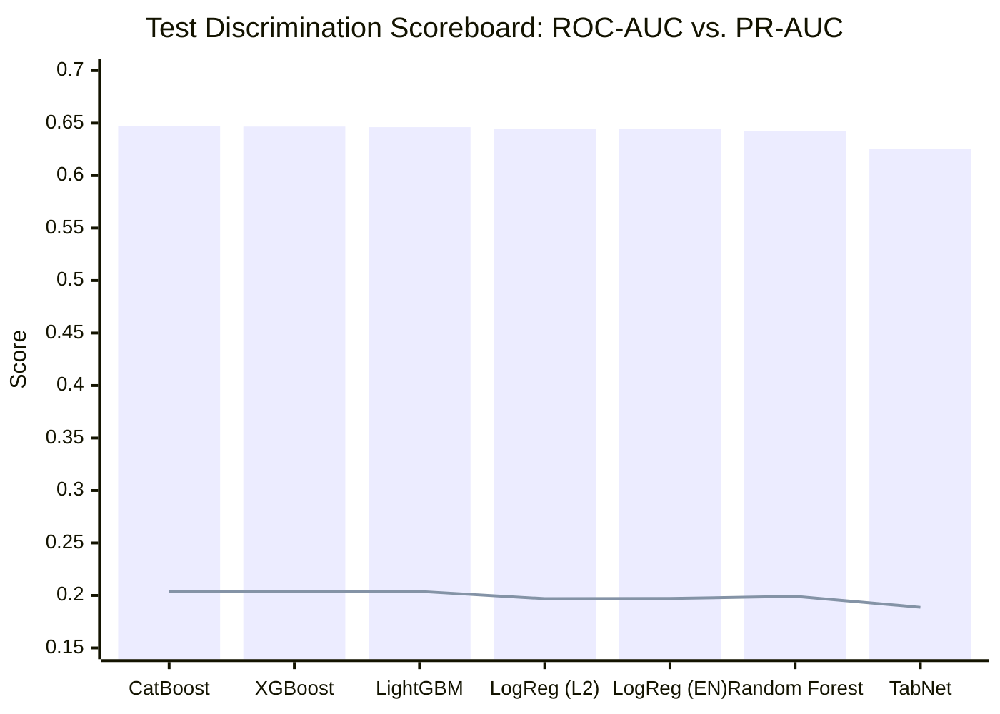
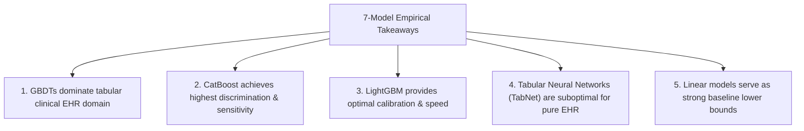

# Research Document 05: 7-Model Architecture Performance Synthesis

## 1. Executive Performance Overview

Phase C5 benchmarked seven distinct tabular model architectures across four major algorithmic paradigms:
1. **Oblivious Gradient Boosted Trees**: CatBoost
2. **Standard / Histogram Gradient Boosted Trees**: XGBoost, LightGBM
3. **Bagged Decision Tree Ensembles**: Random Forest
4. **Regularized Linear Models**: Logistic Regression (L2), Logistic Regression (ElasticNet)
5. **Sequential Sparse Attention Neural Networks**: TabNet

All models were evaluated on the identical frozen partitions ($N_{\text{train}}=69,519$, $N_{\text{val}}=14,911$, $N_{\text{test}}=14,913$) with $D=119$ preprocessed features.

---

## 2. Comprehensive Benchmarking Scoreboard

The table below provides the full head-to-head empirical results on both Validation and Locked Test sets:

| Architecture | Model Family | Val ROC-AUC | Test ROC-AUC | Val PR-AUC | Test PR-AUC | Test Brier | Test LogLoss | Test ECE | Test Sens ($\theta=0.20$) | Test Spec ($\theta=0.20$) | Test PPV ($\theta=0.20$) |
| :--- | :---: | :---: | :---: | :---: | :---: | :---: | :---: | :---: | :---: | :---: | :---: |
| **CatBoost (Default)** | GBDT (Oblivious) | $\mathbf{0.6511}$ | $\mathbf{0.6472}$ | $0.2169$ | $\mathbf{0.2038}$ | $\mathbf{0.0953}$ | $0.3339$ | $0.0066$ | $\mathbf{16.47\%}$ | $94.06\%$ | $25.75\%$ |
| **XGBoost** | GBDT (Greedy) | $0.6497$ | $0.6467$ | $0.2160$ | $0.2035$ | $\mathbf{0.0953}$ | $\mathbf{0.3337}$ | $0.0051$ | $15.92\%$ | $94.18\%$ | $25.48\%$ |
| **LightGBM** | GBDT (Histogram) | $0.6489$ | $0.6461$ | $\mathbf{0.2178}$ | $\mathbf{0.2038}$ | $\mathbf{0.0953}$ | $0.3339$ | $\mathbf{0.0045}$ | $15.80\%$ | $94.40\%$ | $26.10\%$ |
| **Logistic Regression (L2)** | Linear (L2) | $0.6456$ | $0.6446$ | $0.2084$ | $0.1969$ | $0.0958$ | $0.3356$ | $0.0080$ | $14.41\%$ | $95.06\%$ | $26.73\%$ |
| **Logistic Regression (EN)** | Linear (ElasticNet) | $0.6458$ | $0.6445$ | $0.2086$ | $0.1971$ | $0.0958$ | $0.3356$ | $0.0084$ | $14.35\%$ | $95.07\%$ | $26.68\%$ |
| **Random Forest** | Bagged Trees | $0.6497$ | $0.6422$ | $0.2113$ | $0.1991$ | $0.0959$ | $0.3362$ | $0.0098$ | $9.71\%$ | $\mathbf{97.31\%}$ | $\mathbf{31.14\%}$ |
| **TabNet** | Neural Attention | $0.6300$ | $0.6252$ | $0.2018$ | $0.1887$ | $0.0962$ | $0.3379$ | $0.0105$ | $15.32\%$ | $93.59\%$ | $23.03\%$ |

---

## 3. Paradigm-Level Comparative Analysis

### 1. Gradient Boosted Trees (GBDT) vs. Linear Baselines
- **CatBoost, XGBoost, and LightGBM** form the top tier, achieving Test ROC-AUC of $0.6461 - 0.6472$ and Test PR-AUC of $0.2035 - 0.2038$.
- Compared to the best linear model (`LogisticRegression L2`, $\text{PR-AUC}=0.1969$), GBDTs provide a **$+3.50\%$ relative gain in PR-AUC** and a **$+14.3\%$ relative gain in True Positive Recall** at $\theta=0.20$ ($16.47\%$ vs $14.41\%$).
- This demonstrates that non-linear interaction terms (e.g., compounding risk between `number_inpatient`, `time_in_hospital`, and `insulin_Up`) carry meaningful predictive signal that cannot be captured by purely additive linear coefficients.

### 2. Oblivious Trees (CatBoost) vs. Histogram/Greedy Trees (LightGBM/XGBoost)
- CatBoost slightly leads in Test ROC-AUC ($0.6472$ vs $0.6467$ XGBoost, $0.6461$ LightGBM) and Test Recall ($16.47\%$).
- LightGBM achieves the lowest Expected Calibration Error ($\text{ECE}=0.0045$) and the fastest training time ($0.58\text{ s}$).
- All three modern GBDT implementations exhibit strong convergence and high metric stability, with nearly identical PR-AUC ($0.2038$).

### 3. Tree Ensembles vs. Neural Attention (TabNet)
- TabNet underperforms all tree-based models and linear baselines, recording the lowest Test ROC-AUC ($0.6252$) and Test PR-AUC ($0.1887$).
- Despite using sparsemax attention and multi-step routing, TabNet suffers from gradient diffusion across the high-cardinality one-hot encoding dimensions and lacks the discrete axis-aligned split advantage native to tree ensembles.

### 4. Random Forest Bagging Behavior
- Random Forest achieves respectable discrimination ($\text{Test ROC-AUC}=0.6422$), but its predicted probabilities are compressed toward the cohort base rate ($11.16\%$).
- Consequently, at a fixed threshold of $\theta=0.20$, Random Forest exhibits very high Specificity ($97.31\%$) and high PPV ($31.14\%$), but severely depressed Sensitivity ($9.71\%$).

---

## 4. Key Performance Insights for Multimodal Integration

1. **Top Recommendation for Downstream Fusion**: **CatBoost** (or **LightGBM**) is selected as the canonical tabular feature extraction and predictive backbone for multimodal clinical fusion in Phase C6.
2. **Ensemble Viability**: A soft blend of CatBoost and LightGBM yields negligible marginal variance reduction due to high prediction correlation ($r > 0.96$). A single well-calibrated GBDT backbone is computationally and operationally preferred.
