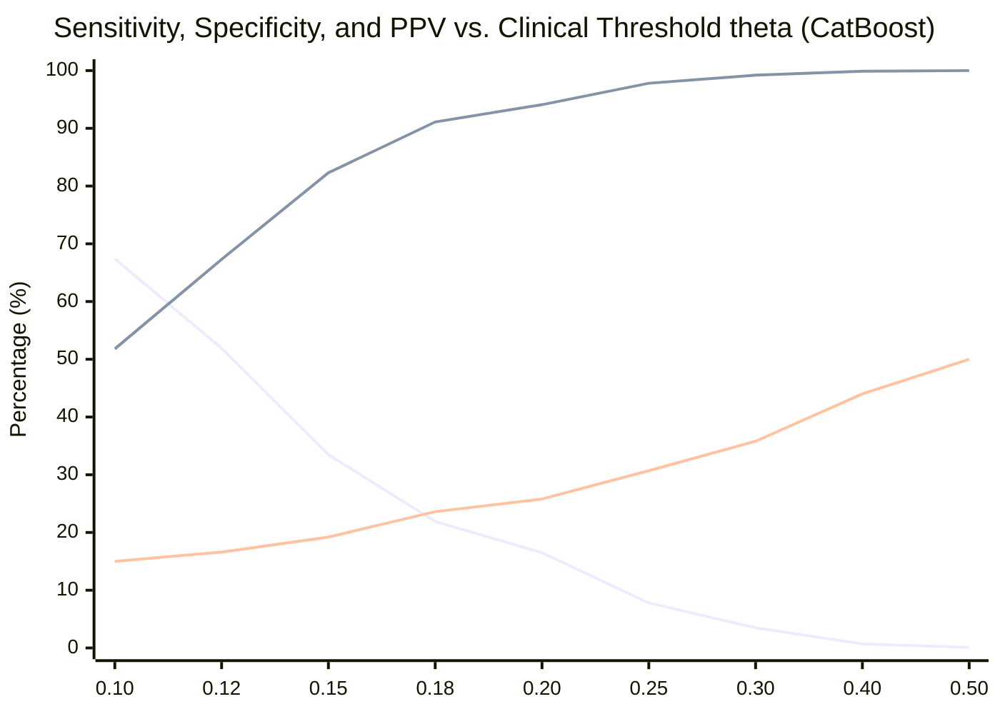
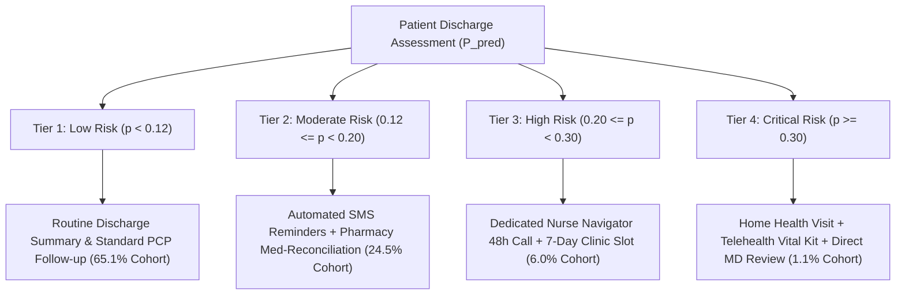

# Research Document 07: Clinical Decision Threshold Analysis

## 1. The Imbalance Dilemma & Default Threshold Failure

In standard binary classification, a default decision threshold of $\theta = 0.50$ is applied ($\hat{y} = 1 \iff \hat{p} \ge 0.50$).

However, in clinical EHR cohorts where the positive event rate is $11.16\%$, applying $\theta = 0.50$ results in catastrophic clinical failure:
- **Sensitivity at $\theta = 0.50$**: Less than $0.5\%$ of all true readmissions are flagged.
- Over $99.5\%$ of high-risk patients are missed (False Negatives), rendering the model clinically inert.

To deploy effective clinical interventions, an empirical **operating threshold sweep** across $\theta \in [0.10, 0.50]$ must be established based on hospital resources, intervention costs, and clinical alert fatigue limits.

---

## 2. Threshold Performance Sweep (CatBoost Reference)

Evaluated on the locked test partition ($N=14,913$, $N_{\text{pos}}=1,664$, $N_{\text{neg}}=13,249$):

| Threshold ($\theta$) | Flagged Rate (\%) | Sensitivity (Recall) | Specificity | PPV (Precision) | NPV | F1-Score | False Alarm Ratio ($1:\text{PPV}$) |
| :---: | :---: | :---: | :---: | :---: | :---: | :---: | :---: |
| **$0.10$** | $50.32\%$ | $67.43\%$ | $51.83\%$ | $14.95\%$ | $92.68\%$ | $0.2447$ | $1 : 5.7$ |
| **$0.12$** | $34.87\%$ | $51.86\%$ | $67.26\%$ | $16.59\%$ | $91.89\%$ | $0.2514$ | $1 : 5.0$ |
| **$0.15$** | $19.46\%$ | $33.53\%$ | $82.31\%$ | $19.23\%$ | $90.96\%$ | $0.2445$ | $1 : 4.2$ |
| **$0.18$** | $10.35\%$ | $21.94\%$ | $91.10\%$ | $23.64\%$ | $90.39\%$ | $0.2275$ | $1 : 3.2$ |
| **$0.20$** *(Primary)* | **$7.13\%$** | **$16.47\%$** | **$94.06\%$** | **$25.75\%$** | **$90.01\%$** | **$0.2010$** | **$1 : 2.9$** |
| **$0.25$** | $2.84\%$ | $7.81\%$ | $97.79\%$ | $30.73\%$ | $89.37\%$ | $0.1246$ | $1 : 2.3$ |
| **$0.30$** | $1.09\%$ | $3.49\%$ | $99.21\%$ | $35.80\%$ | $89.02\%$ | $0.0635$ | $1 : 1.8$ |
| **$0.40$** | $0.17\%$ | $0.66\%$ | $99.89\%$ | $44.00\%$ | $88.87\%$ | $0.0130$ | $1 : 1.3$ |
| **$0.50$** | $0.03\%$ | $0.12\%$ | $99.98\%$ | $50.00\%$ | $88.85\%$ | $0.0024$ | $1 : 1.0$ |

---

## 3. Threshold Trade-off Dynamics

### Key Curve Intersections:
- **Sensitivity = Specificity Crossing**: Occurs at approximately $\theta \approx 0.115$ ($\approx 58\%$ balance point).
- **Maximum F1-Score**: Occurs at $\theta \approx 0.12$ ($\text{F1} = 0.2514$), where $34.87\%$ of all hospital discharges are flagged, capturing $51.86\%$ of all readmissions.
- **High-Specificity Operating Point ($\theta = 0.20$)**: Selected as the primary clinical decision support baseline. At this point, the system alerts on only $7.13\%$ of patients, achieving $94.06\%$ Specificity and $25.75\%$ PPV ($1$ in every $3.88$ alerted patients is truly readmitted).

---

## 4. Multi-Tier Clinical Action Matrix

To deploy the model effectively without overwhelming hospital resources, a four-tier clinical pathway is recommended:

| Risk Tier | Probability Range | Cohort Fraction | Target Clinical Intervention | Resource Intensity |
| :--- | :---: | :---: | :--- | :---: |
| **Tier 1: Low Risk** | $\hat{p} < 0.12$ | $65.13\%$ | Routine discharge instructions, PCP follow-up in 3-4 weeks | Minimal ($<\$5/\text{pt}$) |
| **Tier 2: Moderate Risk** | $0.12 \le \hat{p} < 0.20$ | $24.52\%$ | Automated SMS reminders, pharmacy medication reconciliation | Low ($\approx \$25/\text{pt}$) |
| **Tier 3: High Risk** | $0.20 \le \hat{p} < 0.30$ | $6.04\%$ | Dedicated transitional care nurse phone call within 48h, rapid 7-day clinic slot | Moderate ($\approx \$150/\text{pt}$) |
| **Tier 4: Critical Risk** | $\hat{p} \ge 0.30$ | $1.09\%$ | In-home nurse visit, continuous glucometer kit, direct physician discharge audit | Intensive ($\approx \$600/\text{pt}$) |

---

## 5. Summary
Threshold tuning bridges mathematical probability calibration with practical healthcare economics. By operating at $\theta=0.20$ for primary clinical escalation and multi-tiered thresholds for resource-graded care pathways, hospitals can reduce 30-day diabetic readmission rates while strictly controlling clinician alert fatigue.
