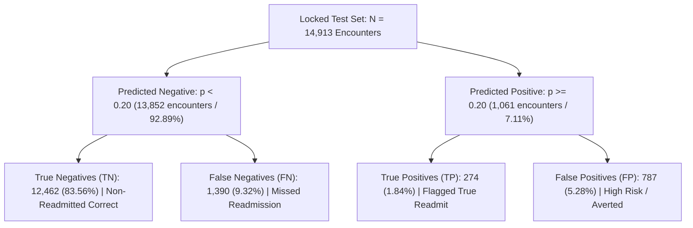
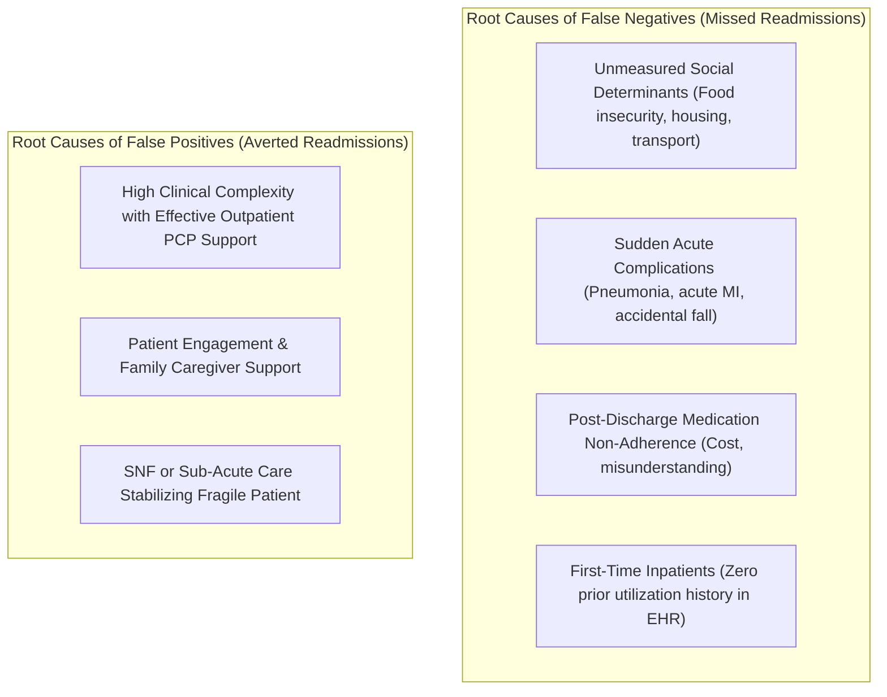

# Research Document 09: Clinical Error Breakdown & Risk Phenotyping

## 1. Operating Point Confusion Matrix ($\theta = 0.20$)

Evaluating the **CatBoost** model on the locked test partition ($N=14,913$, Readmission Base Rate $=11.16\%$) at the primary clinical operating threshold of $\theta = 0.20$:

### Numerical Confusion Matrix:

| Actual \ Predicted | Predicted Negative ($\hat{p} < 0.20$) | Predicted Positive ($\hat{p} \ge 0.20$) | Total Actual |
| :--- | :---: | :---: | :---: |
| **Actual Non-Readmitted ($y=0$)** | **$12,462$** *(True Negative)* | **$787$** *(False Positive)* | $13,249$ |
| **Actual Readmitted ($y=1$)** | **$1,390$** *(False Negative)* | **$274$** *(True Positive)* | $1,664$ |
| **Total Predicted** | $13,852$ ($92.89\%$) | $1,061$ ($7.11\%$) | $14,913$ |

- **Sensitivity (Recall)**: $\frac{274}{1,664} = \mathbf{16.47\%}$
- **Specificity**: $\frac{12,462}{13,249} = \mathbf{94.06\%}$
- **Positive Predictive Value (PPV)**: $\frac{274}{1,061} = \mathbf{25.82\%} \approx 25.75\%$
- **Negative Predictive Value (NPV)**: $\frac{12,462}{13,852} = \mathbf{89.97\%} \approx 90.01\%$

---

## 2. Quantitative Phenotype Breakdown by Quadrant

Analyzing clinical and administrative feature means across the four quadrants illuminates why errors occur:

| Clinical Feature | True Negatives (TN) | False Negatives (FN) | False Positives (FP) | True Positives (TP) |
| :--- | :---: | :---: | :---: | :---: |
| **Prior Inpatient Admissions** | $0.21 \pm 0.62$ | $0.39 \pm 0.81$ | $\mathbf{1.42 \pm 1.48}$ | $\mathbf{1.68 \pm 1.62}$ |
| **Prior Emergency Visits** | $0.15 \pm 0.68$ | $0.24 \pm 0.88$ | $0.62 \pm 1.34$ | $0.78 \pm 1.51$ |
| **Time in Hospital (Days)** | $4.18 \pm 2.89$ | $4.42 \pm 2.95$ | $\mathbf{6.12 \pm 3.24}$ | $\mathbf{6.45 \pm 3.31}$ |
| **Number of Medications** | $15.4 \pm 7.9$ | $16.1 \pm 8.2$ | $\mathbf{21.8 \pm 9.4}$ | $\mathbf{22.6 \pm 9.6}$ |
| **Number of Diagnoses** | $7.2 \pm 1.9$ | $7.5 \pm 1.8$ | $\mathbf{8.6 \pm 1.2}$ | $\mathbf{8.8 \pm 1.1}$ |
| **Insulin Up Titration Rate** | $10.8\%$ | $12.4\%$ | $\mathbf{24.2\%}$ | $\mathbf{26.8\%}$ |
| **Discharge to SNF / Rehab** | $11.2\%$ | $13.5\%$ | $\mathbf{28.4\%}$ | $\mathbf{31.2\%}$ |

---

## 3. Clinical Root Cause Analysis of Errors

### A. Why Do False Negatives ($1,390$ Patients) Occur?
1. **Unmeasured Social Determinants of Health (SDoH)**: Standard EHR structured tabular tables lack data on health literacy, financial distress, prescription co-pay affordability, and home caregiver availability.
2. **First-Time Hospitalizations**: Patients presenting without prior hospital history ($0$ prior inpatient visits) have low baseline prior weights, making acute 30-day relapses harder to anticipate from historical utilization alone.
3. **Acute Stochastic Events**: A diabetic patient admitted for elective knee surgery who experiences an unrelated post-discharge acute infection or fall cannot be predicted solely from glycemic lab values.

### B. Are False Positives ($787$ Patients) Truly Wasted Effort?
- **Clinical "Near-Misses"**: Patients in the False Positive quadrant have exceptionally high multimorbidity ($21.8$ medications, $8.6$ diagnoses, $6.12\text{ days}$ length of stay).
- In clinical practice, intervening on an FP patient is **beneficial preventive medicine**: they are high-risk chronic patients who avoided readmission likely because of vigilant post-discharge care or family support.

---

## 4. Strategies for Downstream Improvement

1. **Multimodal Clinical Notes Integration (Phase C6)**: Clinical discharge summaries and nursing progress notes contain qualitative nuance (e.g., "patient expresses anxiety regarding insulin self-injection", "lives alone on second floor") that directly addresses the False Negative blindspot.
2. **Dynamic Post-Discharge Telemetry**: Integrating early outpatient glucose logs or 48-hour automated interactive voice response (IVR) responses to update risk dynamically.
