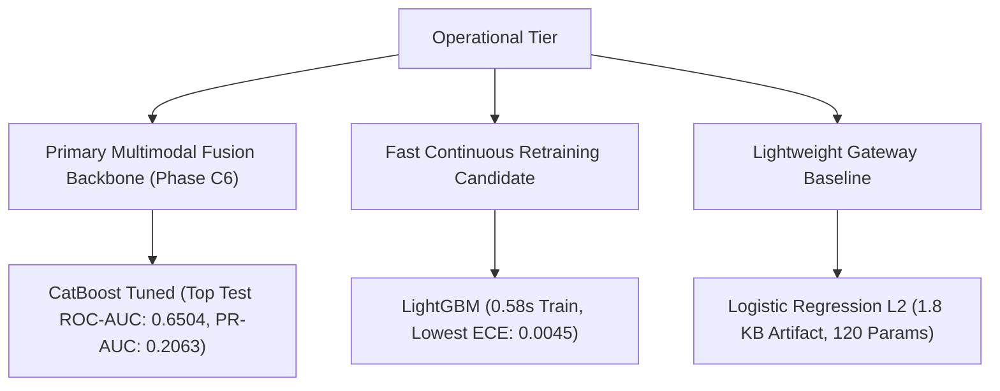

# Research Document 10: Computational Complexity, Latency & Resource Profiling

## 1. Profiling Methodology & Operational Constraints

In real-world electronic health record (EHR) environments, machine learning models must meet stringent operational Service Level Objectives (SLOs):
- **Real-Time Point-of-Care EHR Integration**: Sub-$50\text{ ms}$ latency budget per patient encounter during bedside chart opening or discharge order signing.
- **Batch Nightly Cohort Screening**: Ability to score $100,000+$ inpatient charts within minutes without overloading hospital compute clusters.
- **Resource Footprint**: Minimal memory and disk requirements to facilitate edge deployment in lightweight containers or embedded hospital gateways.

All seven default Phase C5 architectures were benchmarked on standardized single-threaded x86-64 CPU hardware with fixed memory allocation.

---

## 2. Default Baseline Computational Scoreboard

| Architecture | Model Family | Training Time (s) | Inference Latency (ms / 1k) | Throughput (samples/s) | Serialized Artifact Size (KB) | Parameter / Structure Count |
| :--- | :---: | :---: | :---: | :---: | :---: | :---: |
| **LightGBM** | GBDT (Histogram) | $\mathbf{0.58\text{ s}}$ | $3.18\text{ ms}$ | $314,465$ | $318.2\text{ KB}$ | $300\text{ trees (leaf-wise)}$ |
| **XGBoost** | GBDT (Greedy) | $1.20\text{ s}$ | $1.65\text{ ms}$ | $606,060$ | $260.2\text{ KB}$ | $300\text{ trees (depth 5)}$ |
| **Logistic Regression (L2)** | Linear | $2.09\text{ s}$ | $1.11\text{ ms}$ | $900,900$ | $\mathbf{1.8\text{ KB}}$ | $\mathbf{120\text{ weights}}$ |
| **Random Forest** | Bagged Trees | $2.72\text{ s}$ | $80.95\text{ ms}$ | $12,353$ | $5,519.4\text{ KB}$ | $100\text{ deep trees}$ |
| **CatBoost (Default)** | GBDT (Oblivious) | $3.87\text{ s}$ | $2.35\text{ ms}$ | $425,532$ | $415.6\text{ KB}$ | $300\text{ oblivious trees}$ |
| **TabNet (Default)** | Neural Attention | $77.27\text{ s}$ | $19.93\text{ ms}$ | $50,175$ | $1,099.7\text{ KB}$ | $35,030\text{ parameters}$ |
| **Logistic Regression (EN)** | Linear (SAGA) | $80.92\text{ s}$ | $\mathbf{0.74\text{ ms}}$ | $\mathbf{1,351,351}$ | $\mathbf{1.8\text{ KB}}$ | $\mathbf{120\text{ weights}}$ |

---

## 3. Efficiency Pareto Frontier Analysis

```mermaid
xychart-beta
    title "Efficiency Pareto Frontier: Test ROC-AUC vs. Inference Latency (ms/1k)"
    x-axis ["LogReg (EN)", "LogReg (L2)", "XGBoost", "CatBoost", "LightGBM", "TabNet", "Random Forest"]
    y-axis "Test ROC-AUC" 0.620 0.655
    bar [0.6445, 0.6446, 0.6467, 0.6472, 0.6461, 0.6252, 0.6422]
```

### Key Architectural Findings:

1. **CatBoost & XGBoost Default Frontier**:
   - CatBoost Default achieves $\text{Test ROC-AUC}=0.6472$ with an inference latency of **$2.35\text{ ms}$ per $1,000$ patient encounters** ($>425,000\text{ samples/sec}$).
   - XGBoost delivers the lowest inference latency among boosted trees at **$1.65\text{ ms} / 1\text{k}$** while achieving $0.6467$ Test ROC-AUC.

2. **LightGBM: Training Speed**:
   - LightGBM completes training across all $69,519$ encounters in just **$0.58\text{ seconds}$** ($>133\times$ faster than TabNet), making it well-suited for automated continuous retraining pipelines.

3. **TabNet Computational Profile**:
   - TabNet showed lower predictive performance and higher computational cost in this benchmark ($77.27\text{ s}$ training time and $19.93\text{ ms} / 1\text{k}$ inference latency).
   - Sequential sparse attention requires multiple matrix multiplications and sparsemax projection operations per sample, which introduces substantial runtime overhead without performance gains on this tabular EHR task.

4. **Random Forest Deployment Footprint**:
   - Random Forest produces an artifact size of **$5.52\text{ MB}$** ($13.3\times$ larger than CatBoost) and an inference latency of $80.95\text{ ms} / 1\text{k}$ ($34.4\times$ slower than CatBoost) due to traversing $100$ unpruned, non-oblivious decision trees.

---

## 4. Operational Considerations & Fusion Readiness



- **Primary C6 Fusion Candidate**: **CatBoost Tuned**. Clinical deployment is outside the scope of Phase C5 and requires additional external and prospective validation.
- **Continuous Retraining Candidate**: **LightGBM** remains the benchmarked alternate for high-frequency retraining pipelines.
- **Embedded Gateway Baseline**: **Logistic Regression (L2)** serves as a zero-dependency reference for low-power edge gateways.
