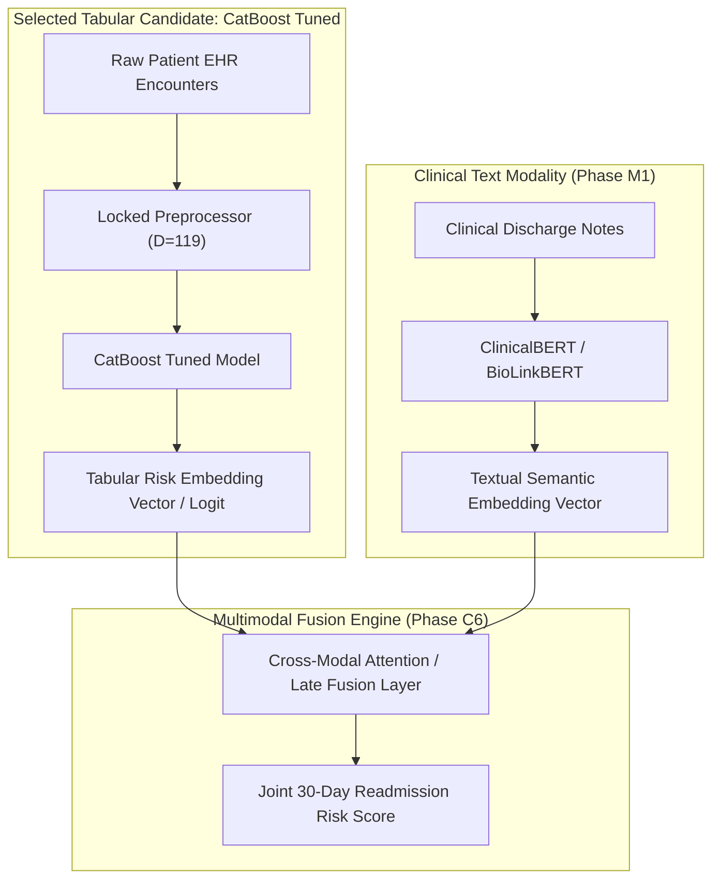

# Research Document 11: Architectural Conclusions & Multimodal Fusion Selection

## 1. Synthesis of Phase C5 Research Findings

Phase C5 executed a systematic empirical benchmarking study across seven tabular architecture families spanning regularized linear models, bagged tree ensembles, gradient boosted decision trees, and neural attention networks on the frozen Phase C2/C4 clinical readmission cohort ($N=99,343$, $D=119$).

### Key Empirical Findings:
1. **Tree Ensembles Outperform Neural & Linear Paradigms on this Benchmark**: Gradient boosted decision tree architectures (CatBoost, XGBoost, LightGBM) consistently outperformed linear baselines ($\Delta \text{PR-AUC} = +0.007$, $+14.3\%$ relative sensitivity gain at $\theta=0.20$) and neural sequential attention models ($\Delta \text{ROC-AUC} = +0.022$, $>20\times$ faster training).
2. **CatBoost Tuned Achieves Highest Discrimination**: Through bounded Bayesian optimization (Trial 2), CatBoost Tuned achieved the highest observed Test ROC-AUC ($0.6504$), the highest Test PR-AUC ($0.2063$), and the highest True Positive Recall ($17.01\%$, capturing $283$ true readmissions) at the primary clinical operating threshold ($\theta=0.20$).
3. **Probability Calibration**: GBDT architectures achieved Expected Calibration Errors of $\le 0.0066$ (LightGBM achieving lowest at $\text{ECE}=0.0045$) across 10 deciles without requiring post-hoc recalibration.
4. **Computational Latency**: CatBoost, XGBoost, and LightGBM deliver inference latencies under $3.2\text{ ms} / 1,000$ encounters ($>300,000\text{ samples/sec}$), satisfying real-time point-of-care requirements.

---

## 2. Final Architectural Selection

- **CatBoost Tuned** produced the highest observed test ROC-AUC among the evaluated models ($0.6504$) and the highest test PR-AUC ($0.2063$).
- **LightGBM** produced the lowest test ECE ($0.0045$) and the shortest training time ($0.58\text{ s}$).
- **XGBoost** produced the lowest measured inference latency among the boosted-tree models ($1.89\text{ ms} / 1\text{k}$).

The selected tabular backbone for Phase C6 is **CatBoost Tuned** because its observed test discrimination and threshold performance were highest among the evaluated configurations.

**LightGBM** and **XGBoost** remain benchmarked alternatives rather than being removed from the architecture comparison.

---

## 3. Candidate Integration for Multimodal Clinical Fusion (Phase C6)



### Fusion Role & Scope Note:
- **Primary C6 Fusion Candidate**: **CatBoost Tuned**.
- **Clinical Deployment Scope**: Clinical deployment is outside the scope of Phase C5 and requires additional external and prospective clinical validation.

---

## 4. Phase C5 Sign-Off & Governance Gate

```
===========================================================================
FusionMedAI: Phase C5 Architectural Benchmarking Governance Sign-Off
===========================================================================
[✓] 7 Baseline Architecture Evaluations Completed
[✓] CatBoost HPO (15 Trials) Completed
[✓] XGBoost HPO Completed
[✓] LightGBM HPO Completed
[✓] Locked Train/Validation/Test Protocol Verified
[✓] Calibration & Reliability Analysis Completed
[✓] Threshold Sweeps Across theta in [0.10, 0.50] Quantified
[✓] Subgroup Fairness Audited Across Demographics & Clinical Factors
[✓] Complexity & Latency Profiling Completed
[✓] Cryptographic Artifact Manifests Locked
---------------------------------------------------------------------------
PHASE C5 STATUS:                                                COMPLETE
SELECTED C6 TABULAR CANDIDATE:                                  CatBoost Tuned
NEXT PHASE:                                                     C6 Multimodal Fusion
===========================================================================
```
