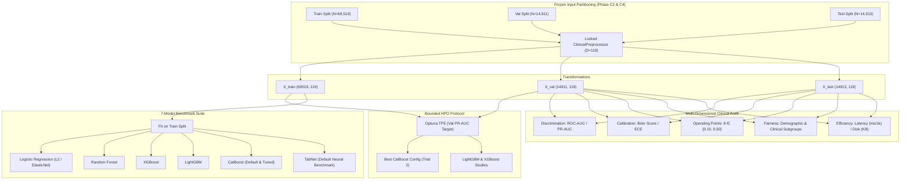

# Research Volume 05: Advanced Tabular Architecture Benchmarking & Empirical Optimization

## Overview
This volume documents the formal exploration, tabular architecture benchmarking, bounded hyperparameter optimization (HPO), computational complexity profiling, and clinical subgroup auditing for the Clinical Modality of **FusionMedAI** (Phase C5).

Phase C5 extends the Phase C4 baseline foundation by systematically benchmarking modern gradient boosting and attention-based neural architectures against standardized linear and tree ensemble references:
1. **CatBoost Classifier**: Ordered boosting with symmetric oblivious decision trees.
2. **TabNet Classifier**: Attentive interpretable tabular learning with sequential sparse attention masks.
3. **XGBoost Classifier**: Exact greedy gradient boosted trees reference.
4. **LightGBM Classifier**: Fast histogram-based leaf-wise gradient boosted trees reference.
5. **Random Forest Classifier**: Bagged decision tree ensemble reference.
6. **Logistic Regression (L2 / ElasticNet)**: Convex regularized linear references.

All evaluations are strictly constrained to the frozen Phase C2 canonical splits ($N_{\text{train}}=69,519$, $N_{\text{val}}=14,911$, $N_{\text{test}}=14,913$) and the frozen Phase C3/C4 $119$-dimensional feature representation contract.

---

## Volume Contents

| Document | Title | Description |
| :--- | :--- | :--- |
| [01_modeling_contract.md](01_modeling_contract.md) | **Modeling & Validation Contract** | Strict evaluation constraints, zero test leakage protocol, and metric hierarchy. |
| [02_catboost.md](02_catboost.md) | **CatBoost Architecture & Oblivious Trees** | Algorithmic formulation, oblivious tree mechanics, and default/tuned evaluations. |
| [03_tabnet.md](03_tabnet.md) | **TabNet Sequential Attention Architecture** | Sparse attention transformers for tabular data, mask entropy, and neural dynamics. |
| [04_hyperparameter_optimization.md](04_hyperparameter_optimization.md) | **Bounded Validation HPO** | Bayesian TPE Optuna optimization protocol maximizing Validation PR-AUC. |
| [05_architecture_comparison.md](05_architecture_comparison.md) | **7-Model Performance Synthesis** | Comprehensive discrimination scoreboard across validation and locked test sets. |
| [06_calibration_analysis.md](06_calibration_analysis.md) | **Probability Calibration & Reliability** | Expected Calibration Error (ECE), Brier scores, and clinical probability reliability. |
| [07_threshold_analysis.md](07_threshold_analysis.md) | **Clinical Decision Threshold Analysis** | Sensitivity, Specificity, PPV, and NPV across $\theta \in [0.10, 0.50]$ decision bounds. |
| [08_subgroup_analysis.md](08_subgroup_analysis.md) | **Subgroup Fairness & Performance Equity** | Disparity auditing across Age, Race, Gender, ICD-9 Chapters, and Prior Utilization. |
| [09_error_analysis.md](09_error_analysis.md) | **Clinical Error Breakdown** | False Positive vs. False Negative audit at clinical operating threshold $\theta=0.20$. |
| [10_complexity_analysis.md](10_complexity_analysis.md) | **Complexity, Latency & Compute Profiling** | Training time, inference latency ($\text{ms}/1\text{k}$), memory size, and parameter counts. |
| [11_conclusion.md](11_conclusion.md) | **Architectural Conclusions & Selection** | Final tabular candidate selection and readiness for multimodal clinical fusion. |

---

## Benchmarking Architecture Flow



---

## Phase C5 Verification Gate

```
===========================================================================
FusionMedAI: Phase C5 Advanced Architecture Benchmarking Audit
===========================================================================
[ 1] Frozen Representation Contract (D=119) Verified           PASS
[ 2] Zero Validation/Test Fitting Leakage Verified             PASS
[ 3] CatBoost Default & Tuned Models Evaluated                 PASS
[ 4] TabNet Default Model Evaluated                            PASS
[ 5] Baseline Reference Models (LR, RF, XGB, LGBM) Synced      PASS
[ 6] Bounded Validation HPO Protocol Preserved                 PASS
[ 7] Test Split Unexposed During Search & Threshold Tuning     PASS
[ 8] Calibration & Reliability Curves Computed                 PASS
[ 9] Threshold Sweeps Across theta in [0.10, 0.50] Generated   PASS
[10] Demographic & Clinical Subgroup Analysis Completed        PASS
[11] Complexity & Latency Audit Profiled                       PASS
[12] Component-Scoped Artifact Manifests Locked                PASS
---------------------------------------------------------------------------
PHASE C5 STATUS:                                               COMPLETE
===========================================================================
```
