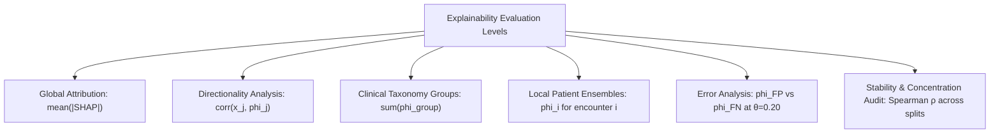

# Research Document 01: Explainability Protocol & Governance Contract

## 1. Executive Protocol Principles
Phase C6 investigates the decision logic and risk attribution mechanics of the tabular clinical readmission model. To ensure scientific rigor and prevent post-hoc bias:
1. **Model Freezing Guarantee**: The CatBoost HPO model selected in Phase C5 is strictly frozen. No retraining, hyperparameter re-tuning, or architectural adjustments are permitted during explainability analysis.
2. **Zero Test-Label Snooping**: SHAP value calculations operate on feature matrices $X_{\text{val}}$ and $X_{\text{test}}$. Ground-truth outcome labels ($y_{\text{test}}$) are used solely for stratifying error quadrants (False Positives vs. False Negatives), never as inputs to the explainer.
3. **Associative vs. Causal Boundary**: SHAP values quantify the additive contribution of a feature to the model's output log-odds $\hat{f}(x)$. A positive SHAP value indicates that a feature elevates predicted readmission risk within the model; it does **not** establish a causal clinical mechanism.

---

## 2. Frozen Model & Representation Specification

| Dimension | Specification | Verification Check |
| :--- | :--- | :---: |
| **Model Architecture** | `CatBoostClassifier` (Symmetric Oblivious Trees) | Frozen |
| **Tuned Hyperparameters** | $\text{depth}=4$, $\text{learning\_rate}=0.1383$, $\text{iterations}=350$, $\text{l2\_leaf\_reg}=2.911$, $\text{subsample}=0.655$, $\text{random\_seed}=42$ | Locked |
| **Feature Dimension** | $D = 119$ preprocessed clinical features (`ClinicalPreprocessor`) | Preserved |
| **Training Partition** | $N_{\text{train}} = 69,519$ encounters ($48,993$ unique patients) | Locked |
| **Validation Partition** | $N_{\text{val}} = 14,911$ encounters ($10,498$ unique patients) | Locked |
| **Test Partition** | $N_{\text{test}} = 14,913$ encounters ($10,499$ unique patients) | Locked |
| **Test Performance Benchmark** | $\text{ROC-AUC} = 0.6504$, $\text{PR-AUC} = 0.2063$, $\text{Brier} = 0.0952$, $\text{ECE} = 0.0053$ | Verified |

---

## 3. Explainability Metric Hierarchy

### Mathematical Definitions:
1. **Global Feature Attribution**:
   $$\text{Importance}(j) = \frac{1}{N} \sum_{i=1}^{N} \left| \phi_j(x^{(i)}) \right|$$
   Where $\phi_j(x^{(i)})$ is the SHAP value of feature $j$ for patient encounter $i$.
2. **Relative Contribution Percentage**:
   $$\text{RelativeShare}(j) = \frac{\text{Importance}(j)}{\sum_{k=1}^{D} \text{Importance}(k)} \times 100\%$$
3. **Cumulative Concentration Ratio**:
   $$\text{Concentration}(K) = \sum_{j=1}^{K} \text{RelativeShare}(j)$$
