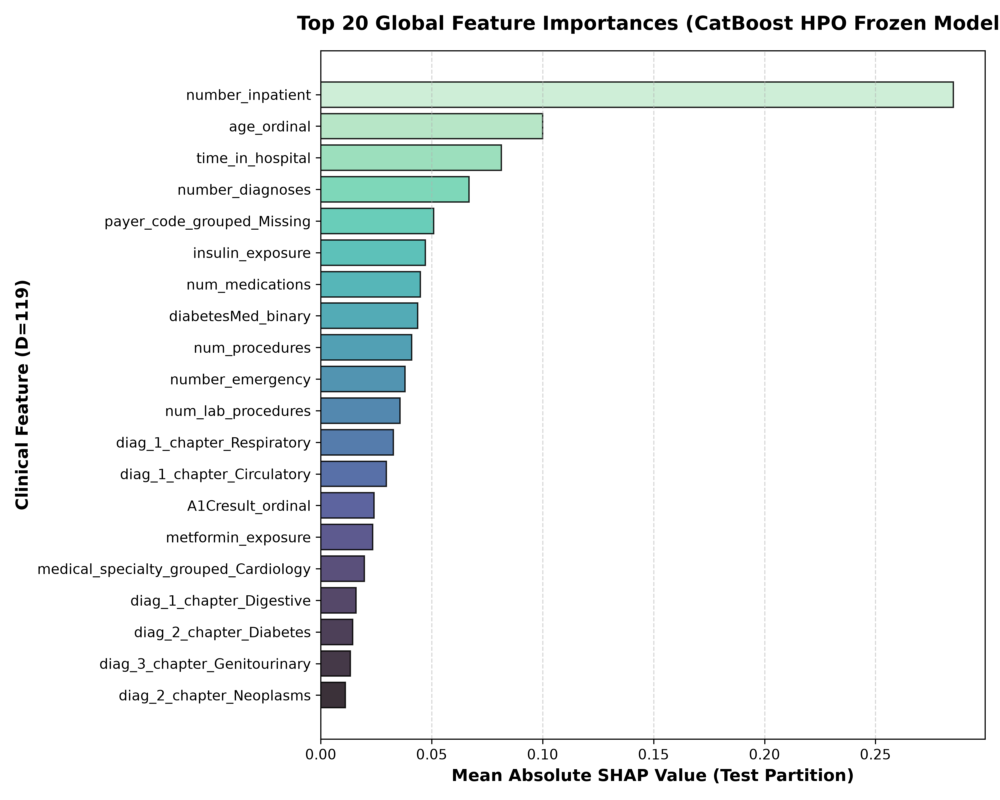
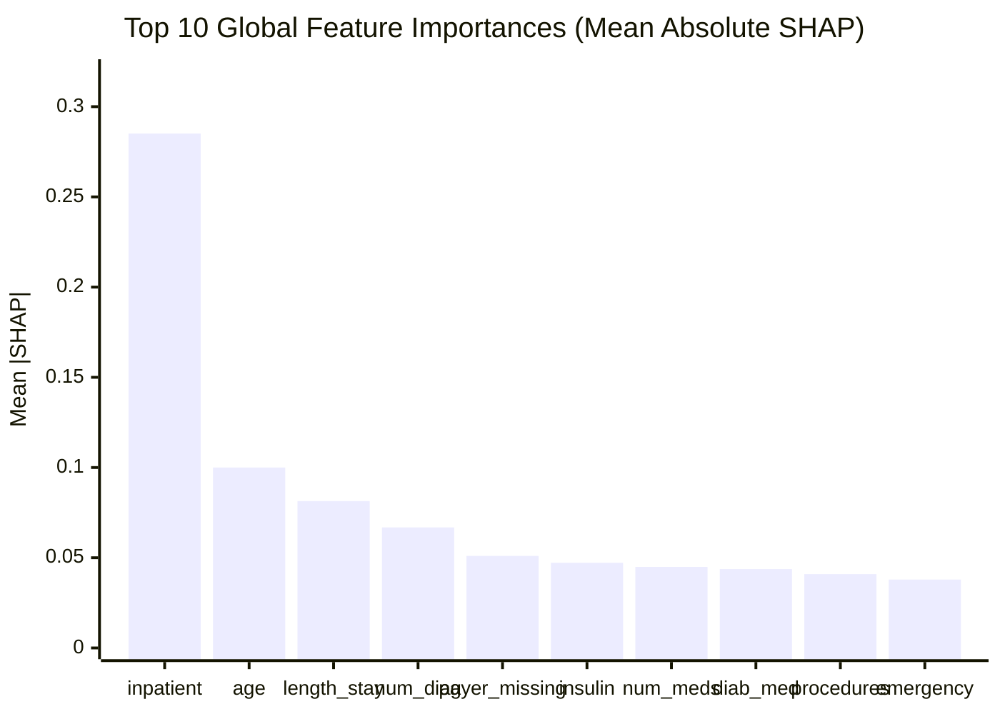

# Research Document 03: Global Feature Importance Rankings

## 1. Top 20 Global Features (Locked Test Partition: $N=14,913$)

Global importance is quantified by the mean absolute SHAP value $\frac{1}{N}\sum |\phi_j|$. The top 20 features computed on the locked test partition are:

| Rank | Feature Name | Clinical Taxonomy Group | Mean \|SHAP\| | Relative Share (\%) | Cumulative Share (\%) | Directionality Summary |
| :---: | :--- | :--- | :---: | :---: | :---: | :--- |
| **1** | `number_inpatient` | Prior Healthcare Utilization | **$0.2851$** | **$22.43\%$** | $22.43\%$ | Positive ($r = +0.9531$, Higher value $\to$ Higher predicted risk) |
| **2** | `age_ordinal` | Age & Glycemic Monitoring | **$0.1000$** | **$7.86\%$** | $30.29\%$ | Positive ($r = +0.8604$, Higher value $\to$ Higher predicted risk) |
| **3** | `time_in_hospital` | Acute Clinical & Encounter Complexity | **$0.0814$** | **$6.41\%$** | $36.70\%$ | Positive ($r = +0.6754$, Higher value $\to$ Higher predicted risk) |
| **4** | `number_diagnoses` | Acute Clinical & Encounter Complexity | **$0.0668$** | **$5.26\%$** | $41.95\%$ | Positive ($r = +0.9582$, Higher value $\to$ Higher predicted risk) |
| **5** | `payer_code_grouped_Missing` | Encounter Context & Administrative | **$0.0510$** | **$4.01\%$** | $45.96\%$ | Positive ($r = +0.9533$, Missing flag $\to$ Higher predicted risk) |
| **6** | `insulin_exposure` | Diabetic Medications | **$0.0472$** | **$3.71\%$** | $49.68\%$ | Positive ($r = +0.9292$, Insulin exposure $\to$ Higher predicted risk) |
| **7** | `num_medications` | Acute Clinical & Encounter Complexity | **$0.0449$** | **$3.54\%$** | $53.21\%$ | Positive ($r = +0.5969$, Higher count $\to$ Higher predicted risk) |
| **8** | `diabetesMed_binary` | Treatment Dynamics | **$0.0437$** | **$3.44\%$** | $56.65\%$ | Positive ($r = +0.9757$, On diabetic med $\to$ Higher predicted risk) |
| **9** | `num_procedures` | Acute Clinical & Encounter Complexity | **$0.0409$** | **$3.22\%$** | $59.87\%$ | Negative ($r = -0.7700$, Higher procedures $\to$ Lower predicted risk) |
| **10** | `number_emergency` | Prior Healthcare Utilization | **$0.0379$** | **$2.98\%$** | $62.86\%$ | Positive ($r = +0.5749$, Higher emergency $\to$ Higher predicted risk) |
| **11** | `num_lab_procedures` | Acute Clinical & Encounter Complexity | **$0.0358$** | **$2.81\%$** | $65.67\%$ | Positive ($r = +0.2925$, Higher lab tests $\to$ Higher predicted risk) |
| **12** | `diag_1_chapter_Respiratory`| ICD-9 Diagnosis Chapters | **$0.0327$** | **$2.57\%$** | $68.25\%$ | Negative ($r = -0.9691$, Primary respiratory $\to$ Lower predicted risk) |
| **13** | `diag_1_chapter_Circulatory`| ICD-9 Diagnosis Chapters | **$0.0295$** | **$2.32\%$** | $70.57\%$ | Positive ($r = +0.9318$, Primary circulatory $\to$ Higher predicted risk) |
| **14** | `A1Cresult_ordinal` | Age & Glycemic Monitoring | **$0.0241$** | **$1.89\%$** | $72.46\%$ | Negative ($r = -0.9443$, Measured/normal A1C $\to$ Lower predicted risk) |
| **15** | `metformin_exposure` | Diabetic Medications | **$0.0234$** | **$1.84\%$** | $74.30\%$ | Negative ($r = -0.6498$, Metformin exposure $\to$ Lower predicted risk) |
| **16** | `medical_specialty_grouped_Cardiology`| Encounter Context & Administrative | **$0.0196$** | **$1.54\%$** | $75.84\%$ | Negative ($r = -0.9862$, Cardiology specialty $\to$ Lower predicted risk) |
| **17** | `diag_1_chapter_Digestive` | ICD-9 Diagnosis Chapters | **$0.0159$** | **$1.25\%$** | $77.10\%$ | Negative ($r = -0.8954$, Primary digestive $\to$ Lower predicted risk) |
| **18** | `diag_2_chapter_Diabetes` | ICD-9 Diagnosis Chapters | **$0.0144$** | **$1.13\%$** | $78.23\%$ | Positive ($r = +0.8935$, Secondary diabetes $\to$ Higher predicted risk) |
| **19** | `diag_3_chapter_Genitourinary`| ICD-9 Diagnosis Chapters| **$0.0133$** | **$1.05\%$** | $79.27\%$ | Positive ($r = +0.9382$, Tertiary genitourinary $\to$ Higher predicted risk)|
| **20** | `diag_2_chapter_Neoplasms` | ICD-9 Diagnosis Chapters | **$0.0111$** | **$0.87\%$** | $80.15\%$ | Positive ($r = +0.9715$, Secondary neoplasm $\to$ Higher predicted risk) |

---

## 2. Global Importance Visualizations

---

## 3. Key Observations & Associative Scope

1. **Dominance of Prior Inpatient Utilization**:
   `number_inpatient` is the single most influential predictor, accounting for **$22.43\%$ of the total mean absolute SHAP attribution** with a mean $|SHAP|$ of $0.2851$ (nearly $3\times$ higher than `age_ordinal` at $0.1000$).
2. **Acute Complexity Cluster**:
   `time_in_hospital`, `number_diagnoses`, and `num_medications` form a cohesive acute complexity cluster, collectively contributing **$15.21\%$** of total mean absolute SHAP attribution.
3. **Associative Medication Signals**:
   - `insulin_exposure`: Shows a positive model attribution in this dataset ($+0.0472$ mean $|SHAP|$, $r = +0.9292$); this reflects an empirical association learned by the model between insulin therapy and elevated readmission risk, rather than a causal or treatment effect.
   - `metformin_exposure`: Shows a negative model attribution in this dataset ($-0.0234$ mean $|SHAP|$, $r = -0.6498$); this represents an associative pattern learned by the model rather than a causal or treatment recommendation.
4. **Administrative & Context Features**:
   - `payer_code_grouped_Missing`: Missing payer information is associated with higher model attribution ($+0.0510$ mean $|SHAP|$, $r = +0.9533$) in the evaluated data.
   - `diag_1_chapter_Respiratory`: Shows a negative model attribution ($r = -0.9691$); primary respiratory admission is associated with lower predicted readmission risk relative to baseline in this cohort.
   - `num_procedures`: Higher inpatient procedure count is associated with negative model attribution ($r = -0.7700$), representing an empirical association with lower predicted readmission in this dataset.

