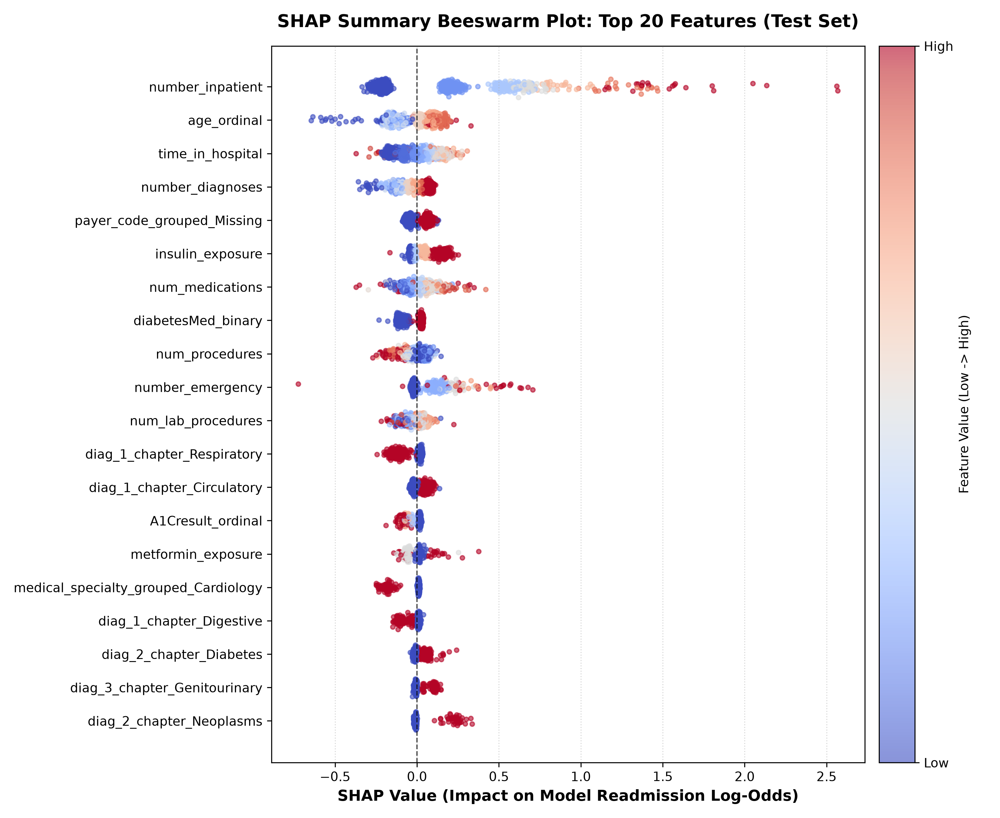
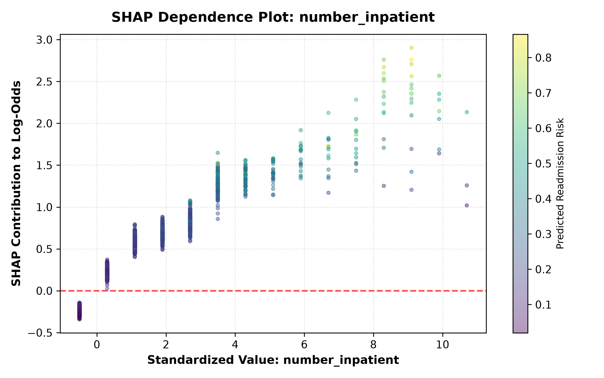
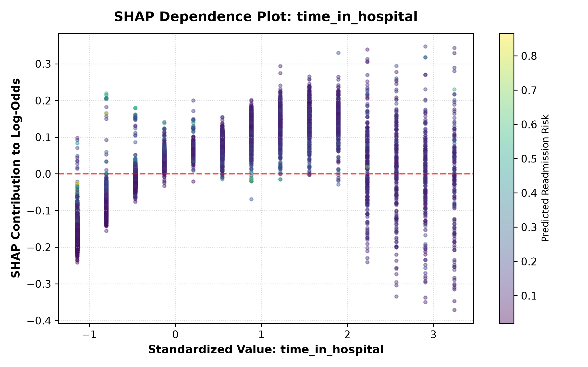
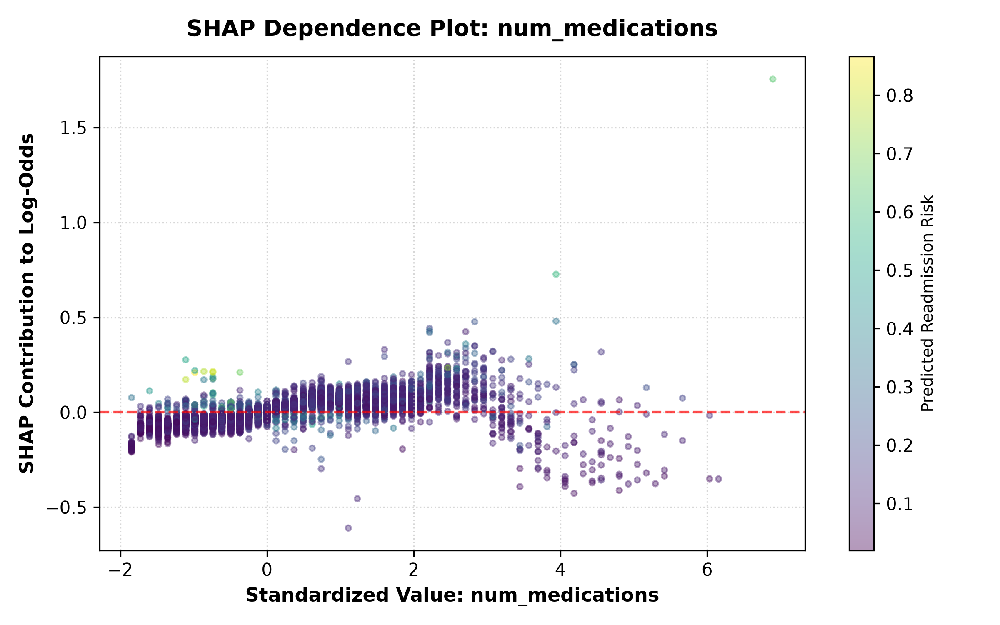
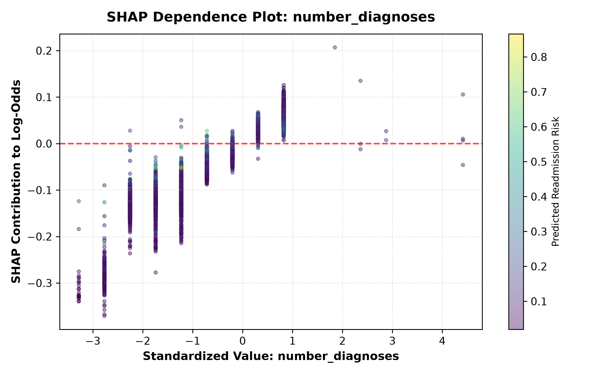
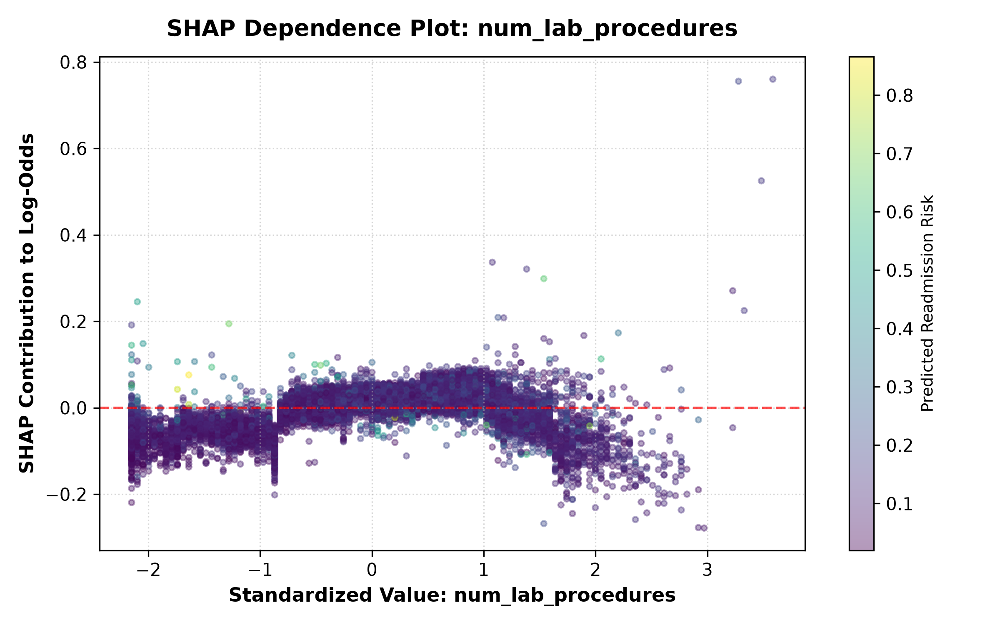
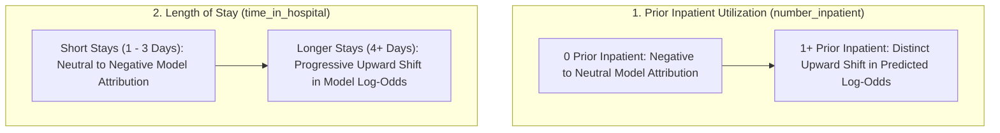

# Research Document 04: Feature Directionality & Dependence Analysis

## 1. Directionality Analysis Methodology
To determine whether higher feature values increase or decrease predicted readmission risk, we analyze:
1. **Directionality Correlation**: $\text{Pearson } r(X_j, \Phi_j)$ between standardized feature values and individual encounter SHAP contributions.
2. **SHAP Beeswarm Dynamics**: Visualizing the distribution of SHAP contributions across the full value range (low vs high).
3. **Continuous Dependence Plots**: Examining non-linear risk trajectories for key numerical features.

> [!NOTE]
> Pearson correlation $r(X_j, \Phi_j)$ summarizes the empirical alignment between feature values and SHAP contributions. For binary flags and discrete ordinal categories, this metric represents descriptive statistical association within the evaluated dataset, not a continuous or monotonic clinical dose-response relationship.

---

## 2. Directionality Matrix for Top Predictors

| Feature | Directionality Correlation ($r$) | Feature Value $\to$ Risk Impact | Model Attribution & Associative Scope |
| :--- | :---: | :--- | :--- |
| `number_inpatient` | **$+0.9531$** | High $\to$ High Risk | Higher values are associated with higher model-attributed readmission risk. |
| `age_ordinal` | **$+0.8604$** | High $\to$ High Risk | Older age brackets are associated with higher model attribution. |
| `time_in_hospital` | **$+0.6754$** | High $\to$ High Risk | Longer length of stay is associated with higher model attribution. |
| `number_diagnoses` | **$+0.9582$** | High $\to$ High Risk | Higher coded diagnosis counts are associated with higher model attribution. |
| `payer_code_grouped_Missing` | **$+0.9533$** | Present $\to$ High Risk | Missing payer information is associated with higher model attribution in the evaluated data. |
| `insulin_exposure` | **$+0.9292$** | Present $\to$ High Risk | Insulin exposure is associated with higher model attribution in this dataset; this represents an empirical association rather than a causal or disease-severity claim. |
| `num_medications` | **$+0.5969$** | High $\to$ High Risk | Higher medication count is associated with higher model attribution. |
| `diabetesMed_binary` | **$+0.9757$** | Present $\to$ High Risk | Active diabetic pharmacotherapy flag is associated with higher model attribution. |
| `num_procedures` | **$-0.7700$** | High $\to$ Low Risk | Higher inpatient procedure count is associated with lower model attribution in this dataset. |
| `number_emergency` | **$+0.5749$** | High $\to$ High Risk | Higher prior emergency visit count is associated with higher model attribution. |
| `diag_1_chapter_Respiratory` | **$-0.9691$** | Present $\to$ Low Risk | Primary respiratory admission flag is associated with lower model attribution relative to baseline. |
| `A1Cresult_ordinal` | **$-0.9443$** | High/Normal $\to$ Low Risk | Recorded/normal A1C test indicator is associated with lower model attribution. |
| `metformin_exposure` | **$-0.6498$** | Present $\to$ Low Risk | Metformin exposure is associated with lower model attribution in this dataset; this represents an empirical association rather than a treatment recommendation. |

---

## 3. SHAP Summary Beeswarm Distribution

---

## 4. Continuous Feature Risk Trajectories & Dependence Analysis

### Key Feature Dependence Profiles

| Feature | Dependence Plot |
| :--- | :---: |
| `number_inpatient` |  |
| `time_in_hospital` |  |
| `num_medications` |  |
| `number_diagnoses` |  |
| `num_lab_procedures` |  |

### Key Takeaways:
- **Prior Inpatient Shifts**: As shown in the dependence profile for `number_inpatient`, the presence of one or more prior hospitalizations marks a substantial upward shift in the model's output log-odds relative to zero prior hospitalizations.
- **Negative Association of `num_procedures`**: Higher inpatient procedure counts exhibit a negative correlation with model attribution ($r = -0.7700$), contrasting with the positive correlation observed for total medication count ($r = +0.5969$).
