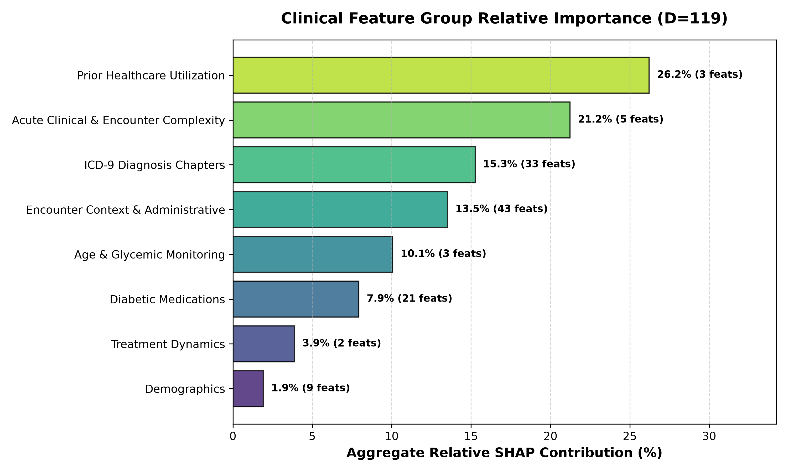
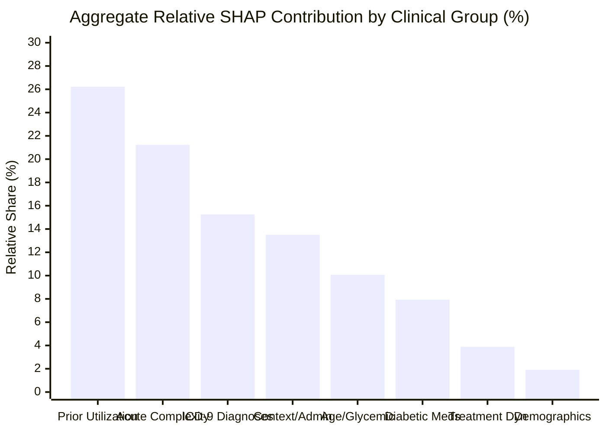

# Research Document 05: Clinical Feature Group Taxonomy Analysis

## 1. Clinical Taxonomy Mapping (Total $D=119$)

To provide actionable clinical insight, the 119 preprocessed dimensions are categorized into 8 functional clinical groups:

| Taxonomy Group | Feature Count | Total Absolute SHAP | Average Absolute SHAP | Relative Share (%) | Group Rank |
| :--- | :---: | :---: | :---: | :---: | :---: |
| **Prior Healthcare Utilization** | $3$ | **$0.3333$** | **$0.1111$** | **$26.22\%$** | **1** |
| **Acute Clinical Complexity** | $5$ | **$0.2699$** | $0.0540$ | **$21.23\%$** | **2** |
| **ICD-9 Diagnosis Chapters** | $33$ | $0.1939$ | $0.0059$ | **$15.25\%$** | **3** |
| **Encounter Context & Admin** | $43$ | $0.1717$ | $0.0040$ | **$13.51\%$** | **4** |
| **Age & Glycemic Monitoring** | $3$ | $0.1280$ | $0.0427$ | **$10.07\%$** | **5** |
| **Diabetic Medications** | $21$ | $0.1008$ | $0.0048$ | **$7.93\%$** | **6** |
| **Treatment Dynamics** | $2$ | $0.0493$ | $0.0246$ | **$3.88\%$** | **7** |
| **Demographics** | $9$ | $0.0243$ | $0.0027$ | **$1.91\%$** | **8** |
| **Total** | **$119$** | **$1.2712$** | — | **$100.00\%$** | — |

---

## 2. Feature Group Share Distribution

---

## 3. Structural Observations

1. **High Concentration in Compact Feature Groups**:
   - **Prior Healthcare Utilization** ($26.22\%$) and **Acute Clinical Complexity** ($21.23\%$) together account for **$47.45\%$ of total mean absolute SHAP attribution** while comprising only $8$ of the $119$ features ($6.7\%$ of feature space).
   - The model's additive output is heavily shaped by these two compact groups.

2. **Distributed Influence in Diagnosis Chapters**:
   - The 33 one-hot ICD-9 chapter indicators contribute $15.25\%$ collectively.
   - While individual diagnosis flags have modest mean $|SHAP|$ ($0.0059$ average per feature), their aggregate sum provides additional aggregate predictive attribution across multiple organ system categories.

3. **Demographic Attribution Share**:
   - Demographic variables (race, gender) contribute **$1.91\%$** of total mean absolute SHAP attribution ($0.0027$ average per feature).
   - In this dataset, the measured SHAP attribution is concentrated more heavily in utilization, complexity, diagnosis, and encounter-context groups than in demographic features.
