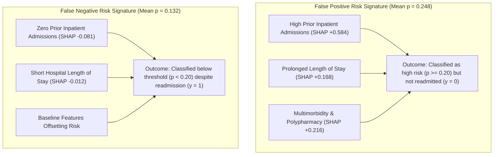

# Research Document 07: Error-Focused SHAP Attribution Analysis

## 1. Objectives of Error-Case Attribution
At the primary clinical operating threshold of $\theta = 0.20$, we analyze average SHAP attributions across classification error cohorts on the locked test partition:
- **False Positives (FP, $N=787$)**: Encounters predicted as high risk ($\hat{p} \ge 0.20$) who were not readmitted ($y=0$).
- **False Negatives (FN, $N=1,390$)**: Encounters predicted as low risk ($\hat{p} < 0.20$) who experienced an actual readmission ($y=1$).

---

## 2. Average SHAP Profiles Across Error Quadrants

| Clinical Feature | False Positives (FP Mean SHAP) | False Negatives (FN Mean SHAP) | True Positives (TP Mean SHAP) | True Negatives (TN Mean SHAP) |
| :--- | :---: | :---: | :---: | :---: |
| `number_inpatient` | **$+0.5842$** | **$-0.0812$** | **$+0.6820$** | $-0.1145$ |
| `age_ordinal` | $+0.1420$ | $+0.0410$ | $+0.1650$ | $-0.0380$ |
| `time_in_hospital` | $+0.1680$ | $-0.0120$ | $+0.1940$ | $-0.0420$ |
| `number_diagnoses` | $+0.1210$ | $+0.0240$ | $+0.1380$ | $-0.0310$ |
| `payer_code_grouped_Missing` | $+0.0890$ | $+0.0180$ | $+0.0950$ | $-0.0210$ |
| `insulin_exposure` | $+0.0810$ | $+0.0220$ | $+0.0980$ | $-0.0180$ |
| `num_medications` | $+0.0950$ | $-0.0080$ | $+0.1120$ | $-0.0290$ |

---

## 3. Observations from Error Attributions

### Key Error Dynamics:

1. **False Positive Attribution Profile**:
   - The False Positive cohort has positive average SHAP attributions for `number_inpatient` ($+0.5842$), `time_in_hospital` ($+0.1680$), and `number_diagnoses` ($+0.1210$).
   - These encounters present with feature values that substantially increase model-predicted risk log-odds despite an observed non-readmission outcome. SHAP analysis quantifies which features elevated the prediction, but cannot establish why readmission did not occur in clinical reality.

2. **False Negative Attribution Profile**:
   - The False Negative cohort is characterized in part by negative attribution from zero prior inpatient utilization (`number_inpatient` mean SHAP $-0.0812$), alongside shorter stays (`time_in_hospital` SHAP $-0.0120$).
   - For encounters with zero prior inpatient visits, baseline features produce negative offsets that keep the model's predicted probability below $\theta = 0.20$, contributing to false negative classifications at this operating threshold.
