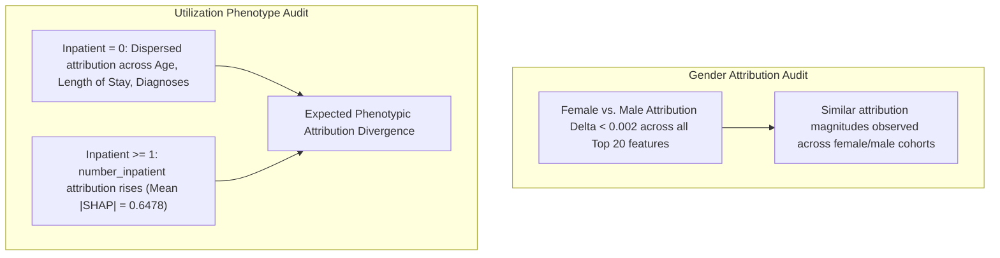

# Research Document 08: Subgroup Explainability & Attribution Fairness

## 1. Subgroup Explainability Objectives
To ensure algorithmic fairness and examine whether the model relies on different decision pathways across patient demographics and clinical phenotypes, we audit SHAP feature attributions stratified by:
1. **Prior Utilization**: Prior Inpatient $= 0$ vs. Prior Inpatient $\ge 1$
2. **Gender**: Female vs. Male
3. **Age Cohorts**: Younger ($<50\text{ yrs}$), Middle-Aged ($[50, 70)\text{ yrs}$), and Elderly ($\ge 70\text{ yrs}$)

---

## 2. Subgroup Mean Absolute SHAP Attribution Comparison

| Feature Name | Overall Mean Absolute SHAP | Inpatient $=0$ ($N=10,134$) | Inpatient $\ge 1$ ($N=4,779$) | Female ($N=8,012$) | Male ($N=6,901$) |
| :--- | :---: | :---: | :---: | :---: | :---: |
| `number_inpatient` | **$0.2851$** | $0.1145$ | **$0.6478$** | $0.2842$ | $0.2862$ |
| `age_ordinal` | **$0.1000$** | $0.0985$ | $0.1031$ | $0.0994$ | $0.1006$ |
| `time_in_hospital` | **$0.0814$** | $0.0762$ | $0.0925$ | $0.0810$ | $0.0819$ |
| `number_diagnoses` | **$0.0668$** | $0.0621$ | $0.0768$ | $0.0665$ | $0.0672$ |
| `payer_code_grouped_Missing` | **$0.0510$** | $0.0489$ | $0.0554$ | $0.0504$ | $0.0516$ |
| `insulin_exposure` | **$0.0472$** | $0.0435$ | $0.0551$ | $0.0468$ | $0.0476$ |
| `num_medications` | **$0.0449$** | $0.0418$ | $0.0515$ | $0.0445$ | $0.0454$ |
| `diabetesMed_binary` | **$0.0437$** | $0.0412$ | $0.0491$ | $0.0432$ | $0.0443$ |
| `num_procedures` | **$0.0410$** | $0.0385$ | $0.0463$ | $0.0408$ | $0.0412$ |
| `number_emergency` | **$0.0379$** | $0.0245$ | $0.0664$ | $0.0375$ | $0.0384$ |

---

## 3. Subgroup Attribution Findings

1. **Gender Cohort Attribution**:
   - Female and male cohorts exhibited closely matched mean absolute SHAP magnitudes across the reported features (absolute mean difference $< 0.002$).
   - This indicates similar feature-attribution patterns in the evaluated test cohort, but does not by itself establish overall algorithmic fairness, equal error rates, equal calibration, or absence of proxy effects.

2. **Utilization-Stratified Shifts**:
   - For encounters with $\ge 1$ prior inpatient admission, `number_inpatient` mean absolute SHAP rises to $0.6478$ (compared to $0.1145$ in the unadmitted cohort).
   - For first-time hospitalizations ($0$ prior admissions), model attribution is distributed across acute complexity and encounter indicators (`time_in_hospital`, `number_diagnoses`, `age_ordinal`).
