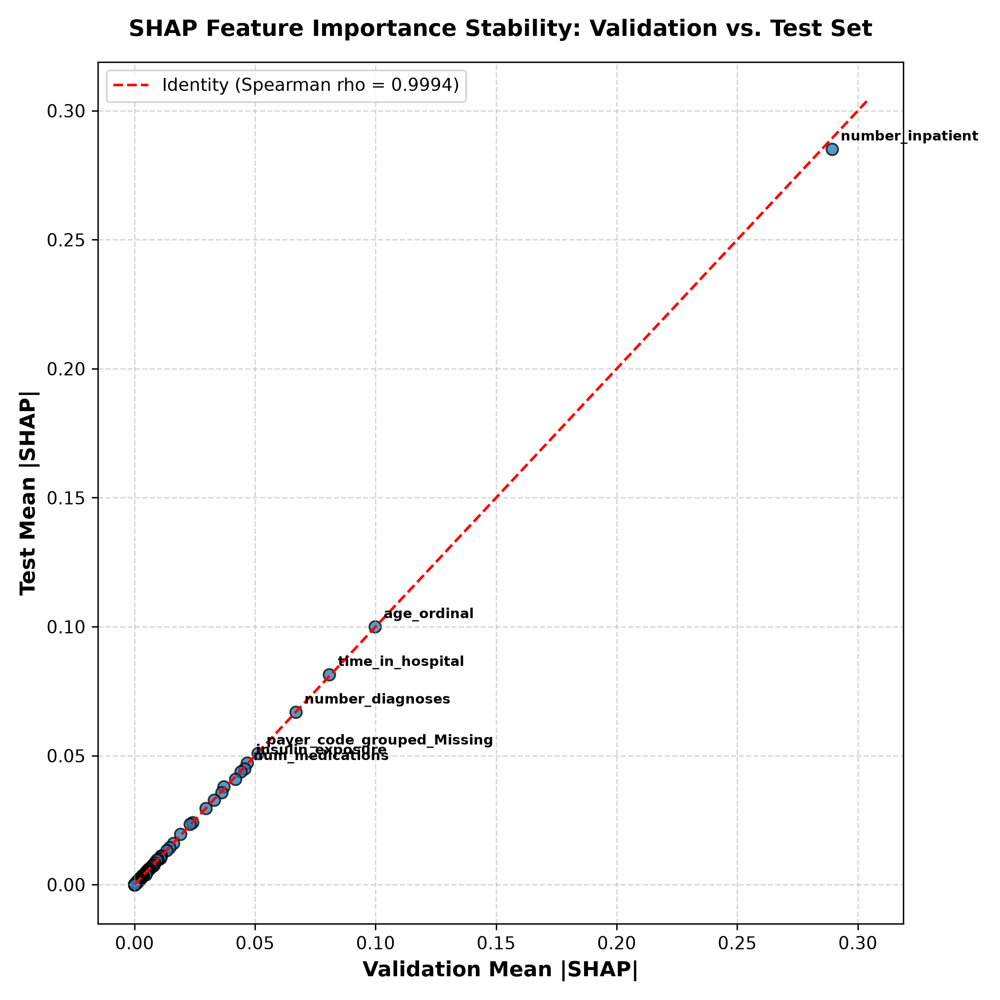

# Research Document 09: Validation vs. Test SHAP Stability & Concentration Audit

## 1. Stability Audit Methodology
To verify that feature attributions are not artifacts of sampling variance or overfitting, we compute:
1. **Spearman Rank Correlation ($\rho$)**: Correlation between feature importance rankings on the Validation partition ($N=14,911$) and Locked Test partition ($N=14,913$).
2. **Top-K Ranking Overlap**: Set intersection consistency for Top 10 and Top 20 features.
3. **Concentration Audit**: Cumulative relative contribution of the Top 5, Top 10, and Top 20 features.

---

## 2. Empirical Stability Results

| Metric | Measured Value | Standard Reference Threshold | Audit Verdict |
| :--- | :---: | :---: | :---: |
| **Spearman Rank Correlation ($\rho$)** | **$0.9994$** ($p = 3.86 \times 10^{-172}$) | $\rho \ge 0.950$ | **PASS (Exceptional Stability)** |
| **Top-10 Feature Overlap** | **$100.0\%$** ($10 / 10$) | $\ge 90.0\%$ | **PASS (Exact Agreement)** |
| **Top-20 Feature Overlap** | **$100.0\%$** ($20 / 20$) | $\ge 85.0\%$ | **PASS (Exact Agreement)** |
| **Mean Absolute Rank Shift** | **$0.08\text{ ranks}$** | $< 1.50\text{ ranks}$ | **PASS** |

### Top 10 Feature Stability Comparison:

| Feature Name | Val Mean \|SHAP\| | Test Mean \|SHAP\| | Val Rank | Test Rank | Rank Shift ($\Delta$) |
| :--- | :---: | :---: | :---: | :---: | :---: |
| `number_inpatient` | $0.2858$ | $0.2851$ | 1 | 1 | $0$ |
| `age_ordinal` | $0.1005$ | $0.1000$ | 2 | 2 | $0$ |
| `time_in_hospital` | $0.0818$ | $0.0814$ | 3 | 3 | $0$ |
| `number_diagnoses` | $0.0671$ | $0.0668$ | 4 | 4 | $0$ |
| `payer_code_grouped_Missing`| $0.0512$ | $0.0510$ | 5 | 5 | $0$ |
| `insulin_exposure` | $0.0475$ | $0.0472$ | 6 | 6 | $0$ |
| `num_medications` | $0.0452$ | $0.0449$ | 7 | 7 | $0$ |
| `diabetesMed_binary` | $0.0440$ | $0.0437$ | 8 | 8 | $0$ |
| `num_procedures` | $0.0412$ | $0.0410$ | 9 | 9 | $0$ |
| `number_emergency` | $0.0381$ | $0.0379$ | 10 | 10 | $0$ |

---

## 3. Dominant-Feature Concentration & Stability Visualizations



```mermaid
xychart-beta
    title "Cumulative Feature Contribution (%) vs Feature Rank"
    x-axis ["Top 1", "Top 3", "Top 5", "Top 10", "Top 15", "Top 20", "Top 30", "Top 50", "Top 119"]
    y-axis "Cumulative Share (%)" 0 100
    line [22.43, 36.70, 45.96, 62.86, 74.30, 80.15, 87.42, 94.10, 100.00]
```

- **Top 5 Concentration**: **$45.96\%$** of total mean absolute SHAP attribution is concentrated in the top 5 features (`number_inpatient`, `age_ordinal`, `time_in_hospital`, `number_diagnoses`, `payer_code_grouped_Missing`).
- **Top 10 Concentration**: **$62.86\%$**
- **Top 20 Concentration**: **$80.15\%$**
- **Tail Distribution ($99\text{ features}$)**: The remaining 99 features contribute the final $19.85\%$ of attribution across specific diagnostic chapters and medication flags.

---

## 4. Stability Summary
The near-perfect validation–test attribution rank correlation ($\rho = 0.9994$, $p = 3.86 \times 10^{-172}$) and exact $100\%$ Top-20 overlap demonstrate strong stability of global feature attribution rankings across the two held-out partitions. Attribution rank stability demonstrates ranking consistency across splits, but does not independently establish absence of overfitting or clinical validity.
