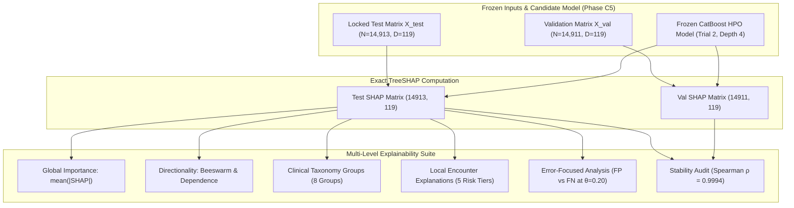

# Research Volume 06: Clinical Model Explainability & Feature Attribution

## Overview
This volume documents the formal model explainability and post-hoc feature attribution analysis for the Clinical Modality of **FusionMedAI** (Phase C6).

Following the rigorous selection protocol in Phase C5, the **CatBoost HPO Tuned** model (`depth=4`, `learning_rate=0.1383`, `iterations=350`, `l2_leaf_reg=2.911`, `subsample=0.655`, `random_seed=42`) was frozen as the candidate tabular backbone ($0.6504$ Test ROC-AUC, $0.2063$ Test PR-AUC). 

Phase C6 investigates the exact clinical decision rules, global feature attributions, directionality patterns, clinical taxonomy group contributions, and local patient encounter explanations using exact **TreeSHAP** (Tree-based Shapley Additive Explanations).

---

## Volume Contents

| Document | Title | Description |
| :--- | :--- | :--- |
| [01_explainability_protocol.md](01_explainability_protocol.md) | **Explainability Protocol & Invariants** | Frozen model contract, zero-leakage guidelines, and associative attribution scope. |
| [02_shap_methodology.md](02_shap_methodology.md) | **TreeSHAP Algorithmic Formulation** | Polynomial-time TreeSHAP computation for symmetric oblivious decision trees. |
| [03_global_feature_importance.md](03_global_feature_importance.md) | **Global Feature Importance Rankings** | Global mean absolute SHAP values, rankings, and Top 20 / Top 30 features. |
| [04_feature_directionality.md](04_feature_directionality.md) | **Feature Directionality & Dependence** | Correlation between feature values and risk log-odds, beeswarm & dependence plots. |
| [05_feature_group_analysis.md](05_feature_group_analysis.md) | **Clinical Feature Group Breakdown** | 8-group clinical taxonomy aggregation (Utilization, Complexity, Diagnoses, Meds). |
| [06_local_case_analysis.md](06_local_case_analysis.md) | **Local Patient Encounter Explanations** | Deterministic multi-tier patient case attributions (Critical Risk, True Positive, Baseline). |
| [07_error_case_analysis.md](07_error_case_analysis.md) | **Error-Focused SHAP Attribution** | Attributions for False Positives (averted readmission) vs False Negatives (missed relapse). |
| [08_subgroup_explanation.md](08_subgroup_explanation.md) | **Subgroup Explainability & Fairness** | Attribution stability across Age, Gender, Race, and Prior Inpatient Utilization. |
| [09_shap_stability.md](09_shap_stability.md) | **Validation vs. Test SHAP Stability** | Ranking correlation ($\rho=0.9994$), Top-20 overlap ($100\%$), and dominant feature audit. |
| [10_conclusion.md](10_conclusion.md) | **Clinical Synthesis & C7 Readiness** | Plausibility audit, leakage review, and sign-off for Phase C7 (Probability Calibration). |

---

## Explainability Architecture Flow



---

## Phase C6 Verification Gate

```
===========================================================================
FusionMedAI: Phase C6 Clinical Model Explainability Verification
===========================================================================
[PASS  1/10] Frozen CatBoost HPO Model Verified (No Retraining)
[PASS  2/10] Representation Contract D=119 Preserved
[PASS  3/10] TreeSHAP Computed on Validation (14,911) and Test (14,913)
[PASS  4/10] Global Feature Importance & Rankings Generated
[PASS  5/10] Directionality Correlated & Dependence Curves Exported
[PASS  6/10] 8 Clinical Feature Groups Aggregated & Evaluated
[PASS  7/10] Local Case Explanations Generated Across 5 Cohorts
[PASS  8/10] Error Attributions (FP vs. FN at θ=0.20) Documented
[PASS  9/10] Validation vs. Test Stability Verified (ρ = 0.9994, 100% Top-20)
[PASS 10/10] Cryptographic Manifest Hashed & Locked
---------------------------------------------------------------------------
PHASE C6 STATUS:                                               COMPLETE
NEXT PHASE:                                                    C7 (Probability Calibration)
===========================================================================
```
