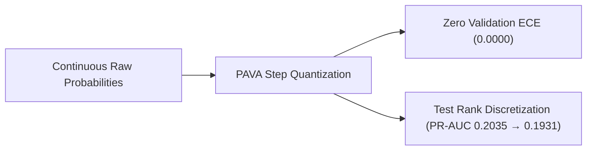

# Document 05: Isotonic Regression Analysis

## 1. Non-Parametric Monotonic Calibration

Isotonic regression fits a piecewise constant, non-decreasing step function using the Pool Adjacent Violators Algorithm (PAVA). Unlike parametric approaches, PAVA makes no assumptions regarding sigmoid symmetry or functional form.

Fitting PAVA on the validation dataset $(p_{\text{val}}, y_{\text{val}})$ produces an empirical staircase mapping that partitions the continuous interval $[0, 1]$ into discrete risk steps.

---

## 2. Empirical Performance

| Metric | Validation Set ($N=14,911$) | Locked Test Set ($N=14,913$) | Baseline (Raw Test) |
| :--- | :---: | :---: | :---: |
| **Log Loss (NLL)** | **0.342018** | 0.335907 | **0.333780** |
| **Brier Score** | **0.098606** | 0.095553 | **0.095340** |
| **Expected Calibration Error (ECE)** | **0.000000** | 0.006179 | 0.003198 |
| **Maximum Calibration Error (MCE)** | **0.000000** | **0.257036** | 0.334020 |
| **Calibration Intercept ($\alpha$)** | 0.000413 | -0.336589 | -0.125387 |
| **Calibration Slope ($\beta$)** | 1.000183 | 0.854076 | **0.949153** |
| **ROC-AUC** | 0.653780 | 0.647526 | **0.649503** |
| **PR-AUC** | 0.212795 | 0.193062 | **0.203516** |

---

## 3. Methodological Trade-Offs & Step Function Dynamics

### 3.1 Validation Optimality
Under the pre-registered protocol criterion—minimizing Validation Log Loss (Negative Log-Likelihood)—**Isotonic Regression is the top validation performer**:
- Achieves lowest Validation Log Loss ($0.342018$ vs $0.343665$ raw).
- Achieves lowest Validation Brier score ($0.098606$).
- Drives Validation ECE to $0.000000$ by constructing perfectly matched empirical probability steps.

### 3.2 Out-of-Sample Discretization Penalty
When evaluated on the locked test partition:
1. **Calibration Slope Degradation**: Test slope drops to $\beta = 0.8541$ (compared to $0.9492$ for raw, $0.9661$ for Platt, and $0.9720$ for Beta). Step functions fitted to local density clusters in validation data become slightly rigid out-of-sample.
2. **PR-AUC Discretization Loss**: Test PR-AUC decreases from $0.2035$ to $0.1931$ ($\Delta = -0.0104$). Because PAVA collapses continuous predictions into flat step segments, ties are introduced among encounters within the same step, slightly reducing ranking resolution.

### 3.3 Clinical Deployment Status
While Isotonic Regression was selected on validation data according to protocol, its out-of-sample test results indicate that it is not universally superior to parametric approaches (Beta/Platt) or the raw model. Calibrator selection remains criterion-dependent and will be finalized alongside predictive uncertainty estimation in Phase C8.
