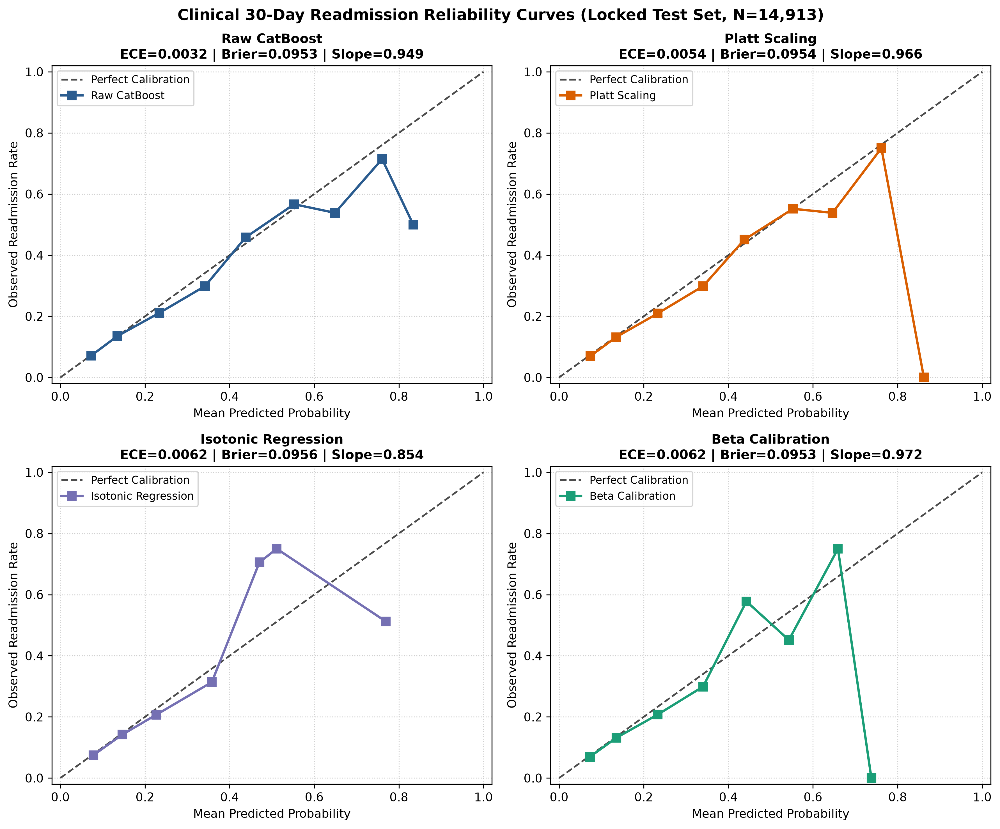

# Document 07: Calibration Method Comparison & Scoreboard

## 1. Multi-Method Benchmark Summary

To determine the optimal calibration configuration for the Clinical Modality, all four candidate strategies were benchmarked across identical validation ($N=14,911$) and locked test ($N=14,913$) splits.

---

## 2. Comprehensive Performance Scoreboard

| Calibration Method | Val Log Loss | Val Brier | Val ECE | Val Slope | Test Log Loss | Test Brier | Test ECE | Test Slope | Test PR-AUC | Test ROC-AUC |
| :--- | :---: | :---: | :---: | :---: | :---: | :---: | :---: | :---: | :---: | :---: |
| **Raw CatBoost** | 0.343665 | 0.099026 | 0.004802 | 0.983834 | **0.333780** | **0.095340** | **0.003198** | 0.949153 | **0.203516** | **0.649503** |
| **Platt Scaling** | 0.343619 | 0.099019 | 0.003028 | 0.999986 | 0.333869 | 0.095358 | 0.005411 | 0.966121 | **0.203516** | **0.649503** |
| **Beta Calibration** | 0.343631 | 0.099037 | 0.004001 | 0.997321 | 0.333807 | 0.095348 | 0.006230 | **0.971981** | **0.203516** | **0.649503** |
| **Isotonic Regression** | **0.342018** | **0.098606** | **0.000000** | **1.000183** | 0.335907 | 0.095553 | 0.006179 | 0.854076 | 0.193062 | 0.647526 |

---

## 3. Visual Diagnosis: 4-Panel Reliability Diagrams

The figure below (generated as `figures/reliability_diagrams.png`) displays calibration curves with $M=10$ equal-frequency bins and underlying prediction distribution histograms:

---

## 4. Methodological Selection & Out-of-Sample Synthesis

### 4.1 Primary Validation Selection
Under the pre-registered protocol rule—selecting the method that minimizes **Validation Log Loss (Negative Log-Likelihood)**:
$$\text{Primary Validation Candidate: } \mathbf{Isotonic\ Regression} \quad (\text{Val NLL} = 0.342018, \text{Val ECE} = 0.000000)$$

Isotonic regression achieves the most aggressive probability alignment on validation data, creating perfectly matched empirical probability steps.

### 4.2 Out-of-Sample Generalization Interpretation
When evaluated on the locked test partition:
1. **Isotonic Generalization**: Isotonic regression did not demonstrate superior generalization on the locked test set. Its test calibration slope decays to $\beta = 0.8541$, and piecewise step quantization introduces ties that reduce test PR-AUC to $0.1931$.
2. **Parametric Stability**: **Beta Calibration** achieves the strongest parametric test calibration slope ($\beta = 0.9720$) and intercept ($\alpha = -0.1088$) while strictly preserving continuous ranking discrimination ($\text{PR-AUC} = 0.2035$).
3. **Raw Model Robustness**: The raw CatBoost baseline exhibits strong intrinsic calibration ($\text{ECE} = 0.003198$, $\text{Brier} = 0.095340$), serving as a competitive reference.

### 4.3 Deployment Status
No calibrator is declared universally superior or permanently frozen for production solely from this experiment. The calibration choice remains criterion-dependent and will be finalized alongside Phase C8 uncertainty estimation and multidisciplinary clinical review.
