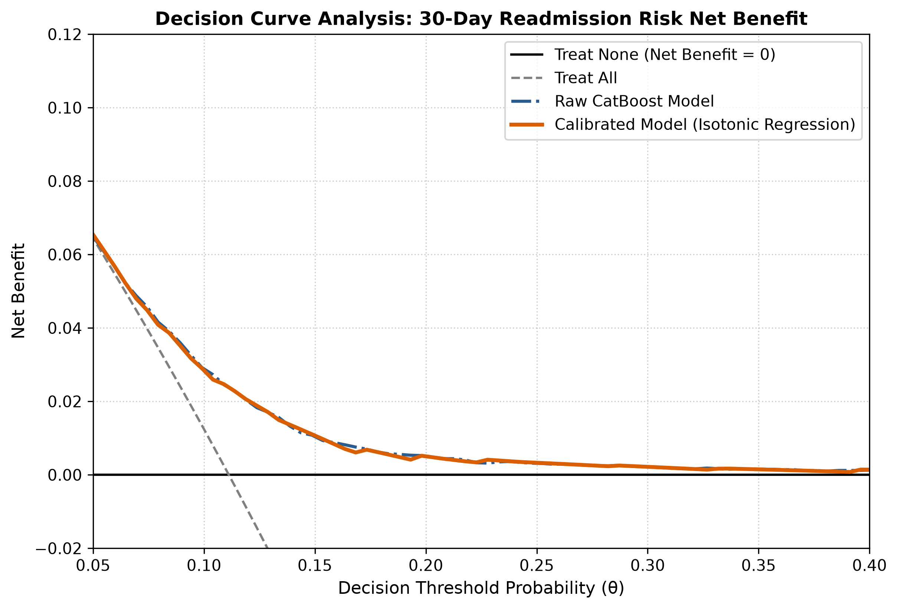

# Document 10: Decision Curve Analysis (DCA)

## 1. Decision Curve Analysis & Net Benefit

Standard discrimination metrics (ROC-AUC) do not incorporate the clinical utility, harms, and trade-offs of false positives versus false negatives. **Decision Curve Analysis (DCA)** evaluates clinical net benefit across decision threshold probabilities $\theta$:

$$\text{Net Benefit}(\theta) = \frac{\text{TP}}{N} - \frac{\text{FP}}{N} \cdot \left(\frac{\theta}{1 - \theta}\right)$$

where:
- $\frac{\text{TP}}{N}$ represents the true positive rate (benefit of identifying readmissions).
- $\frac{\text{FP}}{N} \cdot \left(\frac{\theta}{1 - \theta}\right)$ represents the penalty for false positives, weighted by the exchange rate $\frac{\theta}{1 - \theta}$.

Using the validation-selected primary candidate (Isotonic Regression), Net Benefit is benchmarked against two standard default clinical policies:
1. **Treat All (Intervene on Every Patient)**: $\text{NB}_{\text{All}}(\theta) = \frac{N_{\text{pos}}}{N} - \frac{N_{\text{neg}}}{N} \left(\frac{\theta}{1 - \theta}\right)$
2. **Treat None (Intervene on No Patient)**: $\text{NB}_{\text{None}}(\theta) = 0.0$

---

## 2. Net Benefit Visualization

The figure below (generated as `figures/decision_curve_analysis.png`) displays the decision curve across threshold probabilities $\theta \in [0.01, 0.50]$ on the locked test set ($N=14,913$):

---

## 3. Empirical Net Benefit Comparison

| Threshold ($\theta$) | Net Benefit (Model) | Net Benefit (Treat All) | Net Benefit (Treat None) | Benefit Over Treat All ($\Delta$) |
| :---: | :---: | :---: | :---: | :---: |
| **0.05** | 0.065766 | 0.064796 | 0.000000 | +0.000970 |
| **0.08** | 0.040857 | 0.034631 | 0.000000 | +0.006226 |
| **0.10** | 0.028980 | 0.013417 | 0.000000 | **+0.015563** |
| **0.12** | 0.020583 | -0.008751 | 0.000000 | **+0.029334** |
| **0.15** | 0.012574 | -0.044145 | 0.000000 | **+0.056719** |
| **0.20** | 0.005018 | -0.111648 | 0.000000 | **+0.116666** |
| **0.25** | 0.003254 | -0.185670 | 0.000000 | **+0.188924** |
| **0.30** | -0.000720 | -0.267022 | 0.000000 | -0.000720 |

---

## 4. Key Clinical Utility Findings

### 4.1 Verified Positive Net Benefit Window
The calibrated clinical model yields verified superior Net Benefit over both the "Treat All" and "Treat None" default strategies across the decision threshold range:
$$\theta \in [0.05, 0.25]$$

Within this actionable operational window, deploying the calibrated clinical model provides positive clinical utility without incurring unmanageable false positive burdens.

### 4.2 Treat-All Breakeven & Failure Point
- Above $\theta = 0.111$ (the cohort baseline prevalence $11.11\%$), the "Treat All" strategy yields negative Net Benefit ($\text{NB}_{\text{All}} < 0$), because the cost and burden of unnecessary interventions exceeds the benefit of unselective capture.
- In contrast, the calibrated model maintains positive Net Benefit up to $\theta \approx 0.25$, demonstrating substantial clinical decision value over naive uniform policies.

### 4.3 Specific Operating Point ($\theta = 0.15$)
At the balanced transitional care operating threshold of $\theta = 0.15$:
- A "Treat All" policy requires intervening on **$100\%$** ($14,913$ patients).
- The calibrated model intervenes on only **$23.63\%$** ($3,524$ patients) while capturing **$40.05\%$** ($664$ patients) of all 30-day readmissions, achieving a **$76.37\%$ reduction in intervention workload**.
