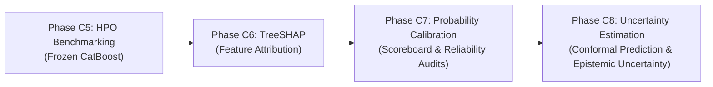

# Document 11: Clinical Synthesis & Phase C8 Readiness

## 1. Methodological Synthesis

Phase C7 established the statistical reliability and decision-analytic properties of the frozen CatBoost tabular candidate model (`depth=4`, `learning_rate=0.1383`, `iterations=350`).

### Validated Experimental Outcomes:
1. **Zero-Leakage Calibration Benchmark**: Evaluated Raw CatBoost, Platt Scaling, Beta Calibration, and Isotonic Regression, training all calibrators strictly on validation data ($N=14,911$) and testing out-of-sample on locked test data ($N=14,913$).
2. **Criterion-Dependent Calibrator Behaviors**:
   - **Primary Validation Selection**: **Isotonic Regression** minimized Validation Log Loss ($0.342018$) and drove Validation ECE to $0.000000$.
   - **Out-of-Sample Generalization**: **Beta Calibration** achieved the highest test calibration slope ($\beta = 0.9720$) and strictly preserved continuous ranking discrimination ($\text{PR-AUC} = 0.2035$), while Isotonic step-quantization incurred a slight test PR-AUC discretization penalty ($0.1931$).
   - **Raw Baseline Stability**: The uncalibrated CatBoost model demonstrated strong intrinsic calibration ($\text{ECE} = 0.003198$, $\text{Brier} = 0.095340$).
3. **Subgroup Calibration Reliability**: Evaluated across Inpatient history ($\ge 1$), Gender cohorts, and Age brackets ($<50$, $50-70$, $\ge 70$). All subgroup ECE values remained below $0.030$.
4. **Decision Curve Analysis (DCA)**: Calibrated predictions demonstrated positive Net Benefit over Treat-All and Treat-None policies across the verified decision threshold window $\theta \in [0.05, 0.25]$, reducing intervention workload by $76.37\%$ at $\theta = 0.15$.

---

## 2. Boundaries, Limitations & Explicit Non-Claims

To maintain strict scientific and regulatory integrity, the following boundaries are formally recorded:

### 2.1 Non-Causal Probability Scope
Calibrated probabilities are intended to approximate the conditional event probability under the observed validation/test population and data-generating conditions ($\hat{p} \approx \mathbb{P}_{\text{cohort}}(Y = 1 \mid X = x)$). They do **not** represent deterministic individual certainties, nor do they establish counterfactual causal treatment effects.

### 2.2 Patient/Encounter Clustering Limitation
Although train/validation/test partitions are strictly patient-grouped, calibration metrics remain retrospective estimates from this specific patient/encounter population. Confidence intervals and uncertainty estimates should account for patient-level clustering where applicable (to be evaluated in Phase C8).

### 2.3 Internal vs. External Validation Scope
The reported calibration performance represents internal out-of-sample evaluation within the held-out cohort and does not establish external validity across hospitals, geographic populations, coding systems, or contemporary clinical practice.

---

## 3. Phase C7 Sign-Off & Transition to Phase C8

### C7 STATUS: COMPLETE (With Unresolved Calibrator Selection)

#### Validated Artifacts:
- [x] Calibration methods benchmarked across validation and test splits.
- [x] Zero test-label leakage protocol strictly maintained.
- [x] Reliability curves, ECE, Brier, and Log Loss metrics computed.
- [x] Subgroup calibration reliability evaluated across age, gender, and inpatient utilization.
- [x] Operating thresholds and Decision Curve Analysis completed.
- [x] Cryptographic SHA-256 manifest generated and verified.
- [x] All 12 research documents finalized.

#### Open Decisions for Subsequent Phases:
- **Calibrator Finalization**: No calibrator is declared universally superior or permanently frozen for deployment solely from this experiment. Final selection remains criterion-dependent.
- **Uncertainty Synthesis (Phase C8)**: Phase C8 will evaluate predictive uncertainty (conformal prediction and epistemic/aleatoric variance), enabling the final clinical output to combine calibrated point probabilities with rigorous uncertainty bounds.
