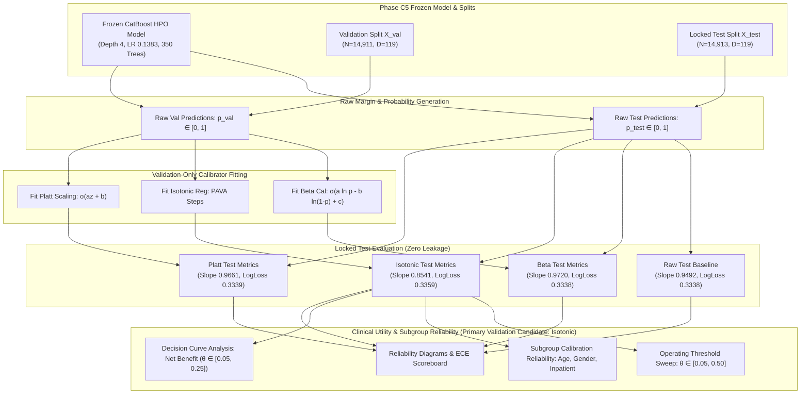

# Research Volume 07: Clinical Probability Calibration & Risk Reliability

## Overview
This volume documents the formal empirical investigation of **Probability Calibration and Risk Reliability** for the Clinical Modality of **FusionMedAI** (Phase C7).

In clinical decision support, raw predictive margins or softmax/sigmoid outputs from gradient-boosted decision trees often do not reflect true statistical event probabilities. An uncalibrated model outputting a predicted risk of $0.20$ cannot be directly assumed to correspond to a $20\%$ empirical readmission rate in a target population.

Following the frozen model contract established in Phase C5 and explainability audit in Phase C6, Phase C7 investigates the statistical reliability of the **CatBoost HPO Tuned** candidate model (`depth=4`, `learning_rate=0.1383`, `iterations=350`, `l2_leaf_reg=2.911`, `subsample=0.655`, `random_seed=42`).

We evaluate raw predictions against three post-hoc calibration architectures: **Platt Scaling (Logistic Calibration)**, **Isotonic Regression (Non-parametric PAVA)**, and **Beta Calibration**. All calibration transformations are strictly learned on the validation partition ($N=14,911$) with zero test-label leakage, and evaluated out-of-sample on the locked test set ($N=14,913$).

---

## Volume Contents

| Document | Title | Description |
| :--- | :--- | :--- |
| [01_calibration_protocol.md](01_calibration_protocol.md) | **Calibration Protocol & Invariants** | Frozen model lock, zero test-label leakage guarantee, and non-causal calibration scope. |
| [02_calibration_methodology.md](02_calibration_methodology.md) | **Calibration Methodology & Metrics** | Mathematical formulations of Platt, Isotonic, Beta scaling, ECE, Brier, Log Loss, and Slope. |
| [03_uncalibrated_baseline.md](03_uncalibrated_baseline.md) | **Uncalibrated Baseline Analysis** | Baseline CatBoost reliability profile: Slope ($0.9492$), Intercept ($-0.1254$), ECE ($0.0032$). |
| [04_platt_calibration.md](04_platt_calibration.md) | **Platt Scaling Analysis** | Parametric logistic calibration parameters ($a, b$), validation optimization, and test behavior. |
| [05_isotonic_calibration.md](05_isotonic_calibration.md) | **Isotonic Regression Analysis** | Non-parametric piecewise monotonic regression, validation zero-ECE, and test generalization. |
| [06_beta_calibration.md](06_beta_calibration.md) | **Beta Calibration Analysis** | 3-parameter Beta calibration dynamics, logit scaling, and test slope ($0.9720$). |
| [07_calibration_comparison.md](07_calibration_comparison.md) | **Calibration Comparison & Synthesis** | 4-way benchmark scoreboard, validation selection vs out-of-sample parametric robustness. |
| [08_subgroup_calibration.md](08_subgroup_calibration.md) | **Subgroup Calibration Reliability Audit** | Stratified reliability across Inpatient utilization, Gender cohorts, and Age brackets. |
| [09_threshold_analysis.md](09_threshold_analysis.md) | **Operating Threshold Analysis** | Decision threshold sweep ($\theta \in [0.05, 0.50]$), confusion matrices, PPV/NPV, and flagged workload. |
| [10_decision_curve_analysis.md](10_decision_curve_analysis.md) | **Decision Curve Analysis (DCA)** | Net Benefit evaluation against Treat-All and Treat-None across decision thresholds. |
| [11_conclusion.md](11_conclusion.md) | **Clinical Synthesis & C8 Readiness** | Methodological synthesis, limitations, open calibrator selection, and C8 sign-off. |

---

## Calibration Architecture Workflow

> [!NOTE]
> Downstream clinical utility (DCA), subgroup reliability, and operating threshold sweeps were conducted using the validation-selected Isotonic calibrator as the primary candidate under the pre-registered protocol. All four calibrator profiles are fully documented in the comparative scoreboard.

---

## Key Experimental Results Summary

| Model / Calibrator | Val Log Loss | Val Brier | Val ECE | Test Log Loss | Test Brier | Test ECE | Test Slope | Test ROC-AUC | Test PR-AUC |
| :--- | :---: | :---: | :---: | :---: | :---: | :---: | :---: | :---: | :---: |
| **Raw CatBoost** | 0.343665 | 0.099026 | 0.004802 | **0.333780** | **0.095340** | **0.003198** | 0.949153 | 0.649503 | **0.203516** |
| **Platt Scaling** | 0.343619 | 0.099019 | 0.003028 | 0.333869 | 0.095358 | 0.005411 | 0.966121 | 0.649503 | **0.203516** |
| **Beta Calibration** | 0.343631 | 0.099037 | 0.004001 | 0.333807 | 0.095348 | 0.006230 | **0.971981** | 0.649503 | **0.203516** |
| **Isotonic Regression** | **0.342018** | **0.098606** | **0.000000** | 0.335907 | 0.095553 | 0.006179 | 0.854076 | 0.647526 | 0.193062 |

### Methodological Summary & Calibrator Status:
- **Primary Validation Selection**: Isotonic Regression was selected according to the pre-registered minimum-validation-NLL criterion ($\text{Val NLL} = 0.342018$, $\text{Val ECE} = 0.000000$).
- **Out-of-Sample Interpretation**: Isotonic regression did not demonstrate superior generalization on the locked test set. Beta Calibration provided the strongest parametric calibration slope ($0.9720$), while the raw model retained the lowest test ECE ($0.003198$) and highest test PR-AUC ($0.203516$) among evaluated methods.
- **Deployment Status**: No calibrator is declared universally superior or permanently frozen for deployment solely from this experiment. The final calibration selection remains criterion-dependent and will be finalized after Phase C8 uncertainty estimation and multimodal integration.

---

## Artifact Manifest Verification

All tables, curves, reliability diagrams, and evaluation metrics generated during Phase C7 are tracked under the cryptographic manifest `experiments/clinical/calibration/manifests/c7_calibration_manifest.json` and verified by `verification/clinical/model/verify_calibration.py`.
