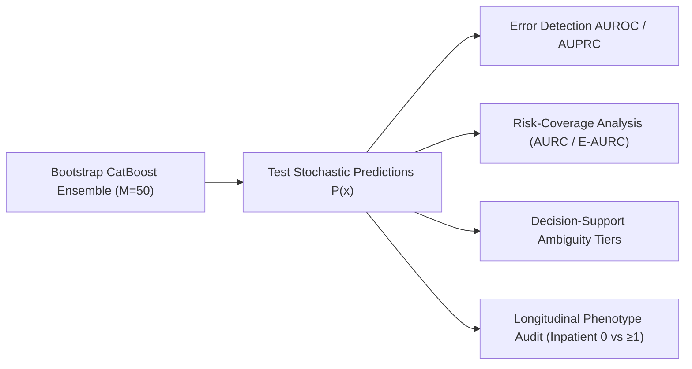

# Document 01: Uncertainty Protocol & Governance Contract

## 1. Scientific Context & Purpose
Point predictions and single calibrated probability values fail to communicate a model's parameter confidence in individual clinical predictions. An encounter with a predicted readmission probability $\hat{p} = 0.20$ located in a high-density training region possesses high model certainty, whereas the same probability predicted for an unusual clinical phenotype reflects high model parameter ambiguity.

Phase C8 investigates the estimation, empirical validity, and clinical utility of **Prediction Uncertainty** for the frozen CatBoost tabular candidate model established in Phase C5, explained in Phase C6, and calibrated in Phase C7.

---

## 2. Experimental Invariants & Governance

To maintain scientific rigor and prevent methodological bias, Phase C8 enforces four strict invariants:

### Invariant 1: Strictly Frozen Upstream Backbone & Calibrator
The underlying CatBoost architecture, decision tree depth, learning rate, regularizers, preprocessing pipeline, partition assignments, and calibration mapping are locked:
- **Model**: CatBoost HPO Candidate (Trial 2 configuration)
- **Hyperparameters**: `depth = 4`, `learning_rate = 0.1383`, `iterations = 350`, `l2_leaf_reg = 2.911`, `subsample = 0.655`, `random_seed = 42`
- **Feature Representation**: $D = 119$ clinical features generated by `ClinicalPreprocessor(scale_numerical=True)`
- **Data Partitions**:
  - Training Partition: $N_{\text{train}} = 69,519$ encounters ($48,993$ unique patients)
  - Validation Partition: $N_{\text{val}} = 14,911$ encounters ($10,498$ unique patients)
  - Test Partition: $N_{\text{test}} = 14,913$ encounters ($10,499$ unique patients)
- **Frozen Calibration Mapping**: **Isotonic Regression** (the pre-registered validation NLL winner from Phase C7).
- **Zero Retraining of Single-Point Model**: The single candidate model from C5 is unchanged; bootstrap models are resampled draws solely for uncertainty quantification.

### Invariant 2: Zero Test-Label Snooping
All bootstrap ensemble models are fitted **exclusively on resampled draws of the training partition** ($X_{\text{train}}, y_{\text{train}}$). Calibration mappings are fitted strictly on validation predictions. The locked test set ($X_{\text{test}}, y_{\text{test}}$) is accessed solely for out-of-sample uncertainty evaluation.

### Invariant 3: Precision in Uncertainty Terminology
We distinguish three distinct statistical notions of uncertainty:
1. **Bootstrap Ensemble Dispersion ($\sigma_p(x)$)**: The standard deviation of predicted probability across bootstrap models:
   $$\sigma_p(x) = \sqrt{\frac{1}{M-1}\sum_{m=1}^M \left(p_m(x) - \bar{p}(x)\right)^2}$$
   This dispersion primarily reflects **model parameter-estimation uncertainty** induced by finite training data.
2. **Epistemic Uncertainty**: Model uncertainty arising from finite training sample size and data sparsity in local feature space.
3. **Aleatoric Uncertainty**: Irreducible stochasticity inherent in retrospective EHR outcomes (proxied by binary entropy $\mathcal{H}(\bar{p})$).

> [!WARNING]
> We do not claim that the bootstrap ensemble cleanly and perfectly separates epistemic from aleatoric uncertainty; rather, bootstrap variance captures parameter estimation variability across finite training draws.

### Invariant 4: Non-Causal & Population Scope
Bootstrap predictive intervals $[q_{2.5\%}(x), q_{97.5\%}(x)]$ describe empirical variation across model bootstrap resamples within this specific EHR cohort distribution. They do **not** represent:
- Frequentist confidence intervals or true biological Bayesian posteriors for individual patient outcomes.
- Generalizable uncertainty bounds under severe external distribution shift across health systems.

---

## 3. Evaluation Architecture

