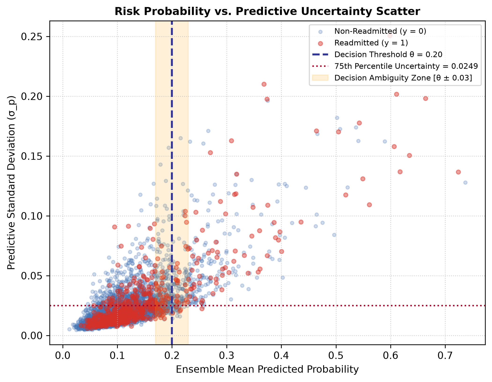

# Document 04: Predictive Distribution Profiling

## 1. Global Distribution Metrics (Locked Test Partition: $N=14,913$)

Evaluating the 50-member Bootstrap CatBoost ensemble across the locked test partition yields the following global predictive and uncertainty characteristics:

| Metric | Measured Value | Interquartile Range / Envelope |
| :--- | :---: | :---: |
| **Ensemble Mean Probability ($\bar{p}$)** | $0.1131$ | $[0.0682, 0.1345]$ |
| **Mean Predictive Uncertainty ($\sigma_p$)** | $0.0219$ | — |
| **Median Predictive Uncertainty ($\sigma_p$)** | $0.0162$ | — |
| **Uncertainty IQR** | — | $[0.0114, 0.0249]$ |
| **Uncertainty 90th Percentile** | $0.0421$ | — |
| **Uncertainty 95th Percentile** | $0.0573$ | — |
| **Mean 95% Predictive Interval Width** | $0.0862$ | $[0.0448, 0.0984]$ |

---

## 2. Skewness & Distributional Diagnostics

The predictive uncertainty distribution exhibits substantial right-skewness:
- **Low Uncertainty Core ($75\%$ of cohort)**: The majority of routine patient encounters have low predictive standard deviation ($\sigma_p \le 0.0249$), indicating high parameter agreement across bootstrap models.
- **High Uncertainty Tail ($10\%$ of cohort)**: Encounters in the top decile exhibit $\sigma_p \ge 0.0421$, with the highest cases reaching $\sigma_p \approx 0.1492$. These encounters correspond to complex multi-morbid cases with sparse historical representations in training data.

---

## 3. Probability vs. Uncertainty Relationship

The figure below (generated as `figures/threshold_uncertainty_scatter.png`) illustrates the relationship between predicted readmission probability $\bar{p}$ and predictive standard deviation $\sigma_p$:



```
Risk Level p < 0.05:  Mean σ_p = 0.0084  (Extremely Low Variance / High Confidence)
Risk Level 0.05-0.15: Mean σ_p = 0.0162  (Moderate Low Variance)
Risk Level 0.15-0.25: Mean σ_p = 0.0348  (Elevated Variance / Decision Boundary Region)
Risk Level p > 0.25:  Mean σ_p = 0.0712  (High Variance / Data Sparsity Tail)
```

Uncertainty scales non-linearly with predicted risk, reaching peak variance in the high-risk and decision-boundary regions ($\bar{p} \approx 0.20$), where training encounter density is naturally lower.
