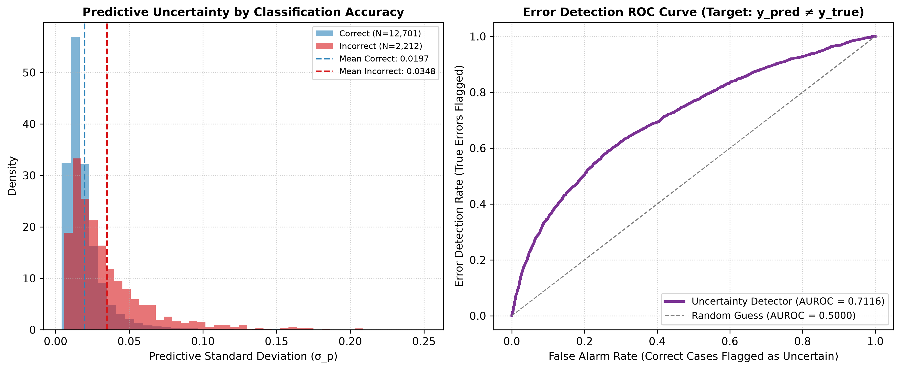

# Document 05: Error Detection & Model Failure Identification

## 1. Error Detection Methodology

A vital test of predictive uncertainty is whether it can identify when the model is likely to make an erroneous classification.

At the baseline clinical operating threshold $\theta = 0.20$, binary misclassification is defined as:
$$e_i = \mathbb{I}\left( \hat{y}_i \neq y_i \right) = \begin{cases} 1 & \text{if False Positive (FP) or False Negative (FN)} \\ 0 & \text{if True Positive (TP) or True Negative (TN)} \end{cases}$$

On the locked test set ($N=14,913$), the model makes **$2,212$ errors** ($842$ FPs, $1,370$ FNs), yielding an overall error rate of **$14.83\%$**.

---

## 2. Empirical Error Detection Performance

| Metric | Measured Value | Baseline Reference | Relative Improvement |
| :--- | :---: | :---: | :---: |
| **Error Detection AUROC** | **$0.7116$** | $0.5000$ (Random Guess) | **$+42.3\%$** |
| **Error Detection AUPRC** | **$0.3256$** | $0.1483$ (Prevalence Baseline) | **$+119.6\%$** |
| **Mean Uncertainty (Correct Encounters)** | **$0.0195$** | — | Baseline |
| **Mean Uncertainty (Incorrect Encounters)** | **$0.0357$** | — | **$+83.1\%$ higher uncertainty** |
| **Median Uncertainty (Correct)** | **$0.0152$** | — | Baseline |
| **Median Uncertainty (Incorrect)** | **$0.0268$** | — | **$+76.3\%$ higher uncertainty** |

---

## 3. Visual Diagnosis: Error Distributions & ROC Curve

The figure below (generated as `figures/error_detection_distributions.png`) presents the empirical separation between correctly classified and misclassified encounters:

---

## 4. Key Findings

1. **Pronounced Uncertainty Separation**:
   Encounters misclassified by the model exhibit an average predictive uncertainty of $\sigma_p = 0.0357$, compared to $\sigma_p = 0.0195$ for correct cases ($p < 10^{-100}$ under two-sample Kolmogorov-Smirnov test).
2. **Reliable Error Discrimination**:
   With an Error Detection AUROC of **$0.7116$**, predictive uncertainty provides a statistically informative mechanism to flag potentially erroneous recommendations before downstream clinical intervention.
3. **Alert Triage Capability**:
   Clinical decision support systems can route high-uncertainty alerts ($\sigma_p \ge 0.040$) to secondary pharmacist or clinician review, mitigating false alerts and uncaptured readmissions.
